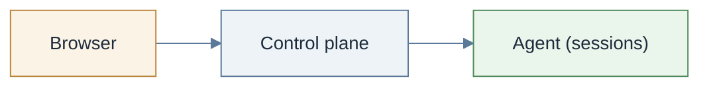

# Kasm Workspaces on Kubernetes

  

Kasm Workspaces streams desktops, browsers and applications into an ordinary web browser. A
deployment has two halves: a **control plane** that people sign in to, and one or more **agents**
that run the sessions. This repository holds the Helm charts for both.



## Install it

One command, no values:

```console
helm install kasm oci://registry-1.docker.io/kasmweb/kasm-platform -n kasm --create-namespace
```

The notes Helm prints begin:

```text
The Kasm platform has been installed as release "kasm" in namespace "kasm".

Installed with this release:
  * kasm-helm    the control plane: web UI, manager/API, session proxy, Guacamole, RDP gateways, database
  * kasm-agent   the Kubernetes agent: operator, telemetry collector, Agent resource, session proxy

** Please be patient: on a first install the database initializes and both halves pull their
   images, which takes several minutes on a cold cluster. **
```

The agent registers with the control plane beside it, both halves generate self-signed
certificates, and session traffic is relayed through the control plane. Nothing else is needed to
reach a running session. [Get started](docs/tutorials/get-started.md) takes it from here.

## Where to go next

| Read | When |
| ---- | ---- |
| [Get started](docs/tutorials/get-started.md) | The install above, end to end, with what to expect at every step |
| [How-to guides](docs/README.md#how-to-guides) | One task per page: install layouts, exposure, certificates, nodes, storage, day 2 |
| [Explanation](docs/README.md#explanation) | Why it is shaped this way: topologies, security posture, capacity, the chart tree |
| [Reference](docs/README.md#reference) | What works on Kubernetes, ports and hostnames, troubleshooting, every chart's values |

## The charts in this repository

You install an umbrella; the parts are configured through it. Published charts live at
`oci://registry-1.docker.io/kasmweb/<chart>`.

| Chart | One line |
| ----- | -------- |
| [`kasm-platform`](charts/kasm-platform/README.md) | The whole stack in one release: control plane plus Kubernetes agent, each half switchable off. Published. |
| [`kasm-agent`](charts/kasm-agent/README.md) | The Kubernetes agent umbrella: nine dependencies, six of them Kasm subcharts. Published. |
| [`kasm-helm`](charts/kasm-helm/README.md) | The control plane on its own: web UI, manager/API, proxy, Guacamole, RDP gateways, PostgreSQL. Published. |
| [`kasm-agent-crds`](charts/kasm-agent-crds/README.md) | The five CRDs as a Helm-owned release, for fleets that upgrade CRDs with Helm. Published. |
| [`kasm-egress-installer`](charts/kasm-egress-installer/README.md) | Per-session VPN egress through a chained CNI shim. Privileged, off by default. Published. |
| [`kasm-agent-operator`](charts/kasm-agent-operator/README.md) | The controller, its CRDs and cluster RBAC. Subchart only. |
| [`kasm-agent-instance`](charts/kasm-agent-instance/README.md) | The `Agent` resource, the session proxy and its exposure options. Subchart only. |
| [`kasm-otel-collector`](charts/kasm-otel-collector/README.md) | The OpenTelemetry collector the agent reports to. Subchart only. |
| [`kasm-node-prep`](charts/kasm-node-prep/README.md) | Kernel modules and node tuning from a privileged DaemonSet. Subchart only. |
| [`kasm-video-device-plugin`](charts/kasm-video-device-plugin/README.md) | Advertises `/dev/video*` as `kasm.com/video` for webcam sessions. Subchart only. |

[Every chart, one line each](docs/reference/charts.md) says which to install and links each value
reference. Working on the charts themselves? See [CONTRIBUTING.md](CONTRIBUTING.md) and
[Publish the charts](docs/how-to/publish-charts.md).

## License

These charts are published by Kasm Technologies. Kasm Workspaces itself is licensed separately;
see [kasm.com](https://kasm.com/) for license terms. [Kasm Workspaces Community
Edition](https://kasm.com/community-edition) is free for personal and small-team use, and these
charts work with both Community and commercial editions.
