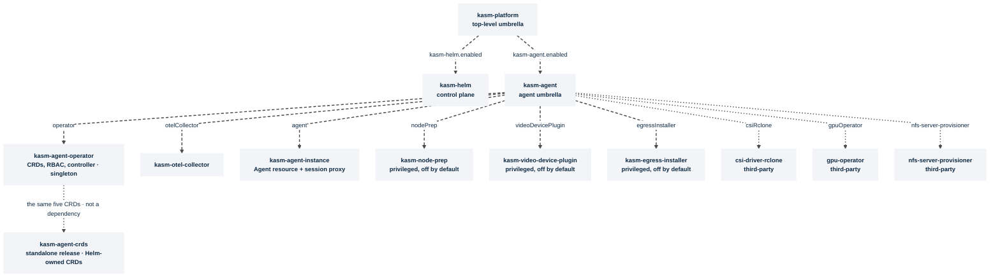

# Architecture

> **Applies to:** both halves

This is the map of the ten Helm charts in this repository - what each one is, how
they depend on one another, and which combination to reach for. Every chart keeps
its own README with the full value reference; this document links to those rather
than repeating them.

## The two halves of a Kasm deployment

A Kasm Workspaces deployment has two halves:

- **The control plane** - what users log in to: the web UI, the manager and API
  services, the session proxy, Guacamole, the RDP gateways, and a database. In this
  repository that is the **[kasm-helm](../../charts/kasm-helm/README.md)** chart.
  **Sessions do not run here.**
- **The agent** - what actually runs sessions: an operator, an `Agent` custom
  resource, and a session proxy that the control plane relays to (the default) or that
  users' browsers connect to directly. In this repository that is the
  **[kasm-agent](../../charts/kasm-agent/README.md)** umbrella and the subcharts it composes.

An agent registers with a manager, and from then on the manager schedules workspaces
into the agent's cluster. The manager a Kubernetes agent registers with can be this
repo's control plane, a control plane in another cluster, a VM/Docker deployment, or
a Kasm-hosted one - the two halves are deployed and versioned independently, and each
installs perfectly well alone.

## The chart dependency tree

Grounded in the actual `Chart.yaml` dependency blocks:

- **kasm-platform** (`charts/kasm-platform/Chart.yaml`) declares two `file://`
  dependencies - `kasm-helm` (condition `kasm-helm.enabled`) and `kasm-agent`
  (condition `kasm-agent.enabled`). Neither is aliased. It adds no workloads of its
  own beyond an `extraObjects` escape hatch.
- **kasm-agent** (`charts/kasm-agent/Chart.yaml`) declares **nine** dependencies  - 
  six local Kasm subcharts and three optional third-party charts:
  - Local, aliased: `kasm-agent-operator` (alias `operator`),
    `kasm-otel-collector` (`otelCollector`), `kasm-agent-instance` (`agent`),
    `kasm-node-prep` (`nodePrep`), `kasm-video-device-plugin`
    (`videoDevicePlugin`), and `kasm-egress-installer` (`egressInstaller`).
  - Third-party: `csi-driver-rclone` (`csiRclone`, from
    `oci://ghcr.io/veloxpack/charts`), `gpu-operator` (`gpuOperator`, from
    `https://helm.ngc.nvidia.com/nvidia`), and `nfs-server-provisioner`
    (un-aliased, from the nfs-ganesha repo). Each is gated by a `*.enabled`
    condition and defaults **off**.
- **kasm-agent-crds** (`charts/kasm-agent-crds/Chart.yaml`) has **no dependencies,
  and nothing depends on it**. It is a standalone release - see
  [Why the CRDs are split](why-the-crds-are-split.md).

Default toggles inside kasm-agent: `operator`, `otelCollector`, and `agent` default
**enabled**; `nodePrep`, `videoDevicePlugin`, `egressInstaller`, and all three
third-party dependencies default **disabled**.

Build order matters. kasm-platform packages kasm-agent from disk - its `charts/`
directory included - so kasm-agent's own nine dependencies must be staged first:
`helm dependency build charts/kasm-agent` before
`helm dependency build charts/kasm-platform` (the `make deps-agent` target does both,
in that order).

## Cluster singletons

- **kasm-agent-operator is a cluster singleton.** It owns cluster-scoped CRDs and
  fixed-name ClusterRoles, so only one release per cluster may set
  `operator.enabled=true`. To run a second agent in another namespace of the same
  cluster, install it with `operator.enabled=false` and let it share the operator
  already there.
- **The operator's Secret access is per namespace, not cluster-wide.** Its ClusterRole carries no
  `secrets` rule; each `kasm-agent-instance` release stamps a Role in its own namespace granting the
  operator's ServiceAccount get/create/update on the storage-mapping Secrets there. In the
  two-namespace layout, tell the agent where the operator runs
  (`agent.operatorRBAC.serviceAccount.namespace`).
- **The third-party GPU Operator and rclone CSI driver are cluster-scoped too.**
  Enable each in at most one release per cluster, and leave it off if something else
  already installs it.
- The control plane (kasm-helm), by contrast, creates **no** cluster-scoped objects
  at all - no CRDs, no ClusterRoles - so it can never collide with the agent's
  cluster-scoped resources. That is what makes single-namespace co-location safe.

## Why the CRDs are split from the operator

The five CRDs exist in the tree twice, in the operator chart's `crds/` directory and as templates
in `kasm-agent-crds`, because Helm's two ways of installing a CRD each give up something the other
has. [Why the CRDs are split](why-the-crds-are-split.md) has the trade-off;
[Install the CRDs as their own release](../how-to/install/crds.md) the procedure.

## Deployment topologies

Which combination of charts to install, relayed or direct-connect sessions, one release or two
namespaces, and one cluster or many, are [Deployment topologies](topologies.md). Which chart is which is
[The charts](../reference/charts.md).

## Versions and history

kasm-helm is versioned on the Kasm Workspaces release cadence - currently chart
`1.1190.6` / app `1.19.0`, GA. The agent-family and umbrella charts are versioned
independently and are currently `0.1.0` (app `develop`), a developer preview. For
release history, see each chart's `CHANGELOG.md` - for example,
[charts/kasm-helm/CHANGELOG.md](../../charts/kasm-helm/CHANGELOG.md). There is no
repository-wide changelog.
