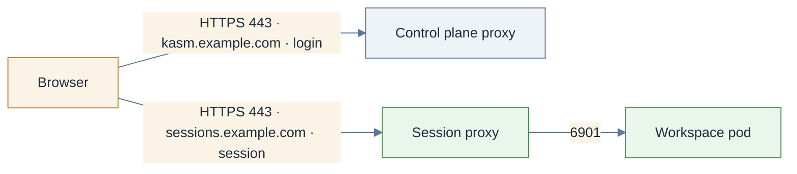
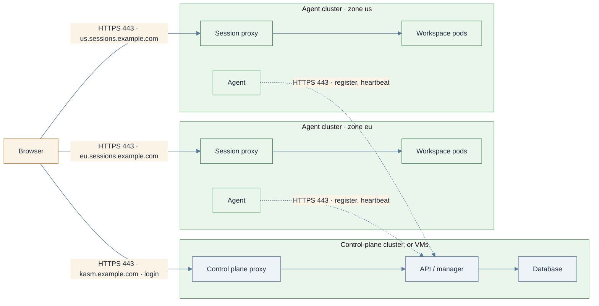

# Deployment topologies

> **Applies to:** both halves

Three decisions shape a Kasm deployment on Kubernetes: how session traffic reaches the session
proxy (relayed or direct-connect), whether the two halves share a namespace (one release or two),
and how many clusters take part (one, or one per zone). Each is independent of the others.

## Relayed or direct-connect

A no-values install lands in the relayed topology and needs nothing configured. Direct-connect is
a switch you make deliberately, with
[Switch sessions to direct-connect](../how-to/networking/direct-connect.md).

### Relayed (the default)

```mermaid
%%{init: {"theme":"base","themeVariables":{"primaryColor":"#eef3f8","primaryBorderColor":"#5b7a99","primaryTextColor":"#1d2b3a","secondaryColor":"#fbf3e6","secondaryBorderColor":"#b8863b","tertiaryColor":"#eaf5ec","tertiaryBorderColor":"#4f8a5b","lineColor":"#5b7a99","fontFamily":"Inter, Helvetica, Arial, sans-serif","fontSize":"14px"},"flowchart":{"curve":"basis","htmlLabels":true}}}%%
flowchart LR
  browser["Browser"] -->|"HTTPS 443 · one hostname"| cp["Control plane proxy"]
  cp -->|"HTTPS 4444 · in-cluster Service"| sp["Session proxy"]
  sp -->|"6901"| ws["Workspace pod"]
  classDef agent fill:#eaf5ec,stroke:#4f8a5b
  classDef ext fill:#fbf3e6,stroke:#b8863b
  class sp,ws agent
  class browser ext
```



### Direct-connect



| | Relayed | Direct-connect |
| --- | --- | --- |
| Zone setting | `proxy_connections: true` (Kasm's default) | `proxy_connections: false` and `upstream_auth_address` = the control plane |
| Browser talks to | the control plane only | the control plane **and** the agent |
| Agent hostname | the in-cluster Service, derived: `<agent>-session-proxy.<ns>.svc.cluster.local:4444` | a public hostname under the same parent domain as the control plane |
| Agent certificate | anything, the self-signed default included; browsers never see it | publicly trusted, plus its wildcard on passthrough and direct-Service paths |
| Kasm Authorization Domain | untouched | the shared parent domain, or every session connect returns 401 |
| Session traffic path | browser, control plane, agent | browser, agent |
| Idle ceiling | 30 minutes, fixed in the control-plane proxy ConfigMap (`proxy_read_timeout 1800s`) | whatever fronts the session proxy, raised to 3600s or more |
| What scales | the control plane carries every session's bandwidth | the agent scales on its own |

**The relay's one constraint.** The control-plane proxy forwards the *browser's* `Host` header
upstream, not the agent's:

```nginx
proxy_set_header  Host $host;
proxy_pass        $connect_schema://$connect_hostname:$connect_port/$connect_path;
```

So nothing between the control-plane proxy and the session proxy may route on the `Host` header.
That rules out `agent.ingress` and `agent.httpRoute` for a relayed zone whose agent sits outside the
cluster: the relayed request carries the control plane's name, matches no rule and returns 404. A
`LoadBalancer`, `NodePort` or `ClusterIP` Service does no host routing, and TLS passthrough
(`agent.gatewayRoute`, `agent.tlsRoute`, an OpenShift `passthrough` Route) routes on SNI, which
nginx takes from the `proxy_pass` host. On one cluster the in-cluster Service is enough, with no
ingress object at all. The relay sets no `proxy_ssl_verify`, so the session proxy's self-signed
certificate is accepted.

**Why switch to direct-connect.** Every relayed session crosses the control-plane proxy: bandwidth,
CPU, and one bottleneck for the whole deployment. The 30-minute idle ceiling is not a value.
Multi-zone loses much of its point when traffic hair-pins through the control plane wherever the
zone runs. Direct-connect costs a second hostname, a trusted certificate for it, the cookie scope,
and the zone switch.

> **Note.** Sessions have been launched end to end on both paths, on k3s and on kind. The automated
> tests all set `proxy_connections: false`; nothing guards the relay path against regression except
> the no-values install itself.

## One release or two namespaces

Two questions decide the layout: where the manager lives, and whether the halves share a namespace.

| Layout | What you install | When |
| ------ | ---------------- | ---- |
| **One release, one namespace** | `kasm-platform`, both halves on | The simplest; [Get started](../tutorials/get-started.md) and [Install on one cluster](../how-to/install/one-cluster.md) |
| **Two namespaces, one cluster** | `kasm-helm` and `kasm-agent` as separate releases, or `kasm-platform` twice with opposite halves off | The recommended production layout; [Install in two namespaces](../how-to/install/two-namespaces.md) |
| **Agent only** | `kasm-agent`, against a manager elsewhere | The multi-cluster building block; [Add an agent cluster](../how-to/install/agent-only.md) |
| **Control plane only** | `kasm-helm`, or `kasm-platform` with `kasm-agent.enabled: false` | Sessions run on Docker or VM agents, or agents come later |

What the layout fixes, none of it a later tuning knob:

| Fixed by the layout | One release | Two namespaces | Agent only |
| ------------------- | ----------- | -------------- | ---------- |
| Scope of the `privileged` Pod Security Standard | covers the control-plane pods too, once `nodePrep`, `videoDevicePlugin` or `egressInstaller` is on | the agent namespace only | the agent namespace only |
| The agent's baseline NetworkPolicies (`kasm-agent.networkPolicies.enabled`) | **must stay off**: the baseline models only the agent's flows and would cut the control plane off | supported | supported |
| Manager token | read from the control plane's Secret in place (`inClusterControlPlane: true`) | one Secret copied across namespaces, which is the entire coupling | issued by the remote manager |
| Manager address | derived: the in-cluster proxy Service | the in-cluster proxy Service, or the public hostname | the public hostname |
| Reachability | none to arrange | none to arrange | the agent must reach the manager, and the manager must reach the session proxy |

**The NetworkPolicy rule, stated once.** `networkPolicies.enabled: true` renders seven policies
(default-deny plus narrow allows for DNS, intra-namespace traffic, the API server, the manager,
session-proxy ingress and the telemetry backend). They describe the agent's traffic and nothing
else. In a namespace that also holds the control plane they sever it. Leave them off there, and
enable them only in a namespace the agent has to itself. This is unrelated to the per-workspace
policies the operator stamps on every session pod, which need no configuration and work in every
layout. Procedure: [NetworkPolicy enforcement](../how-to/networking/network-policies.md).

**Why two namespaces is recommended.** `nodePrep`, `videoDevicePlugin` and `egressInstaller` are
privileged DaemonSets, and `egressInstaller` also needs host namespaces. Pod Security admission is
a namespace-level control; whatever it permits for the agent it permits for everything in the same
namespace. Two namespaces keep the control plane under normal enforcement and let the agent's
baseline policies exist. The cost is one Secret copy, and Gateway or Ingress listeners that admit
both namespaces if both halves are published through one front end.
[Security posture](security-posture.md) has the rest.

**A second agent in the same cluster** is the two-namespace layout with `operator.enabled: false`
on the second release, because the operator is a [cluster singleton](architecture.md#cluster-singletons).
More than one cluster is the next section.

## One cluster or many

A Kasm deployment has exactly one control plane and any number of agents. On Kubernetes an agent
is one `kasm-agent` release, and a release lives in one cluster, so a multi-cluster deployment is
one control-plane cluster (or a VM control plane) plus one `kasm-agent` release in every further
cluster. Each agent cluster joins the control plane as a member of a zone, and the usual shape is
one zone per cluster.



Only three flows cross a cluster boundary, and none of them runs between agent clusters:

| From | To | Port | Carries | Needed |
| ---- | -- | ---- | ------- | ------ |
| every agent cluster | the control plane's public hostname | 443 | registration, heartbeats, session requests, image lists | always |
| browsers | each agent cluster's session hostname | 443, or the Service port | the session itself | direct-connect |
| the control-plane proxy | each agent cluster's session hostname | `agent.publicPort` | the session, relayed | relayed |

**Zones.** One zone per cluster is the default choice. The control plane declares the zone
(`kasm-helm.kasmZones`, or **Infrastructure → Zones**; [Kasm docs: Deployment Zones](https://www.kasmweb.com/docs/latest/guide/zones/deployment_zones.html)), the agent names it (`agent.zone`), and
users are pinned to zones by the same group settings as on any Kasm. Several clusters may share a
zone: the manager then spreads sessions across them by capacity, which suits identical clusters in
one region and nothing else. What a zone changes on the control-plane side, including the per-zone
proxies that `kasmZones` renders in the control-plane cluster, is [Zones](multi-zone.md).

**Relayed across clusters works, but is rarely what you want.** Every session then hair-pins
through the control-plane cluster, with its bandwidth and the 30-minute idle ceiling, and the
session proxy has to be reachable from there at a name that does no `Host` routing (the relay's
one constraint above). Multi-cluster is the main reason to switch to direct-connect, and then the
rules of that switch apply across every cluster: one parent domain covers the control plane and
every session hostname (`kasm.example.com`, `eu.sessions.example.com`, `us.sessions.example.com`),
the Kasm Authorization Domain is that parent, and every zone has `proxy_connections: false`.

**What stays single.** One database, one manager, one set of settings and one admin UI. The
control plane is not itself multi-cluster; its own resilience is a database and replica question,
not a cluster-count one. Agent clusters can run different Kubernetes versions, distributions and
CNIs from the control plane and from each other, since nothing in the data path assumes otherwise.

Procedure: [Add an agent cluster](../how-to/install/agent-only.md).
