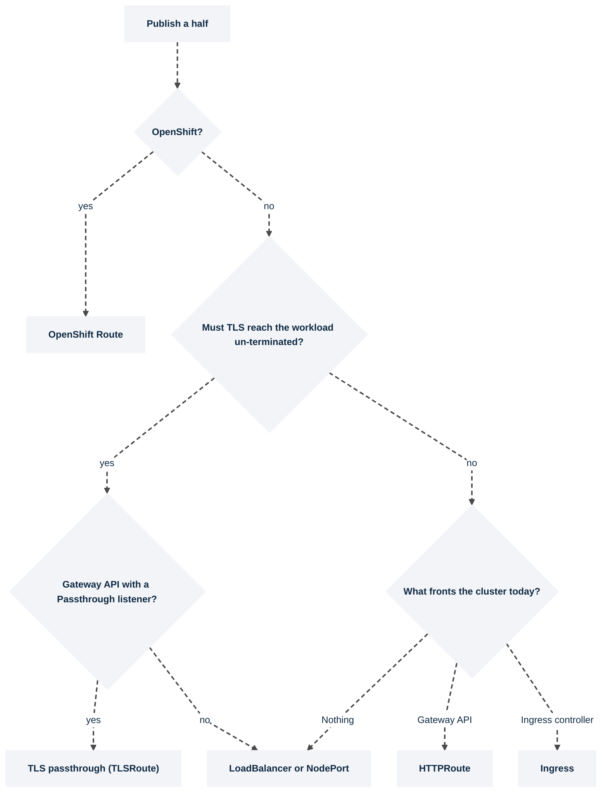

# Networking

> **Applies to:** both halves

The two halves are published **independently**, each with its own mechanism. Users log in to the
control plane. On the relayed default their browsers stay there, and the control plane's proxy
reaches the session proxy inside the cluster; on direct-connect their browsers stream the session
from the agent's own hostname. Pick exactly one mechanism per half from the table, then follow
that page. [Certificates](certificates.md) applies to all of them.

## Choosing a mechanism

| Mechanism | Control plane | Agent | TLS terminates at | Page |
| --------- | ------------- | ----- | ----------------- | ---- |
| Ingress | `kasm-helm.ingress.enabled` | `kasm-agent.agent.ingress.enabled` | the ingress controller | [Ingress](ingress.md) |
| Gateway API, terminating | `kasm-helm.httpRoute.enabled` | `kasm-agent.agent.httpRoute.enabled` | the Gateway | [Gateway API: HTTPRoute](gateway-api-httproute.md) |
| Gateway API, passthrough | `kasm-helm.tlsRoute.enabled` | `kasm-agent.agent.gatewayRoute.enabled` (operator-managed) or `agent.tlsRoute.enabled` | the workload | [Gateway API: TLS passthrough](gateway-api-passthrough.md) |
| OpenShift Route | `kasm-helm.route.enabled` | `kasm-agent.agent.route.enabled` | the router, or the workload with `passthrough` | [OpenShift Route](openshift-route.md) |
| Service, published directly | `kasm-helm.proxyService.type` | `kasm-agent.agent.sessionProxy.service.type` | the workload | [LoadBalancer and NodePort](loadbalancer-nodeport.md) |

> **Note.** On direct-connect every mechanism in the table streams sessions: the session proxy
> serves its own sessions locally and never loops back through the public address, so a front end
> that routes on SNI serves as well as one that routes on `Host`.
> [Switch sessions to direct-connect](direct-connect.md#why-this-is-needed) says how.

**Exactly one per half.** All of a half's options publish the same Service, so enabling two gives
one hostname two owners. `kasm-agent-instance` refuses to render more than one of `ingress`,
`httpRoute`, `route`, `tlsRoute` and `gatewayRoute`, and refuses `httpRoute` or `tlsRoute` with empty
`parentRefs`; `kasm-helm` has the same rule for its four proxy options, plus `LoadBalancer` and
`NodePort` exclusions.

**The control plane stays `ClusterIP` behind anything.** `kasm-helm.proxyService.type=LoadBalancer`
or `NodePort` alongside an Ingress, Route or Gateway API route is refused: it would be a second door
with a different certificate and different timeouts, and on k3s an outright collision with Traefik
on port 443. [LoadBalancer and NodePort](loadbalancer-nodeport.md) has the detail.

**On the relayed default the agent needs no mechanism at all** on one cluster: the control plane's
proxy reaches `<agent>-session-proxy.<ns>.svc.cluster.local:4444` directly. An agent in another
cluster on a relayed zone needs a mechanism that does no `Host` routing, so a published Service,
not an Ingress or HTTPRoute; TLS passthrough is unverified there, because the relay sends no SNI.
[Deployment topologies](../../explanation/topologies.md) explains the constraint;
[Switch sessions to direct-connect](direct-connect.md) is the other topology.

## The rest of networking

| Page | Task |
| ---- | ---- |
| [Certificates](certificates.md) | Which certificate each half needs, and where it comes from |
| [Switch sessions to direct-connect](direct-connect.md) | Hostname pair, authorization domain, zone routing |
| [Upstream auth (management) endpoint](upstream-auth.md) | A separate, typically private URL for agent and Windows-service management traffic |
| [Publish the RDP gateway](rdp-gateway.md) | Raw TCP, so never covered by the mechanisms above |
| [NetworkPolicy enforcement](network-policies.md) | The agent's namespace baseline, and proving the CNI enforces |
| [Egress installer: node prerequisites](egress.md) | Per-session VPN egress through a chained CNI shim |
| [Ports and hostnames](../../reference/ports-and-hostnames.md) | Every port and Service name in one table |
| [Troubleshooting](../../reference/troubleshooting.md) | Symptom, cause, command |

## Words used on these pages

| Term | In one line |
| ---- | ----------- |
| **IngressClass** | Names which ingress controller serves an Ingress. `kubectl get ingressclass` lists them; `agent.ingress.className` picks one. |
| **GatewayClass** | The Gateway API equivalent of an IngressClass: which implementation (Traefik, Envoy, Cilium) will implement a Gateway. |
| **Gateway** | A listening endpoint created from a GatewayClass, with an address and one or more listeners. |
| **listener** | One port, protocol and hostname on a Gateway, with a name. `sectionName` in a route points at one listener by that name. |
| **`parentRef`** | The pointer from a route (HTTPRoute, TLSRoute, TCPRoute) to the Gateway, and optionally the listener, that should serve it. |
| **SNI** | The hostname the browser sends in the clear at the start of a TLS handshake. It is the only thing a passthrough listener can route on. |
| **terminate** | The edge decrypts TLS, so the browser validates the edge's certificate and cleartext continues inside the cluster. |
| **passthrough** | The edge forwards the encrypted bytes untouched, so the browser validates the session proxy's certificate end to end. |
| **`externalTrafficPolicy`** | On a Service: `Cluster` (default) rewrites the client's source IP; `Local` preserves it but only routes through nodes that run a proxy pod. |
| **session proxy** | The nginx Deployment the operator creates next to the agent, named `<agent>-session-proxy`. It is what sessions stream through, on 4444 (HTTPS) and 4445 (HTTP). |
