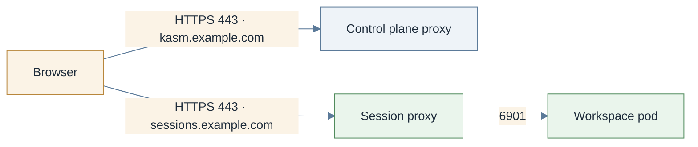

# Switch sessions to direct-connect

> **Applies to:** both halves

## Why this is needed

By default the control plane relays session traffic to the session proxy inside the cluster, and
browsers only ever talk to the control plane. Direct-connect has browsers stream from the agent's
own hostname instead: no relay hop, no 30-minute idle ceiling, and the agent scales on its own.
[Deployment topologies](../../explanation/topologies.md) weighs the two. This page is the switch.
Three things change together: the agent gets a public hostname, the login cookie is scoped to a
domain covering both hostnames, and the zone stops relaying.



## Before you start

- Two hostnames, **siblings under one parent domain**: `kasm.example.com`
  (`kasm-helm.publicAddr`) and `sessions.example.com` (`kasm-agent.agent.publicHostname`). They
  must differ, and the parent must be a registrable domain, not a public suffix. Changing them
  later means renaming a host, reissuing certificates and resetting the auth domain by hand.
- DNS for both, pointing at whatever fronts each half.
- One exposure mechanism for the session proxy from [Networking](../networking/README.md), with an
  idle timeout of 3600s or more on whatever fronts it
  ([Idle timeouts](loadbalancer-nodeport.md#idle-timeouts)).
- A certificate browsers trust for `sessions.example.com`, and `*.sessions.example.com` on
  passthrough and direct-Service paths: [Certificates](certificates.md). The self-signed default
  is shown to browsers on this topology.

```console
dig +short kasm.example.com
dig +short sessions.example.com
```

Both should print an address. An empty answer means there is nothing to debug on the Kubernetes
side yet.

## Steps

1. **Publish the session proxy at its hostname.** Set `kasm-agent.agent.publicHostname` and enable
   exactly one of `ingress`, `httpRoute`, `route`, `tlsRoute`, `gatewayRoute` or
   `sessionProxy.service.type`. The mechanism pages have the values; the umbrella example under
   [Chart values](#chart-values) uses Gateway API passthrough.

2. **Scope the login cookie to the shared parent domain.** Kasm issues its cookie for the
   Authorization Domain; if that is not a parent of both hostnames, the browser never sends it to
   the agent and every session connect returns 401.

   On a **fresh** control plane it is a value, applied at database initialization:

   ```yaml
   kasm-helm:
     kasmConfig:
       authDomain: example.com
   ```

   On an **existing** control plane the db-init Job no longer seeds anything. **Settings → Auth →
   Kasm Auth Domain** in the admin UI ([Kasm docs: Settings](https://www.kasmweb.com/docs/latest/guide/settings.html)), or three API calls: `POST /api/authenticate` for a token,
   `POST /api/admin/get_settings` to find the `setting_id` of `kasm_auth_domain`, then
   `POST /api/admin/update_setting` with `setting_id` and `value` as top-level keys.

3. **Switch the zone to direct connections.** Every zone carries a matched pair: `proxy_connections`
   (Kasm's default `true` relays) and `upstream_auth_address` (default `$request_host$`, which on
   direct-connect would make the session proxy validate sessions against itself).

   On a fresh control plane, preseed it:

   ```yaml
   kasm-helm:
     kasmConfig:
       generatePreseed: true
     kasmZones:
       - name: default
         proxy_hostname: kasm.example.com
         proxy_connections: false
         upstream_auth_address: kasm.example.com
   ```

   On an existing control plane: **Infrastructure → Zones → the zone the agent reports to ([Kasm docs: Deployment Zones](https://www.kasmweb.com/docs/latest/guide/zones/deployment_zones.html))
   (`agent.zone`, default `default`)**: *Proxy Connections* off, *Upstream Auth Address* set to
   `kasm.example.com`.

4. **Upgrade the release** and open a fresh private browser window; a cookie from before the
   change is scoped to the old domain and causes 401s that look like step 2 failed.

## The session proxy's two ports

The session proxy listens on **4444** (its own HTTPS listener, serving `agent.sessionProxy.certSecretName`)
and **4445** (plain HTTP, for use behind something that already terminated TLS).

| Exposure | Default backend port | Why |
| -------- | -------------------- | --- |
| `agent.httpRoute` | 4445 | TLS terminates at the Gateway |
| `agent.ingress` | 4445 | TLS terminates at the Ingress |
| `agent.tlsRoute` / `agent.gatewayRoute` | 4444 | passthrough; nothing decrypted it earlier |
| `agent.route` (OpenShift) | 4444 for `passthrough` and `reencrypt`, 4445 for `edge` | follows `route.tls.termination` |
| `agent.sessionProxy.service` | both published | point the load balancer at whichever suits |

Sending an Ingress or HTTPRoute to 4444 works if the controller is told to speak TLS upstream
(`nginx.ingress.kubernetes.io/backend-protocol: "HTTPS"` on ingress-nginx).

## Verify

```console
curl -k -sS -o /dev/null -w '%{http_code}\n' https://sessions.example.com/
openssl s_client -connect sessions.example.com:443 -servername sessions.example.com </dev/null 2>/dev/null \
  | openssl x509 -noout -subject -ext subjectAltName
```

Expected: the `curl` prints `404`, which is correct with no active session; a refused connection or
a timeout means the route or the Service is wrong. The certificate's SANs include
`sessions.example.com`; on a passthrough route it is the session proxy's own certificate, on
`httpRoute` and `ingress` it is the Gateway's or the controller's.

Then log in at `kasm.example.com` and launch a session. Expected: the address bar shows
**`sessions.example.com`**, and the session survives past 60 seconds, which proves the idle timeout
is raised.

## Chart values

Under the `kasm-platform` umbrella, both halves in one file, Gateway API passthrough on the agent:

```yaml
kasm-helm:
  publicAddr: kasm.example.com
  proxyService:
    type: ClusterIP
  ingress:
    enabled: true
    ingressClassName: traefik
  certificate:
    secretName: kasm-tls
  kasmConfig:
    generatePreseed: true
    authDomain: example.com
  kasmZones:
    - name: default
      proxy_hostname: kasm.example.com
      proxy_connections: false
      upstream_auth_address: kasm.example.com

kasm-agent:
  agent:
    publicHostname: sessions.example.com
    gatewayRoute:
      enabled: true
      parentRef:
        name: traefik-gateway
        namespace: kube-system
        sectionName: sessions-passthrough
    sessionProxy:
      certificate:
        enabled: true
        issuerRef:
          kind: ClusterIssuer
          name: letsencrypt-prod
        dnsNames:
          - sessions.example.com
          - "*.sessions.example.com"
```

Installing the charts directly, drop the `kasm-agent:` key (start at `agent:`) for `kasm-agent`
and the `kasm-helm:` key for `kasm-helm`.

## Troubleshooting

[Troubleshooting](../../reference/troubleshooting.md): a 401 on session connect is the cookie scope;
a 404 from the ingress is a zone still relaying; a session that dies after a minute is the idle
timeout.

## Decisions

- [ ] Two sibling hostnames under one registrable parent; DNS for both.
- [ ] Kasm Auth Domain set to that parent: `kasm-helm.kasmConfig.authDomain` on a fresh install, Settings → Auth on an existing one.
- [ ] Zone switched: `proxy_connections: false`, `upstream_auth_address` = the control plane hostname.
- [ ] Exactly one exposure mechanism on the agent; idle timeout raised on whatever fronts it.
- [ ] Session-proxy certificate publicly trusted, with the wildcard where browsers reach the proxy directly.
- [ ] A browser session connects on `sessions.example.com` and survives past 60 seconds.
