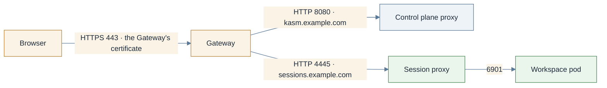

# Gateway API: HTTPRoute

> **Applies to:** both halves

## Why this is needed

A Gateway API implementation already fronts the cluster and TLS may terminate at the Gateway, on a
certificate the Gateway holds. `HTTPRoute` is the simplest Gateway API path and the only one that
gives HTTP-level routing and timeouts. The other two route kinds have their own pages:
[TLS passthrough](gateway-api-passthrough.md) and [the RDP gateway on a TCPRoute](gateway-api-tcproute.md).

| Route kind | TLS terminates at | Control plane | Agent | Standard channel since |
| ---------- | ----------------- | ------------- | ----- | ---------------------- |
| `HTTPRoute` | the Gateway | `kasm-helm.httpRoute.enabled` | `kasm-agent.agent.httpRoute.enabled` | 1.0 |
| `TLSRoute` | the workload (SNI passthrough) | `kasm-helm.tlsRoute.enabled` | `agent.gatewayRoute.enabled` or `agent.tlsRoute.enabled` | 1.5 |
| `TCPRoute` | none, raw TCP | `kasm-helm.tcpRoute.enabled` (RDP gateway) | none | 1.6 |



## Certificates live on the Gateway, not the route

An Ingress has a `tls:` block, so `kasm-helm.ingress.tls` wires `certificate.secretName` straight
into it. A Gateway API route has no such field: the certificate belongs to the Gateway's listener.
The chart still mints the Secret (`certificate.certManager`, or one you create), but you reference
it yourself:

```yaml
listeners:
  - name: kasm
    protocol: HTTPS
    port: 443
    hostname: kasm.example.com
    tls:
      mode: Terminate
      certificateRefs:
        - name: kasm-tls          # the Secret this chart minted
```

When the Gateway is in a different namespace from the Secret, that reference needs a
`ReferenceGrant` in the Secret's namespace. Only `parentRefs` cross namespaces in the routes the
charts render; `backendRefs` stay local and need no grant.

## Before you start

These checks serve all three Gateway API pages; the other two link here.

1. **The CRDs are present, and which bundle version.** The version decides which route kinds
   exist at all:

   ```console
   kubectl get crd gateways.gateway.networking.k8s.io \
       -o jsonpath='{.metadata.annotations.gateway\.networking\.k8s\.io/bundle-version}{"\n"}'
   ```

   Expected: something like `v1.5.1`. `NotFound` means the Gateway API is not installed; use
   [Ingress](ingress.md) or install the CRDs. `kubectl get crd -o name | grep gateway.networking.k8s.io`
   lists the kinds; no `tcproutes` means the bundle predates 1.6.

2. **A Gateway exists and is programmed:**

   ```console
   kubectl get gateway -A
   ```

   Expected: at least one row with `PROGRAMMED True` and an `ADDRESS`.

3. **Its listeners.** The listener, not the route, decides what is possible:

   ```console
   kubectl -n kube-system get gateway traefik-gateway \
       -o jsonpath='{range .spec.listeners[*]}{.name}{"  "}{.protocol}{"  "}{.port}{"  "}{.hostname}{"  "}{.tls.mode}{"\n"}{end}'
   ```

   Expected, for this page: a line like `websecure  HTTPS  8443  sessions.example.com  Terminate`.
   Note the listener's **name**; it is the `sectionName` to pin a route to. The port shown is the
   Gateway's own backend port; what users hit outside can be 443 in front of it.

4. **The listener admits routes from the release namespaces:**

   ```console
   kubectl -n kube-system get gateway traefik-gateway -o yaml | grep -A6 allowedRoutes
   ```

   Expected: `from: All`, or a `Selector` matching the namespaces' `kubernetes.io/metadata.name`
   label. This is the single most common reason a route is rejected, and with two namespaces both
   have to be admitted.

5. **The Gateway holds a certificate for each hostname** (`certificateRefs` on the listener, and the
   Secret it names exists), or cert-manager to produce it: [Certificates](certificates.md).

6. **An idle timeout of 3600s or more on the Gateway's data plane.** There is no Kasm value for
   this; [Idle timeouts](loadbalancer-nodeport.md#idle-timeouts).

> **Note.** On k3s the bundled Traefik's Gateway provider is off by default. Enable it with a
> `HelmChartConfig` in `kube-system` (k3s reconciles it):
>
> ```yaml
> apiVersion: helm.cattle.io/v1
> kind: HelmChartConfig
> metadata:
>   name: traefik
>   namespace: kube-system
> spec:
>   valuesContent: |-
>     providers:
>       kubernetesGateway:
>         enabled: true
>     gateway:
>       enabled: true
>       listeners:
>         websecure:
>           port: 8443              # Traefik's backend port; :443 on the node DNATs to it
>           protocol: HTTPS
>           hostname: sessions.example.com
>           namespacePolicy: All    # must admit the agent namespace
>           certificateRefs:
>             - name: kasm-agent-public-tls
> ```
>
> This is the shape verified with Traefik 3.7 on k3s; check `helm show values traefik/traefik` against
> your Traefik version. One Gateway that did not work: on Cilium 1.20 / kubeadm 1.34 the
> host-network Cilium Gateway reported `Accepted` and `Programmed` and never served traffic. Curl
> the public hostname before trusting status conditions.

## Steps

1. **Control plane.** `proxyService.type` must be `ClusterIP`; the Gateway owns the external
   address.

   ```yaml
   kasm-helm:
     publicAddr: kasm.example.com
     proxyService:
       type: ClusterIP
     httpRoute:
       enabled: true
       backendProtocol: http    # http -> proxy :8080, https -> proxy :8443
       parentRefs:
         - name: kasm-gateway
           namespace: kube-system
   ```

   With `kasmZones` set, the chart renders one `HTTPRoute` per zone plus one for `publicAddr`: an
   HTTPRoute's hostnames belong to the object, so they cannot be fanned out inside one route the way
   Ingress rules can.

2. **Agent, direct-connect only.**

   ```yaml
   kasm-agent:
     agent:
       publicHostname: sessions.example.com
       httpRoute:
         enabled: true
         parentRefs:
           - name: traefik-gateway
             namespace: kube-system
   ```

   `httpRoute.hostnames` defaults to `[publicHostname]`; `httpRoute.backendPort` defaults to 4445,
   the proxy's plain-HTTP listener. Add `sectionName` under `parentRefs` to pin the route to one
   listener. Then finish [Switch sessions to direct-connect](direct-connect.md).

3. **Install or upgrade.**

   ```console
   helm upgrade --install kasm oci://registry-1.docker.io/kasmweb/kasm-platform \
     -n kasm --create-namespace -f values.yaml
   ```

## Verify

```console
kubectl -n kasm get httproute
kubectl -n kasm get httproute kasm-proxy \
    -o jsonpath='{range .status.parents[*]}{.parentRef.name}{" "}{range .conditions[*]}{.type}={.status}{" "}{end}{"\n"}{end}'
```

Expected:

```text
NAME         HOSTNAMES              AGE
kasm-proxy   ["kasm.example.com"]   4m
kasm-gateway Accepted=True ResolvedRefs=True
```

`Accepted=False` is almost always the listener refusing the namespace; `ResolvedRefs=False` is a
backend that does not exist, usually a zone-name mismatch. On direct-connect, run the same against
the agent's route in its namespace, then:

```console
kubectl -n kasm-agent get svc k8s-agent-session-proxy
curl -kI https://sessions.example.com/
```

Expected: a `ClusterIP` Service carrying 4444 and 4445 (created by the operator, named after
`agent.name`), and an HTTP status line, `404` being correct with no active session. A certificate
error means the Gateway serves the wrong certificate for this hostname. Then log in, launch a
session and confirm it survives past 60 seconds.

## Chart values

```yaml
kasm-helm:
  publicAddr: kasm.example.com
  proxyService:
    type: ClusterIP
  httpRoute:
    enabled: true
    backendProtocol: http
    parentRefs:
      - name: kasm-gateway
        namespace: kube-system
  certificate:
    secretName: kasm-tls            # referenced from the Gateway listener, not from the route

kasm-agent:                          # direct-connect only
  agent:
    publicHostname: sessions.example.com
    httpRoute:
      enabled: true
      parentRefs:
        - name: traefik-gateway
          namespace: kube-system
```

Installing the charts directly, drop the `kasm-helm:` and `kasm-agent:` keys.

## Troubleshooting

[Troubleshooting](../../reference/troubleshooting.md).

## Decisions

- [ ] Gateway API bundle version known; `HTTPRoute` is standard since 1.0.
- [ ] A terminating HTTPS listener per hostname, holding its certificate, admitting every release namespace.
- [ ] `kasm-helm.proxyService.type=ClusterIP`.
- [ ] Idle timeout raised on the Gateway's data plane.
- [ ] Multi-zone: one route per zone rendered, each hostname on a listener.
- [ ] Direct-connect: the agent route present and the switch completed; relayed: no agent route.
