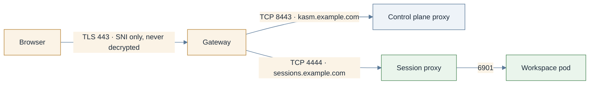

# Gateway API: TLS passthrough (TLSRoute)

> **Applies to:** both halves

## Why this is needed

End-to-end TLS: nothing on shared cluster infrastructure decrypts session traffic, and the browser
validates the session proxy's own certificate. The Gateway reads only the SNI. Prefer
`kasm-agent.agent.gatewayRoute` (the operator creates and reconciles the route) and fall back to
`agent.tlsRoute` (the Helm release owns it) only for operator builds that lack the field. The
control plane can pass through too, with `kasm-helm.tlsRoute`.



## Before you start

The Gateway API checks in [Gateway API: HTTPRoute, Before you start](gateway-api-httproute.md#before-you-start)
apply. On top of them:

1. **Gateway API 1.5 or newer**, so `TLSRoute` is in the standard channel as `v1` (Kubernetes 1.31+).
   Older bundles carry it as experimental `v1alpha2`; the chart picks the version the cluster
   serves, and `v1` when rendering offline. Set `agent.tlsRoute.apiVersion` to override. On the
   `gatewayRoute` path the operator creates the route, always as `v1`.

   ```console
   kubectl api-resources --api-group=gateway.networking.k8s.io | grep -i tlsroute
   ```

   Expected: a row ending `gateway.networking.k8s.io/v1 ... TLSRoute`. No row means the CRD is not
   installed and this path cannot work.

2. **A `Passthrough` listener.** A terminating HTTPS listener will not serve a `TLSRoute`; sessions
   fail at the handshake with no useful error on either side. Expected from the listener check:
   `sessions-passthrough  TLS  8443  sessions.example.com  Passthrough`. The listener verified with
   Traefik 3.7 and Gateway API 1.5.1, sharing port 8443 with the terminated listener
   because the hostnames differ:

   ```yaml
   - name: sessions-passthrough
     port: 8443
     protocol: TLS
     hostname: sessions.example.com
     tls:
       mode: Passthrough
     allowedRoutes:
       namespaces:
         from: Selector
         selector:
           matchExpressions:
             - {key: kubernetes.io/metadata.name, operator: In, values: [kasm, kasm-agent]}
   ```

   Validate a listener on the live Gateway before moving it into chart values: with Traefik's chart, the
   identical listener declared through Traefik's chart values made the chart's upgrade job fail and
   briefly removed the Gateway, while patching the live Gateway programmed it immediately.

3. **A publicly trusted certificate for the session proxy**, covering the hostname and its wildcard,
   because the browser sees it directly: [Certificates](certificates.md).

4. **An L4 idle timeout of 3600s or more** on the Gateway and anything in front. There is no HTTP
   knob on a passthrough path; [Idle timeouts](loadbalancer-nodeport.md#idle-timeouts).

## Steps

1. **Control plane, optional.** Pass through to the proxy's own HTTPS listener when TLS must not
   terminate on shared infrastructure; otherwise keep [HTTPRoute](gateway-api-httproute.md).

   ```yaml
   kasm-helm:
     proxyService:
       type: ClusterIP
     tlsRoute:
       enabled: true
       parentRefs:
         - name: kasm-gateway
           namespace: kube-system
           sectionName: kasm-passthrough
   ```

   `httpRoute`, `tlsRoute`, `ingress` and `route` are alternatives; enable at most one.

2. **Agent.** `gatewayRoute.parentRef` is a **single** reference; `tlsRoute.parentRefs` is a **list**.

   ```yaml
   kasm-agent:
     agent:
       publicHostname: sessions.example.com
       gatewayRoute:
         enabled: true
         parentRef:
           name: traefik-gateway
           namespace: kube-system
           sectionName: sessions-passthrough
       sessionProxy:
         certificate:
           enabled: true
           issuerRef:
             kind: ClusterIssuer
             name: letsencrypt-prod
           dnsNames:
             - sessions.example.com
             - "*.sessions.example.com"
   ```

   The chart-managed alternative swaps the `gatewayRoute` block for:

   ```yaml
       tlsRoute:
         enabled: true
         parentRefs:
           - name: traefik-gateway
             namespace: kube-system
             sectionName: sessions-passthrough
   ```

   `gatewayRoute.hostnames` is defaulted by the operator to `[publicHostname]`, `tlsRoute.hostnames`
   by the chart to the same; the session proxy's certificate must cover whatever is in force. The
   backend port is 4444 on both. On a **relayed** zone this page works as an agent's exposure toward
   a control plane in another cluster (SNI routing needs no `Host` header); on direct-connect, finish
   [Switch sessions to direct-connect](direct-connect.md).

3. **Install or upgrade.**

   ```console
   helm upgrade --install kasm oci://registry-1.docker.io/kasmweb/kasm-platform \
     -n kasm --create-namespace -f values.yaml
   ```

## Verify

```console
kubectl -n kasm-agent get tlsroute
kubectl -n kasm-agent get agent k8s-agent -o jsonpath='{range .status.conditions[*]}{.type}={.status}  {.reason}{"\n"}{end}'
```

Expected: a `TLSRoute` exists, and the Agent reports `Available=True` and `Degraded=False`. On the
`gatewayRoute` path `Degraded=False` carries the reason `GatewayRouteUsable`; a failure shows as
`GatewayRouteAccepted=False` or `Degraded=True` with `TLSRouteForbidden`. With `agent.tlsRoute` the
route is a Helm object, so check its own status instead:

```console
kubectl -n kasm-agent get tlsroute -o jsonpath='{range .items[*]}{.metadata.name}{"\n"}{range .status.parents[*].conditions[*]}  {.type}={.status} {.reason}{"\n"}{end}{end}'
```

Expected: `Accepted=True` and `ResolvedRefs=True`. Then prove it is passthrough: the browser must
get the session proxy's certificate, not the Gateway's. The two fingerprints must match:

```console
kubectl -n kasm-agent get secret kasm-session-proxy-tls -o jsonpath='{.data.tls\.crt}' \
  | base64 -d | openssl x509 -noout -fingerprint -sha256
echo | openssl s_client -servername sessions.example.com -connect sessions.example.com:443 2>/dev/null \
  | openssl x509 -noout -fingerprint -sha256
```

`curl -kI https://sessions.example.com/` prints a status line, `404` being correct with no session.

## Chart values

```yaml
kasm-helm:
  publicAddr: kasm.example.com
  proxyService:
    type: ClusterIP
  httpRoute:                         # or tlsRoute, as in step 1
    enabled: true
    parentRefs:
      - name: traefik-gateway
        namespace: kube-system

kasm-agent:
  agent:
    publicHostname: sessions.example.com
    gatewayRoute:
      enabled: true
      parentRef:
        name: traefik-gateway
        namespace: kube-system
        sectionName: sessions-passthrough
    sessionProxy:
      certificate:
        enabled: true
        issuerRef:
          kind: ClusterIssuer
          name: letsencrypt-prod
        dnsNames:
          - sessions.example.com
          - "*.sessions.example.com"
```

Installing the charts directly, drop the `kasm-helm:` and `kasm-agent:` keys.

## Troubleshooting

[Troubleshooting](../../reference/troubleshooting.md) covers `TLSRouteForbidden`, the
`v1alpha2` version error, and the certificate warning.

## Decisions

- [ ] Gateway API 1.5+; `TLSRoute` served as `v1`.
- [ ] A `protocol: TLS`, `tls.mode: Passthrough` listener carrying the hostname and admitting the release namespaces.
- [ ] `gatewayRoute` (operator-managed) chosen; `tlsRoute` only for older operator builds.
- [ ] Session-proxy certificate publicly trusted, covering the hostname and `*.<hostname>`.
- [ ] L4 idle timeout raised on the Gateway and anything in front.
- [ ] Fingerprint check passed: the browser gets the session proxy's certificate.
