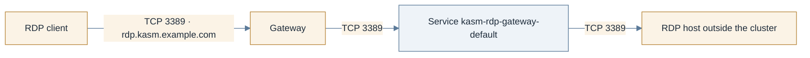

# Gateway API: the RDP gateway (TCPRoute)

> **Applies to:** control plane

## Why this is needed

`components.rdpGateway` speaks raw RDP on 3389, so it needs a `TCPRoute`: standard-channel `v1`
since Gateway API **1.6**, deprecated as `v1alpha2` from that release on. This is the Gateway API
alternative to `directRdpService`; [Publish the RDP gateway](rdp-gateway.md) compares the two.
Being in the CRD bundle is not the same as the data plane implementing it: the failure mode is a
route that reports `Accepted=True` and carries no traffic.



## Before you start

- The Gateway API checks in [Gateway API: HTTPRoute, Before you start](gateway-api-httproute.md#before-you-start),
  with the bundle at 1.6 or newer and `tcproutes` in the CRD list.
- A `protocol: TCP` listener on the Gateway, admitting the control plane's namespace:

  ```yaml
  listeners:
    - name: rdp
      protocol: TCP
      port: 3389
      allowedRoutes:
        namespaces:
          from: Selector
          selector:
            matchLabels:
              kubernetes.io/metadata.name: kasm
  ```

- Confirmation from your Gateway implementation's documentation that it serves TCPRoute.
- `kasm-helm.directRdpService.enabled` left `false`: the gateway Service stays `ClusterIP` while the
  Gateway fronts it, and enabling both is refused.

## Steps

1. **Single zone.**

   ```yaml
   kasm-helm:
     components:
       rdpGateway:
         enabled: true
     tcpRoute:
       enabled: true
       rdpAccessURL: rdp.kasm.example.com
       parentRefs:
         - name: kasm-gateway
           namespace: kube-system
           sectionName: rdp
   ```

   `rdpAccessURL` is required: a TCPRoute carries no hostname, so the gateway cannot infer the name
   it serves under the way an HTTP route's backend can.

2. **Multi-zone needs a listener per zone.** A `TCPRoute` matches on neither hostname nor SNI, so
   where an `HTTPRoute` multiplexes every zone onto one listener, each primary-region zone's RDP
   gateway needs a listener of its own, selected with `parentRefs[].sectionName`:

   ```yaml
   kasm-helm:
     tcpRoute:
       enabled: true
       rdpAccessURL: rdp.kasm.example.com
       zones:
         - name: zonea
           parentRefs:
             - name: kasm-gateway
               namespace: kube-system
               sectionName: rdp-zonea      # listener on :3389
         - name: zoneb
           parentRefs:
             - name: kasm-gateway
               namespace: kube-system
               sectionName: rdp-zoneb      # listener on :3390
   ```

   Only zones in the **primary region** get an RDP gateway, so a `kasmZones` list whose zones sit in
   different regions may still need one entry. The chart fails the render naming any primary-region
   zone left out:

   ```text
   Error: execution error at (kasm-helm/templates/validation.yaml:8:4): tcpRoute.zones has no
   entry for zone(s) zonea, zoneb. A TCPRoute matches on neither hostname nor SNI, so the zones
   cannot share one Gateway listener: give every zone its own entry, using
   parentRefs[].sectionName to select that zone's listener.
   ```

3. **Upgrade the release** and point DNS for `rdpAccessURL` at the Gateway's address.

## Verify

```console
kubectl -n kasm get tcproute
kubectl -n kasm get tcproute kasm-rdp-gateway-default \
    -o jsonpath='{range .status.parents[*]}{.parentRef.sectionName}{" "}{range .conditions[*]}{.type}={.status}{" "}{end}{"\n"}{end}'
```

Expected:

```text
NAME                       AGE
kasm-rdp-gateway-default   2m
rdp Accepted=True ResolvedRefs=True
```

Then prove traffic flows, because the status alone does not: `nc -vz rdp.kasm.example.com 3389`
prints `succeeded`, and a native RDP client connects through Kasm.

## Chart values

```yaml
kasm-helm:
  components:
    rdpGateway:
      enabled: true
  directRdpService:
    enabled: false
  tcpRoute:
    enabled: true
    rdpAccessURL: rdp.kasm.example.com
    parentRefs:
      - name: kasm-gateway
        namespace: kube-system
        sectionName: rdp
```

Installing `kasm-helm` directly, drop the `kasm-helm:` key.

## Troubleshooting

[Troubleshooting](../../reference/troubleshooting.md). Specific to this page: `Accepted=True` with
no traffic means the implementation does not serve TCPRoute; use `directRdpService` instead.

## Decisions

- [ ] Gateway API 1.6+, `tcproutes` in the CRD list, and the implementation proven to serve it.
- [ ] One `protocol: TCP` listener per primary-region zone, admitting the control plane's namespace.
- [ ] `rdpAccessURL` set; DNS pointing at the Gateway.
- [ ] `directRdpService.enabled` left `false`.
- [ ] A native RDP client connected end to end.
