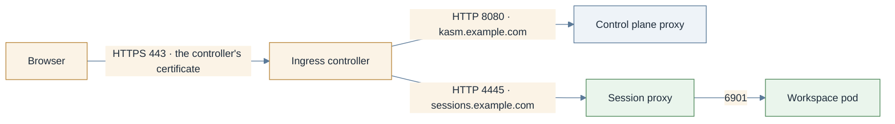

# Ingress

> **Applies to:** both halves

## Why this is needed

The classic path: a `networking.k8s.io/v1` Ingress on an existing controller terminates TLS and
forwards plain HTTP to the workload. It is available for both halves, and the only mechanism where
the control plane's certificate is wired in by the chart itself. On direct-connect it is the
mechanism verified end to end (Traefik 3.7 on k3s): the controller routes by `Host` header, so the
session proxy's own hairpin lands back on it, which the SNI-routed Gateway paths cannot do today
([Switch sessions to direct-connect](direct-connect.md#why-this-is-needed)). It cannot carry the
RDP gateway, which is raw TCP: [Publish the RDP gateway](rdp-gateway.md).



## Before you start

- An ingress controller with a class name to put in `ingressClassName` / `className`:

  ```console
  kubectl get ingressclass
  ```

  Expected: at least one row, for example `nginx  k8s.io/ingress-nginx` or
  `traefik  traefik.io/ingress-controller`. A row marked `(default)` is used when the class is left
  empty; naming it is safer.

- The controller has an address users can reach:

  ```console
  kubectl get svc -A | grep LoadBalancer
  ```

  Expected: the controller's Service shows a real `EXTERNAL-IP`, not `<pending>`. On bare metal
  with no load-balancer implementation, the controller usually uses host ports instead.

- A TLS Secret for each hostname, or cert-manager: [Certificates](certificates.md). With
  cert-manager installed, the annotation `cert-manager.io/cluster-issuer: <issuer>` on the Ingress
  makes ingress-shim create the Secret named in its `tls` block.
- A WebSocket idle timeout of 3600s or more on the controller. ingress-nginx defaults to 60s and
  cuts a session about a minute in; the annotation is in the table at
  [Idle timeouts](loadbalancer-nodeport.md#idle-timeouts).
- The agent half only needs this page on direct-connect. On the relayed default the control
  plane's proxy reaches the session proxy in-cluster and no agent Ingress exists.

## Steps

1. **Control plane.** `proxyService.type` must be `ClusterIP`: the controller owns the external
   address, and the chart refuses `LoadBalancer` or `NodePort` beside an Ingress.

   ```yaml
   kasm-helm:
     publicAddr: kasm.example.com
     proxyService:
       type: ClusterIP
     ingress:
       enabled: true
       ingressClassName: nginx
       tls: true                # wires certificate.secretName into the Ingress
       backendProtocol: http    # http -> proxy :8080, https -> proxy :8443
     certificate:
       secretName: kasm-tls
   ```

   With `kasmZones` set, the chart renders one rule per zone plus a rule for `publicAddr` pointing
   at the primary zone's Service, all on one Ingress; the TLS block lists every zone hostname. The
   backend Services are named `<release>-proxy-<zone>`, so a release called `kasm` with the default
   zone gives `kasm-proxy-default`.

2. **Agent, direct-connect only.**

   ```yaml
   kasm-agent:
     agent:
       publicHostname: sessions.example.com
       ingress:
         enabled: true
         className: nginx
         annotations:
           nginx.ingress.kubernetes.io/proxy-read-timeout: "3600"
           nginx.ingress.kubernetes.io/proxy-send-timeout: "3600"
           cert-manager.io/cluster-issuer: letsencrypt-prod
         tls:
           - secretName: kasm-agent-public-tls
             hosts:
               - sessions.example.com
   ```

   `ingress.hosts` defaults to `[publicHostname]`; `ingress.backendPort` defaults to 4445, the
   proxy's plain-HTTP listener, which is the right pairing when TLS terminates at the controller.
   Then finish [Switch sessions to direct-connect](direct-connect.md).

3. **Install or upgrade.**

   ```console
   helm upgrade --install kasm oci://registry-1.docker.io/kasmweb/kasm-platform \
     -n kasm --create-namespace -f values.yaml
   ```

## Verify

```console
kubectl -n kasm get ingress
```

Expected: two rows, `kasm-proxy` for the control plane and
`<release>-kasm-agent-instance-session-proxy` for the agent on direct-connect, each showing your
`CLASS`, your `HOSTS` and an `ADDRESS`. An empty `ADDRESS` means no controller claimed it, usually
a wrong class name. The agent Ingress points at `k8s-agent-session-proxy:4445`.

```console
kubectl -n kasm get ingress kasm-proxy \
    -o jsonpath='{range .spec.rules[*]}{.host}{" -> "}{.http.paths[0].backend.service.name}{":"}{.http.paths[0].backend.service.port.number}{"\n"}{end}'
```

Expected: `kasm.example.com -> kasm-proxy-default:8080`.

```console
curl -kI https://kasm.example.com/
curl -kI https://sessions.example.com/      # direct-connect only
```

Expected: an HTTP status line from each. `404` from the session hostname is correct with no active
session. Drop `-k` once the certificate is real; it should validate against the controller's
certificate. Then log in and launch a session; on direct-connect it must survive past 60 seconds,
which proves the timeout annotations took.

## Chart values

```yaml
kasm-helm:
  publicAddr: kasm.example.com
  proxyService:
    type: ClusterIP
  ingress:
    enabled: true
    ingressClassName: nginx
    tls: true
    backendProtocol: http
  certificate:
    secretName: kasm-tls

kasm-agent:                          # direct-connect only
  agent:
    publicHostname: sessions.example.com
    ingress:
      enabled: true
      className: nginx
      annotations:
        nginx.ingress.kubernetes.io/proxy-read-timeout: "3600"
        nginx.ingress.kubernetes.io/proxy-send-timeout: "3600"
      tls:
        - secretName: kasm-agent-public-tls
          hosts:
            - sessions.example.com
```

Installing the charts directly, drop the `kasm-helm:` and `kasm-agent:` keys.

## Troubleshooting

[Troubleshooting](../../reference/troubleshooting.md).

## Decisions

- [ ] IngressClass named explicitly on both halves.
- [ ] `kasm-helm.proxyService.type=ClusterIP`.
- [ ] Certificates settled per half; `ingress.tls: true` on the control plane.
- [ ] Idle timeout raised to 3600s on the controller (annotation on the agent Ingress).
- [ ] Multi-zone: the TLS Secret covers every zone hostname.
- [ ] Direct-connect: the agent Ingress present and the switch completed; relayed: no agent Ingress.
