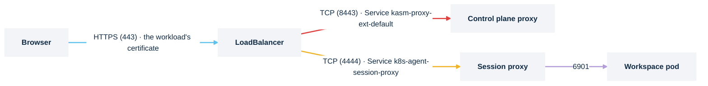

# LoadBalancer and NodePort

> **Applies to:** both halves

## Why this is needed

No ingress controller, no Gateway, no router: the Service is the external address, and TLS
terminates on the workload itself. This is the `kasm-platform` default for the control plane
(`kasm-helm.proxyService.type: LoadBalancer`), the one option that needs neither an ingress
controller nor a load-balancer provider (`NodePort`), and the common way to publish an agent on a
relayed zone from another cluster, because a Service does no `Host` routing.



## Before you start

- For `LoadBalancer`: a controller that provisions one (a cloud provider, MetalLB, the ServiceLB
  that ships with k3s and k3d, or `cloud-provider-kind` for kind). Without one the Service sits at
  `<pending>` forever:

  ```console
  kubectl get svc -A | grep LoadBalancer
  ```

  Expected: existing LoadBalancer Services show real addresses in `EXTERNAL-IP`. MetalLB's
  speaker skips nodes carrying `node.kubernetes.io/exclude-from-external-load-balancers`, which
  kubeadm puts on control-plane nodes: on a single-node or control-plane-only cluster the address
  is allocated and never announced until `speaker.ignoreExcludeLB=true` is set (MetalLB 0.16).
- The session proxy listens on 4444 (HTTPS) and 4445 (HTTP), and a Service publishes those same
  ports unless `agent.sessionProxy.service.httpsPort` and `httpPort` name others. `httpsPort: 443`
  makes a `LoadBalancer` present 443 while the container keeps listening on 4444, so neither
  `publicPort` nor the zone's port has to move.

- For `NodePort`: a port in 30000 to 32767 open on every node the load balancer or DNS points at,
  and a node address clients can reach (`kubectl get nodes -o wide`). A VM host that only forwards
  443 refuses the connection before Kubernetes sees it.
- An L4 idle timeout of 3600s or more on whatever fronts the Service; see
  [Idle timeouts](#idle-timeouts). An AWS NLB defaults to 350s.
- Certificates: the workload's own is what browsers see. The control plane's is
  `kasm-helm.certificate.secretName` or the self-signed default; the session proxy's is
  `kasm-agent.agent.sessionProxy.certSecretName` (`kasm-session-proxy-tls`), self-signed unless you
  pre-create it or enable `sessionProxy.certificate`. On direct-connect the session proxy's must be
  publicly trusted; on the relayed default browsers never see it. [Certificates](certificates.md).

> **Note.** On k3s, Traefik already holds `:443` on every node through ServiceLB. The default
> `proxyService.type=LoadBalancer` asks for the same port, so its ServiceLB pods never schedule and
> the Service stays `<pending>` while the release looks healthy. Use `NodePort`, or publish through
> Traefik with an [Ingress](ingress.md).

## Steps

1. **Control plane, `LoadBalancer`.** The chart renders a second, externally typed Service
   `<release>-proxy-ext-<zone>` publishing 443 onto the proxy's HTTPS listener; the in-cluster
   `<release>-proxy-<zone>` stays as it is.

   ```yaml
   kasm-helm:
     publicAddr: kasm.example.com
     proxyService:
       type: LoadBalancer
       annotations:
         service.beta.kubernetes.io/aws-load-balancer-type: nlb
   ```

   Two combinations the chart refuses: `LoadBalancer` or `NodePort` **with** an Ingress, Route or
   Gateway API route (a second door with a different certificate and timeouts, and on k3s a port
   collision), and either **with** `kasmZones` (one address cannot route by hostname; multi-zone
   needs a front end).

2. **Control plane, `NodePort`.** Kubernetes assigns a port from 30000 to 32767 unless you pin one.

   ```yaml
   kasm-helm:
     proxyService:
       type: NodePort
       nodePort: 31443          # optional; omit to let Kubernetes choose
   ```

   > **Warning.** Kasm builds session URLs from the zone's `proxy_port`, not from this Service.
   > Publish on 32010 while the zone still says 443 and users log in, then every session sends the
   > browser to `https://<host>:443/…` where nothing listens. Set `kasm-helm.kasmZones[].proxy_port`
   > to the node port (preseed, so at database initialization) or change **Proxy Port** under
   > Infrastructure → Zones on a running deployment.

3. **Agent.** Two ports, two audiences. `agent.publicPort` is the port the **manager and API** use
   to reach the session proxy (the hello and create calls for every launch); it must be the port
   the Service actually exposes, and it is derived to 4444 only while `publicHostname` is left
   empty, 443 otherwise. Browsers, on direct-connect,
   are sent to `publicHostname` on the **zone's `proxy_port`**, which Kasm reads from the zone
   record and never from `publicPort`. Both default to 443, so publish the session proxy on 443
   and neither needs setting: on a `LoadBalancer`, `sessionProxy.service.httpsPort: 443` maps the
   Service's 443 onto the proxy's 4444 listener (`httpPort: 80` does the same for the plain 4445
   one). A NodePort cannot sit on 443, so there both have to name the node port: `publicPort` in
   values, and the zone's *Proxy Port* as `kasm-helm.kasmZones[].proxy_port` at database
   initialization or **Infrastructure → Zones** on a running deployment
   ([Kasm docs: Deployment Zones](https://www.kasmweb.com/docs/latest/guide/zones/deployment_zones.html)).
   Verified on Kasm 1.19: with `publicPort: 30443` and the zone at 443, the API reached the agent
   on 30443 and the browser was sent to `:443`. On the relayed default the zone's `proxy_port` is
   the control plane's published port instead, and `publicPort` is the only port that matters for
   the agent.

   LoadBalancer:

   ```yaml
   kasm-agent:
     agent:
       publicHostname: sessions.example.com   # publicPort stays at its default, 443
       sessionProxy:
         service:
           type: LoadBalancer
           httpsPort: 443                     # the Service's 443 onto the proxy's 4444 listener
           externalTrafficPolicy: Local
   ```

   The port fields are part of the `Agent` resource the chart renders, so the Service change
   rolls through the operator. Left empty, `httpsPort` keeps the Service on the proxy's own
   4444, and `publicPort` and the zone's Proxy Port would both have to follow it there.

   NodePort with a pinned port:

   ```yaml
   kasm-agent:
     agent:
       publicHostname: sessions.example.com
       publicPort: 30443
       sessionProxy:
         service:
           type: NodePort
           httpsNodePort: 30443
   ```

   `httpsNodePort` pins the proxy's HTTPS listener (4444); `httpNodePort` pins the plain-HTTP one
   (4445) for when TLS is terminated in front. Both stay stable across reconciles even unpinned.
   On direct-connect, set the zone's Proxy Port to 30443 and finish
   [Switch sessions to direct-connect](direct-connect.md). The step-2 warning applies to the
   agent the same way: a zone has one `proxy_port`, so on direct-connect the sessions' port is
   the one it has to carry.

4. **Install or upgrade**, then point DNS at the address the Service gets.

## Verify

```console
kubectl -n kasm get svc kasm-proxy-ext-default
```

Expected:

```text
NAME                     TYPE           CLUSTER-IP     EXTERNAL-IP    PORT(S)         AGE
kasm-proxy-ext-default   LoadBalancer   10.43.10.201   10.0.0.42      443:31856/TCP   2m
```

or, for `NodePort`, `TYPE NodePort` with `443:32010/TCP`. `EXTERNAL-IP` stuck at `<pending>` means
no load-balancer controller.

```console
curl -sk -o /dev/null -w '%{http_code}\n' https://<address>/
kubectl -n kasm-agent get svc k8s-agent-session-proxy
curl -kI https://sessions.example.com/           # :30443 on the NodePort example
```

Expected: `200` from the control plane; the session-proxy Service with a real `EXTERNAL-IP` and
`443:<nodeport>/TCP,4445:<nodeport>/TCP` (`80:<nodeport>/TCP` beside it with `httpPort: 80`), or
`4444:30443/TCP,4445:<nodeport>/TCP` on the NodePort example; an HTTP status line from the session
hostname on that port, `404` being correct with no session, served
with the session proxy's own certificate. Run the `curl` from **outside** the cluster, on the
network path a user will be on: a NodePort that answers from a node and refuses from a laptop is
a firewall problem. On direct-connect, launch a session and read the port in the address bar: it
is the zone's `proxy_port`, and it must be the one that answered above. The session-proxy access
log then shows only the browser's `/desktop/<id>/...` requests, `200`; the session proxy serves
its own sessions locally, so no `/container/<id>/...` request follows.

## Chart values

```yaml
kasm-helm:
  publicAddr: kasm.example.com
  proxyService:
    type: LoadBalancer           # or NodePort, with nodePort: 31443

kasm-agent:
  agent:
    publicHostname: sessions.example.com
    sessionProxy:
      service:
        type: LoadBalancer       # or NodePort, with httpsNodePort: 30443 and publicPort: 30443
        httpsPort: 443           # LoadBalancer: the Service's 443 onto the proxy's 4444 listener
        externalTrafficPolicy: Local
```

With `httpsPort: 443`, `agent.publicPort` and the zone's `proxy_port` stay at their default of 443.
On a NodePort both carry the node port instead, the zone's on direct-connect only.

Installing the charts directly, drop the `kasm-helm:` and `kasm-agent:` keys.

## Preserving real client IPs

Optional. Two mechanisms, for two kinds of front. A load balancer that preserves the source
address needs only the Service value:

```yaml
kasm-agent:
  agent:
    sessionProxy:
      service:
        type: LoadBalancer
        externalTrafficPolicy: Local     # L4: no SNAT, but only routes via nodes running a proxy pod
```

Verified: with `Local` the session-proxy access log records the client's own address; with the
default `Cluster` it records the node's SNAT address.

A load balancer that SNATs but sends PROXY protocol on every connection needs the listeners told
to expect the header, and nginx told which sources to trust. The load balancer's own setting lives
in `agent.sessionProxy.service.annotations` (the chart's values reference carries an AWS NLB
example):

```yaml
kasm-agent:
  agent:
    sessionProxy:
      service:
        type: LoadBalancer
      proxyProtocol:
        enabled: true
        trustedCIDRs:
          - 10.0.0.0/16                  # the load balancer's own address range
```

`enabled` renders `listen 4444 ssl proxy_protocol` (and the 4445 listener alike) plus
`real_ip_header proxy_protocol`; every `trustedCIDRs` entry renders one `set_real_ip_from`. The
Deployment rolls on its own when either value changes. Two rules:

- **`trustedCIDRs` is what changes the address.** Without it the client address in the access log
  and in `X-Real-IP` stays the front end's. List the load balancer's own address range.
- **Every connection must carry the header.** Once enabled, nginx refuses a connection that
  arrives without a PROXY header: the TLS handshake fails. A browser reaching the NodePort
  directly, a health check without PROXY protocol and `curl` against the Service all stop
  answering, so enable it together with the matching setting on the front, never on its own.

Verified: behind a front that sends the header, with its range in `trustedCIDRs`, the access log
records the client's own address.

## Idle timeouts

Kasm sessions are long-lived WebSockets, and every default in this space is too short. This is
the one table; other pages link here.

| Path | Knob |
| ---- | ---- |
| `kasm-agent.agent.ingress` (ingress-nginx) | `nginx.ingress.kubernetes.io/proxy-read-timeout: "3600"` and `proxy-send-timeout` in `agent.ingress.annotations`; the default is 60s |
| `kasm-agent.agent.route` (OpenShift) | `haproxy.router.openshift.io/timeout: "3600s"` in `agent.route.annotations`; the default is 30s |
| `kasm-agent.agent.httpRoute` | the Gateway data plane's own idle timeout; not a Kasm value |
| `kasm-agent.agent.httpRoute` on Envoy Gateway | a `ClientTrafficPolicy` targeting the Gateway, with `spec.timeout.tcp.idleTimeout` and `spec.timeout.http.idleTimeout` at `3600s`; the defaults are one hour for the connection and five minutes for a stream. Verified on Envoy Gateway 1.6 |
| passthrough and published Service | no HTTP knob exists; raise the **L4 idle timeout** on the Gateway's data plane or the load balancer (an AWS NLB defaults to 350s) |
| the relayed default | fixed at 1800s (30 minutes) in the control-plane proxy ConfigMap; not a value. Switch to direct-connect to go past it |

## Troubleshooting

[Troubleshooting](../../reference/troubleshooting.md).

## Decisions

- [ ] `LoadBalancer` with a provider that hands out addresses and `httpsPort: 443`, or `NodePort` with the range open and the zone's `proxy_port` matched.
- [ ] Not combined with an Ingress, Route or Gateway API route, and not with `kasmZones`.
- [ ] `agent.publicPort` equals the port the Service exposes: 443 with `httpsPort: 443`, so left at its default, or the pinned node port; on direct-connect the zone's `proxy_port` equals it too.
- [ ] Client-IP strategy: `externalTrafficPolicy: Local`, or `proxyProtocol` with `trustedCIDRs` behind a front that sends the PROXY header on every connection.
- [ ] L4 idle timeout raised to 3600s on whatever fronts the Service.
- [ ] Certificates: the workload's own, publicly trusted where browsers reach it directly.
