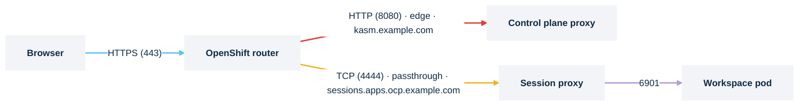

# OpenShift Route

> **Applies to:** both halves

## Why this is needed

The native path on OpenShift. The router is always there, it handles WebSockets, and `passthrough`
termination gives the agent half end-to-end TLS without the Gateway API. Set
`kasm-helm.isOpenshift=true` as well, so the chart drops its explicit UID/GID settings and lets
OpenShift assign them from the namespace's range.



## Before you start

- The `route.openshift.io` API, so OpenShift or OKD:

  ```console
  kubectl api-resources --api-group=route.openshift.io
  ```

  Expected: a `routes` row. Nothing means this is not OpenShift.

- A router shard that admits the namespaces, and the hostnames under a domain the router serves:

  ```console
  oc get ingresscontroller default -n openshift-ingress-operator -o jsonpath='{.status.domain}{"\n"}'
  ```

  Expected: something like `apps.ocp.example.com`. A hostname under it needs no extra DNS; one
  outside it needs its own record pointing at the router.

- Certificates: for the control plane's `edge` termination, a certificate the router serves; for
  the agent's `passthrough`, a publicly trusted certificate on the session proxy covering the
  hostname and its wildcard ([Certificates](certificates.md)).
- The router's default connection timeout is **30 seconds**. The control-plane Route raises it to
  `3600s` by default (`kasm-helm.route.annotations`), because relayed sessions cross that Route;
  the agent Route needs the same annotation set by hand, as in
  [Idle timeouts](loadbalancer-nodeport.md#idle-timeouts).
- SecurityContextConstraints admit the agent half, sessions included:
  [Admit the agent on OpenShift](../nodes/openshift.md).

## Steps

1. **Control plane.** Leaving `route.tls` empty renders a Route with no TLS stanza at all, plain
   HTTP on port 80; set at least `termination`.

   ```yaml
   kasm-helm:
     isOpenshift: true
     publicAddr: kasm.example.com
     proxyService:
       type: ClusterIP
     route:
       enabled: true
       backendProtocol: http
       tls:
         termination: edge
         insecureEdgeTerminationPolicy: Redirect
   ```

   Multi-zone still renders a single Route, for `publicAddr`, targeting the primary zone's proxy
   Service. Zone `proxy_hostname`s are associated with a different backend, usually behind a
   different router entirely, so the chart renders no Route for them.
   `ingress.enabled` and `route.enabled` are mutually exclusive.

2. **Agent, direct-connect only.**

   ```yaml
   kasm-agent:
     agent:
       publicHostname: sessions.apps.ocp.example.com
       route:
         enabled: true
         annotations:
           haproxy.router.openshift.io/timeout: "3600s"
         tls:
           termination: passthrough
           insecureEdgeTerminationPolicy: Redirect
       sessionProxy:
         certificate:
           enabled: true
           issuerRef:
             kind: ClusterIssuer
             name: letsencrypt-prod
           dnsNames:
             - sessions.apps.ocp.example.com
             - "*.sessions.apps.ocp.example.com"
   ```

   `route.host` defaults to `publicHostname`. `route.backendPort` follows the termination mode when
   left empty: 4444 for `passthrough` and `reencrypt`, 4445 for `edge`. On direct-connect, finish
   [Switch sessions to direct-connect](direct-connect.md). A `passthrough` Route routes on SNI and
   `edge` and `reencrypt` on the `Host` header; the session proxy serves its own sessions locally,
   so all three stream. A relayed agent from another cluster behind a `passthrough` Route does
   not work, because the relay sends no SNI.

3. **Install or upgrade.**

   ```console
   helm upgrade --install kasm oci://registry-1.docker.io/kasmweb/kasm-platform \
     -n kasm --create-namespace -f values.yaml
   ```

## Verify

```console
kubectl -n kasm get routes.route.openshift.io
```

Expected:

```text
NAME               HOST/PORT                  SERVICES            PORT   TERMINATION     WILDCARD
kasm-proxy         kasm.example.com           kasm-proxy-zonea    8080   edge/Redirect   None
kasm-proxy-zoneb   zoneb.kasm.example.com     kasm-proxy-zoneb    8080   edge/Redirect   None
```

An empty TLS column means the Route was rendered with no TLS stanza. On direct-connect:

```console
kubectl -n kasm-agent get route -o jsonpath='{range .items[*]}{.spec.host}{"  "}{.spec.tls.termination}{"  "}{.spec.port.targetPort}{"\n"}{end}'
curl -kI https://sessions.apps.ocp.example.com/
```

Expected: your host, `passthrough`, target port `4444`; an HTTP status line, `404` being correct
with no session. Then a session that survives past 60 seconds.

## Chart values

```yaml
kasm-helm:
  isOpenshift: true
  publicAddr: kasm.example.com
  proxyService:
    type: ClusterIP
  route:
    enabled: true
    backendProtocol: http
    tls:
      termination: edge
      insecureEdgeTerminationPolicy: Redirect

kasm-agent:                          # direct-connect only
  agent:
    publicHostname: sessions.apps.ocp.example.com
    route:
      enabled: true
      annotations:
        haproxy.router.openshift.io/timeout: "3600s"
      tls:
        termination: passthrough
```

Installing the charts directly, drop the `kasm-helm:` and `kasm-agent:` keys.

## Troubleshooting

[Troubleshooting](../../reference/troubleshooting.md).

## Decisions

- [ ] `kasm-helm.isOpenshift=true`.
- [ ] `route.tls.termination` set on both halves; `proxyService.type=ClusterIP`.
- [ ] Hostnames under the router's domain, or DNS records pointing at the router.
- [ ] `haproxy.router.openshift.io/timeout: "3600s"` on the agent Route.
- [ ] Session-proxy certificate publicly trusted for `passthrough`.
- [ ] The agent half admitted: [Admit the agent on OpenShift](../nodes/openshift.md).
