# Publish the RDP gateway

> **Applies to:** control plane

## Why this is needed

RDP and RemoteApp workspaces are Windows or Linux hosts **outside** the cluster; the control
plane's RDP gateway brokers native RDP clients to them. It speaks raw TCP on 3389, so no Ingress,
HTTPRoute or Route can carry it. Two ways exist to publish it, and the chart refuses both at once.
The RDP HTTPS gateway (`components.connectionProxy.rdpHttpsGateway`) needs nothing on this page; the
chart publishes nothing extra for it. Both gateways and Guac run inside the zone's connection-proxy
StatefulSet, and every replica of it needs its own external RDP address, which is why the direct
Service path is per replica.

```mermaid
%%{init: {"theme":"base","themeVariables":{"background":"#ffffff","primaryColor":"#f2f4f7","primaryBorderColor":"#f2f4f7","primaryTextColor":"#0f2a44","lineColor":"#0f2a44","clusterBkg":"#ffffff","clusterBorder":"#4a4a4a","edgeLabelBackground":"#ffffff","fontFamily":"Montserrat, Helvetica, Arial, sans-serif","fontSize":"13px"},"flowchart":{"curve":"linear","htmlLabels":true,"nodeSpacing":36,"rankSpacing":64}}}%%
flowchart LR
  rdp["RDP client"]:::card
  lb["LoadBalancer"]:::card
  svc["Service kasm-connection-proxy-default-rdp-0"]:::card
  gwpod["connection-proxy pod 0 (rdp-gateway)"]:::card
  host["RDP host outside the cluster"]:::card
  rdp -->|"TCP (3389) · rdp.kasm.example.com"| lb
  lb -->|"TCP (3389)"| svc
  svc -->|"TCP (3389)"| gwpod
  gwpod -->|"TCP (3389)"| host
  classDef card fill:#f2f4f7,stroke:#f2f4f7,color:#0f2a44,font-weight:600
  linkStyle 0,1,2 stroke:#1a3ec8,stroke-width:2px
  linkStyle 3 stroke:#4cc44c,stroke-width:2px
```



## Before you start

- `kasm-helm.components.connectionProxy.rdpGateway.enabled: true` (the default).
- One external RDP address **per connection-proxy replica**: `deploymentSize: small` runs one replica per
  zone, `medium` two, `large` three (or set `components.connectionProxy.replicas`). With one replica the
  legacy `directRdpService.rdpAccessURL` is enough; with more, list one `perServiceSettings` entry per
  replica. `tcpRoute` supports one replica per zone only.
- A hostname for RDP clients, `rdp.kasm.example.com` below. It is required on both paths: the
  gateway serves under it and Kasm advertises it to clients.
- For `directRdpService`: a load balancer that is **Layer 4 / TCP** (an NLB, not an ALB; an HTTP
  load balancer cannot carry RDP), or a node port open to clients.
- For `tcpRoute`: Gateway API **1.6** or newer (`TCPRoute` in the standard channel as `v1`), a
  `protocol: TCP` listener on the Gateway, and an implementation that serves TCPRoute. Being in the
  CRD bundle is not the same as the data plane implementing it.

## Steps

1. **Pick one path.** `directRdpService.enabled` and `tcpRoute.enabled` together fail the render:
   the gateway Service stays `ClusterIP` while a Gateway fronts it.

2. **Path A: a Service of its own.**

   ```yaml
   kasm-helm:
     directRdpService:
       enabled: true
       type: LoadBalancer            # or NodePort
       rdpAccessURL: rdp.kasm.example.com
       loadBalancerPort: 3389        # LoadBalancer only; ignored for NodePort
       annotations:
         service.beta.kubernetes.io/aws-load-balancer-type: nlb
   ```

   The chart types the existing `<release>-rdp-gateway-<zone>` Service accordingly and publishes
   `loadBalancerPort` onto the gateway's 3389. Because it is the same Service, the nginx sidecar's
   port 9001 is published on the load balancer too (`9001:<nodeport>/TCP` beside
   `3389:<nodeport>/TCP`); block it at the load balancer or firewall if it must not be reachable.
   Point DNS for `rdpAccessURL` at the address the Service gets.

3. **Path B: a Gateway API TCPRoute.** Follow
   [Gateway API: the RDP gateway (TCPRoute)](gateway-api-tcproute.md), which also covers the
   listener-per-zone rule multi-zone imposes.

4. **Upgrade the release.**

## Verify

```console
kubectl -n kasm get svc -l app.kubernetes.io/component=connection-proxy-rdp-direct
```

Expected on path A: one Service per replica, `kasm-connection-proxy-default-rdp-0` and up, each
`TYPE LoadBalancer` with an `EXTERNAL-IP` (not `<pending>`) and `3389:<nodeport>/TCP` in `PORT(S)`, or
`TYPE NodePort` with the node port. On path B the single `-rdp-0` Service stays `ClusterIP` and the
TCPRoute reports `Accepted=True`.

```console
nc -vz rdp.kasm.example.com 3389
```

Expected: `succeeded` (or `open`). Then connect a native RDP client through Kasm.

## Chart values

```yaml
kasm-helm:
  components:
    connectionProxy:
      rdpGateway:
        enabled: true
  directRdpService:
    enabled: true
    type: LoadBalancer
    rdpAccessURL: rdp.kasm.example.com    # one replica; with more, perServiceSettings instead
    loadBalancerPort: 3389
```

Installing `kasm-helm` directly, drop the `kasm-helm:` key.

## Troubleshooting

[Troubleshooting](../../reference/troubleshooting.md). Specific to this page: a render error naming
`rdpAccessURL` means it was left empty; a render error naming both `directRdpService` and `tcpRoute`
means both are on; an `EXTERNAL-IP` stuck at `<pending>` means no load-balancer provider.

## Decisions

- [ ] One path chosen: `directRdpService` or `tcpRoute`, never both.
- [ ] `rdpAccessURL` set and its DNS pointing at the published address.
- [ ] Load balancer confirmed Layer 4 / TCP, or the node port open to clients.
- [ ] With `tcpRoute`: Gateway API 1.6+, a TCP listener, and the implementation proven to serve TCPRoute.
- [ ] Multi-zone: one listener per primary-region zone.
