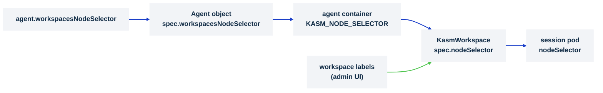

# Scope workspaces to specific nodes

> **Applies to:** agent · **Charts/values:** `agent.workspacesNodeSelector`, `agent.nodeSelector`, `nodePrep.nodeSelector`, `nodePrep.tolerations`, `videoDevicePlugin.nodeSelector`, `videoDevicePlugin.tolerations`, `egressInstaller.nodeSelector`, `egressInstaller.tolerations`

## Why this is needed

Sessions are pods, and by default the scheduler puts them on any node. Most clusters want them on a
dedicated pool: nodes sized for desktop density, prepared with the kernel modules and device plugins
sessions need, and kept clear of other workloads. Three things have to agree for that to hold:

1. **The sessions.** `agent.workspacesNodeSelector` is handed to the agent, which stamps it as
   `spec.nodeSelector` on every `KasmWorkspace` it creates, so every session pod carries it.
2. **The node-level DaemonSets.** `nodePrep`, `videoDevicePlugin` and `egressInstaller` each take a
   `nodeSelector`; they must select the same nodes, or the device plugin advertises webcams where the
   module is not loaded and the egress daemon is missing from nodes that run sessions.
3. **Everything else.** The agent, the operator and the control plane place themselves with their own
   selectors (`agent.nodeSelector` for the agent and its session proxy) and normally stay off the pool.

Per-workspace targeting needs no chart value: the labels set on a workspace in the Kasm admin UI are
added to that workspace's `KasmWorkspace` selector on top of the fleet-wide one.



## Before you start

- A label for the pool, `kasm.com/workspaces=true` below, on every node that should run sessions.
  Use one key for the pool and separate keys for sub-pools (`kasm.com/pool=gpu`), so a workspace can
  narrow within the pool without leaving it.
- Decide whether the pool is **tainted**. A taint keeps other workloads off the pool, and the three
  DaemonSets can tolerate it. Session pods cannot: the chart exposes no tolerations for them, so a
  `NoSchedule` taint on the pool keeps sessions off it too. Taint only nodes you deliberately reserve
  for something sessions must not share, such as a GPU pool with its own selector.
- The namespace must permit privileged pods for the DaemonSets:
  [privileged workloads and cluster policy](privileged-workloads.md).

## Steps

1. **Label the nodes.**

   ```console
   kubectl label node worker-1 worker-2 kasm.com/workspaces=true
   ```

2. **Point the sessions and every node-level DaemonSet at the label**, and give the DaemonSets the
   tolerations for any taint the pool carries:

   ```yaml
   agent:
     workspacesNodeSelector:
       kasm.com/workspaces: "true"
   nodePrep:
     nodeSelector:
       kasm.com/workspaces: "true"
     tolerations:
       - key: kasm.com/workspaces
         operator: Exists
         effect: NoSchedule
   videoDevicePlugin:
     nodeSelector:
       kasm.com/workspaces: "true"
     tolerations:
       - key: kasm.com/workspaces
         operator: Exists
         effect: NoSchedule
   egressInstaller:
     nodeSelector:
       kasm.com/workspaces: "true"
     tolerations:
       - key: kasm.com/workspaces
         operator: Exists
         effect: NoSchedule
   ```

   Through `kasm-platform`, nest the block under `kasm-agent:`.

3. **Upgrade the release.** The agent Deployment rolls to pick up the selector; sessions already
   running keep their old placement until they end.

4. **Narrow a single workspace** where needed: in the admin UI, add a label such as
   `kasm.com/pool=gpu` to that workspace. The agent merges it into the fleet-wide selector, so the
   workspace only ever lands on pool nodes that also carry that label.

5. **Warm pools** are custom resources you author, and place themselves: `spec.nodeSelector`,
   `spec.affinity` and `spec.tolerations` on a `WarmPool` apply to its instance pods. Give them the
   pool selector, and tolerations if the pool is tainted.

## Verify

```console
kubectl -n kasm-agent get agents.agent.kasm.com -o jsonpath='{.items[0].spec.workspacesNodeSelector}{"\n"}'
kubectl -n kasm-agent get deploy -l app.kubernetes.io/component=agent \
  -o jsonpath='{.items[0].spec.template.spec.containers[0].env[?(@.name=="KASM_NODE_SELECTOR")].value}{"\n"}'
kubectl -n kasm-agent get ds -o wide          # DESIRED equals the pool's node count, not the cluster's
```

Then launch a session and check where it went:

```console
kubectl -n kasm-agent get kasmworkspaces.agent.kasm.com -o custom-columns='NAME:.metadata.name,SELECTOR:.spec.nodeSelector'
kubectl -n kasm-agent get pods -o wide | grep -v -E 'agent|operator|otel|node-prep|device-plugin|egress|puller'
```

Expected: the selector on the `Agent` object and in the agent's environment, every DaemonSet sized to
the pool, the `KasmWorkspace` carrying the selector, and the session pod on a labelled node.

## What the operator adds on its own

After a session pod is evicted or OOM-killed, the operator records it on the `KasmWorkspace` status
(`evictionCount`, `lastEvictedNode`, `lastEvictionReason`, `backoffUntil`) and, until `backoffUntil`,
excludes that node through the pod's node affinity so a replacement does not land straight back on
an exhausted node. Before letting the node back in it reads the node's `MemoryPressure`,
`DiskPressure` and `PIDPressure` conditions, which is why the operator's role includes read-only
access to nodes. The image puller keeps the same bookkeeping per node in `status.nodeBackoffs`. No
value controls this; it works within whatever selector you set, so a pool of one node has nowhere to
go and the replacement waits.

## Chart values

```yaml
kasm-agent:
  agent:
    workspacesNodeSelector:
      kasm.com/workspaces: "true"
  nodePrep:
    nodeSelector:
      kasm.com/workspaces: "true"
    tolerations:
      - key: kasm.com/workspaces
        operator: Exists
        effect: NoSchedule
  videoDevicePlugin:
    nodeSelector:
      kasm.com/workspaces: "true"
    tolerations:
      - key: kasm.com/workspaces
        operator: Exists
        effect: NoSchedule
  egressInstaller:
    nodeSelector:
      kasm.com/workspaces: "true"
    tolerations:
      - key: kasm.com/workspaces
        operator: Exists
        effect: NoSchedule
```

Installing `kasm-agent` directly? Drop the `kasm-agent:` key and start at `agent:`.

## Troubleshooting

| Symptom | Cause | Fix |
| ------- | ----- | --- |
| Session pods `Pending` with `didn't match Pod's node affinity/selector` | No node carries the selector, or a workspace label narrows it to nothing | `kubectl get nodes -l <selector>`; fix the labels or the workspace's labels |
| Session pods `Pending` with `had untolerated taint` | The pool is tainted and sessions cannot tolerate taints | Remove the taint from the session pool, or keep the taint on nodes sessions are not meant to use |
| Sessions run on nodes outside the pool | The selector is set on the wrong key, or the agent has not rolled since the upgrade | Check `KASM_NODE_SELECTOR` on the agent Deployment; `kubectl rollout restart` it |
| `kasm.com/video` advertised on nodes that have no `/dev/video*` | `videoDevicePlugin.nodeSelector` wider than `nodePrep.nodeSelector` | Make the three DaemonSet selectors identical |
| A session pod stays `Pending` after an eviction although the pool has room | Every pool node is either the backed-off node or tainted | Wait for `backoffUntil` on the `KasmWorkspace` status, or add a pool node |
| DaemonSet pods missing from a tainted pool node | No tolerations on that DaemonSet | Add the `tolerations` block shown above to each of the three |

## Decisions

- [ ] Pool label chosen; every session node carries it
- [ ] `agent.workspacesNodeSelector` and the three DaemonSet `nodeSelector`s identical
- [ ] Taint decision made, knowing sessions cannot tolerate taints
- [ ] Sub-pool labels (GPU, region) agreed with whoever sets workspace labels in the admin UI
- [ ] A session launched and its pod's node checked after the upgrade
