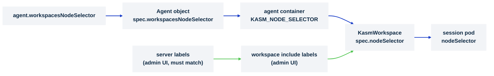

# Scope workspaces to specific nodes

> **Applies to:** agent · **Charts/values:** `agent.workspacesNodeSelector`, `agent.nodeSelector`, `nodePrep.nodeSelector`, `nodePrep.tolerations`, `videoDevicePlugin.nodeSelector`, `videoDevicePlugin.tolerations`, `egressInstaller.nodeSelector`, `egressInstaller.tolerations`

## Why this is needed

Sessions are pods, and by default the scheduler puts them on any node. Most clusters want them on a
dedicated pool: nodes sized for desktop density, prepared with the kernel modules and device plugins
sessions need, and kept clear of other workloads. Three things have to agree for that to hold:

1. **The sessions.** `agent.workspacesNodeSelector` is handed to the agent, which stamps it as
   `spec.nodeSelector` on every `KasmWorkspace` it creates, so every session pod carries it.
2. **The node-level DaemonSets.** `nodePrep`, `videoDevicePlugin` and `egressInstaller` each take a
   `nodeSelector`; they must select the same nodes, or the device plugin advertises webcams where the
   module is not loaded and the egress daemon is missing from nodes that run sessions.
3. **Everything else.** The agent, the operator and the control plane place themselves with their own
   selectors (`agent.nodeSelector` for the agent and its session proxy) and normally stay off the pool.

Per-workspace targeting needs no chart value: the *include labels* set on a workspace in the Kasm
admin UI are added to that workspace's `KasmWorkspace` selector on top of the fleet-wide one. One
precondition is easy to miss: the manager matches a workspace's include labels against the labels of
the *server* (the agent's row under Infrastructure → Servers) before the request ever reaches
Kubernetes, and a Kubernetes agent registers with no labels. Put the same label on the server, or
every launch of that workspace is refused with `No Agent slots available`.



## Before you start

- A label for the pool, `kasm.com/workspaces=true` below, on every node that should run sessions.
  Use one key for the pool and separate keys for sub-pools (`kasm.com/pool=gpu`), so a workspace can
  narrow within the pool without leaving it.
- Decide whether the pool is **tainted**. A taint keeps other workloads off the pool, and the three
  DaemonSets can tolerate it. Session pods cannot: the chart exposes no tolerations for them, so a
  `NoSchedule` taint on the pool keeps sessions off it too. Taint only nodes you deliberately reserve
  for something sessions must not share, such as a GPU pool with its own selector.
- The namespace must permit privileged pods for the DaemonSets:
  [privileged workloads and cluster policy](privileged-workloads.md).

## Steps

1. **Label the nodes.**

   ```console
   kubectl label node worker-1 worker-2 kasm.com/workspaces=true
   ```

2. **Point the sessions and every node-level DaemonSet at the label**, and give the DaemonSets the
   tolerations for any taint the pool carries:

   ```yaml
   agent:
     workspacesNodeSelector:
       kasm.com/workspaces: "true"
   nodePrep:
     nodeSelector:
       kasm.com/workspaces: "true"
     tolerations:
       - key: kasm.com/workspaces
         operator: Exists
         effect: NoSchedule
   videoDevicePlugin:
     nodeSelector:
       kasm.com/workspaces: "true"
     tolerations:
       - key: kasm.com/workspaces
         operator: Exists
         effect: NoSchedule
   egressInstaller:
     nodeSelector:
       kasm.com/workspaces: "true"
     tolerations:
       - key: kasm.com/workspaces
         operator: Exists
         effect: NoSchedule
   ```

   Through `kasm-platform`, nest the block under `kasm-agent:`.

3. **Upgrade the release.** The agent Deployment rolls to pick up the selector; sessions already
   running keep their old placement until they end.

4. **Narrow a single workspace** where needed. Two edits in the admin UI, both as `key=value`
   strings: add `kasm.com/pool=gpu` to the workspace's *Include Labels*, and add the same label to
   the agent's server row (Infrastructure → Servers → edit → Labels). The manager checks the server's
   labels first and refuses the launch with `No Agent slots available` while they do not match; once
   they do, the agent merges the include labels into the fleet-wide selector
   (`{kasm.com/workspaces: "true", kasm.com/pool: gpu}`), so the workspace only ever lands on pool
   nodes that also carry that label. A label the server has but no node has is not caught by the
   control plane: the pod cannot schedule (`didn't match Pod's node affinity/selector`), the agent
   fails the launch after a few seconds and the user sees `An Unexpected Error occurred creating the
   Kasm`, so keep server labels and node labels in step.

5. **Warm pools** are custom resources you author, and place themselves: `spec.nodeSelector`,
   `spec.affinity` and `spec.tolerations` on a `WarmPool` apply to its instance pods. Give them the
   pool selector, and tolerations if the pool is tainted. `spec.affinity` is a node affinity written
   directly (`requiredDuringSchedulingIgnoredDuringExecution` right under `affinity`); the pod-style
   `nodeAffinity` wrapper is rejected with `unknown field "spec.affinity.nodeAffinity"`.

6. **Image puller.** `imagePuller.nodeSelector` and `imagePuller.tolerations` take the same values as
   the three DaemonSets. Without them the operator's puller DaemonSet runs on every schedulable node
   and stages workspace images where no session can ever run. The agent also owns a puller of its own
   (`<release>-image-puller`, fed from the control plane's workspace list); it inherits
   `workspacesNodeSelector` but carries no tolerations, so a tainted pool node is only pre-staged by
   the chart's puller.

## Verify

```console
kubectl -n kasm-agent get agents.agent.kasm.com -o jsonpath='{.items[0].spec.workspacesNodeSelector}{"\n"}'
kubectl -n kasm-agent get deploy -l app.kubernetes.io/component=agent \
  -o jsonpath='{.items[0].spec.template.spec.containers[0].env[?(@.name=="KASM_NODE_SELECTOR")].value}{"\n"}'
kubectl -n kasm-agent get ds -o wide          # DESIRED equals the pool's node count, not the cluster's
```

Then launch a session and check where it went:

```console
kubectl -n kasm-agent get kasmworkspaces.agent.kasm.com -o custom-columns='NAME:.metadata.name,SELECTOR:.spec.nodeSelector'
kubectl -n kasm-agent get pods -o wide | grep -v -E 'agent|operator|otel|node-prep|device-plugin|egress|puller'
```

Expected: the selector on the `Agent` object and in the agent's environment, every DaemonSet sized to
the pool, the `KasmWorkspace` carrying the selector, and the session pod on a labelled node.

## What the operator adds on its own

After a session pod is evicted or OOM-killed, the operator records it on the `KasmWorkspace` status
(`evictionCount`, `lastEvictedNode`, `lastEvictionReason`, `backoffUntil`) and, until `backoffUntil`,
excludes that node through the pod's node affinity so a replacement does not land straight back on
an exhausted node. Before letting the node back in it reads the node's `MemoryPressure`,
`DiskPressure` and `PIDPressure` conditions, which is why the operator's role includes read-only
access to nodes (`get`, `list` and `watch`: the read goes through a cached client, and with `get`
alone the reconcile hangs at the end of the window). The image puller keeps the same bookkeeping per
node in `status.nodeBackoffs`. No value controls this; it works within whatever selector you set, so
a pool of one node has nowhere to go and the replacement waits. The first window is 30 s. The agent's capacity report to the control plane is the
sum of allocatable CPU and memory over the nodes the selector matches and nothing else (verified
with pool nodes of unique sizes), refreshed by the heartbeat; it counts tainted pool nodes too, so
with a tainted node in the pool the control plane can hand the agent sessions the pool cannot
schedule, and those pods stay `Pending` rather than being refused. Only
kubelet-side failures count: an OOM-killed container or a node-pressure eviction. A delete through
the Eviction API (`kubectl drain`, a descheduler) is a graceful delete to the operator and is not
recorded, so the replacement schedules without an exclusion.

## Chart values

```yaml
kasm-agent:
  agent:
    workspacesNodeSelector:
      kasm.com/workspaces: "true"
  nodePrep:
    nodeSelector:
      kasm.com/workspaces: "true"
    tolerations:
      - key: kasm.com/workspaces
        operator: Exists
        effect: NoSchedule
  videoDevicePlugin:
    nodeSelector:
      kasm.com/workspaces: "true"
    tolerations:
      - key: kasm.com/workspaces
        operator: Exists
        effect: NoSchedule
  egressInstaller:
    nodeSelector:
      kasm.com/workspaces: "true"
    tolerations:
      - key: kasm.com/workspaces
        operator: Exists
        effect: NoSchedule
  agent:
    imagePuller:
      nodeSelector:
        kasm.com/workspaces: "true"
      tolerations:
        - key: kasm.com/workspaces
          operator: Exists
          effect: NoSchedule
```

Installing `kasm-agent` directly? Drop the `kasm-agent:` key and start at `agent:`.

## Troubleshooting

| Symptom | Cause | Fix |
| ------- | ----- | --- |
| Session pods `Pending` with `didn't match Pod's node affinity/selector` | No node carries the selector, or a workspace label narrows it to nothing | `kubectl get nodes -l <selector>`; fix the labels or the workspace's labels |
| Session pods `Pending` with `had untolerated taint` | The pool is tainted and sessions cannot tolerate taints | Remove the taint from the session pool, or keep the taint on nodes sessions are not meant to use |
| Sessions run on nodes outside the pool | The selector is set on the wrong key, or the agent has not rolled since the upgrade | Check `KASM_NODE_SELECTOR` on the agent Deployment; `kubectl rollout restart` it |
| `kasm.com/video` advertised on nodes that have no `/dev/video*` | `videoDevicePlugin.nodeSelector` wider than `nodePrep.nodeSelector` | Make the three DaemonSet selectors identical |
| A session pod stays `Pending` after an eviction although the pool has room | Every pool node is either the backed-off node or tainted | Wait for `backoffUntil` on the `KasmWorkspace` status, or add a pool node |
| DaemonSet pods missing from a tainted pool node | No tolerations on that DaemonSet | Add the `tolerations` block shown above to each of the three |
| Every launch of a workspace that has include labels is refused with `No Agent slots available`, with room in the pool | The agent's server row carries no matching label; the manager filters servers by label before Kubernetes is involved | Add the same `key=value` label to the server under Infrastructure → Servers |
| A session pod is replaced after `kubectl drain` with no back-off on the `KasmWorkspace` status | Eviction API deletes are not node-exhaustion failures; only OOM kills and kubelet pressure evictions are tracked | Expected; the replacement schedules normally |
| After a back-off window closes the `KasmWorkspace` stays `Pending` although its pod is `Running` | The operator's role has only `get` on nodes (a chart before this fix), so the cached node read never returns | Upgrade the operator chart (nodes: get, list, watch) and restart the operator |
| `WarmPool` rejected with `unknown field "spec.affinity.nodeAffinity"` | The pools CRD takes a node affinity directly under `spec.affinity` | Drop the `nodeAffinity` wrapper |
| Image puller pods on nodes outside the pool | `imagePuller.nodeSelector` unset | Set it, and `imagePuller.tolerations`, like the three DaemonSets |

## Decisions

- [ ] Pool label chosen; every session node carries it
- [ ] `agent.workspacesNodeSelector` and the three DaemonSet `nodeSelector`s identical
- [ ] Taint decision made, knowing sessions cannot tolerate taints
- [ ] Sub-pool labels (GPU, region) agreed with whoever sets workspace include labels in the admin UI, and mirrored onto the agent's server row
- [ ] `imagePuller.nodeSelector` set with the DaemonSets, or the wider staging accepted
- [ ] A session launched and its pod's node checked after the upgrade
