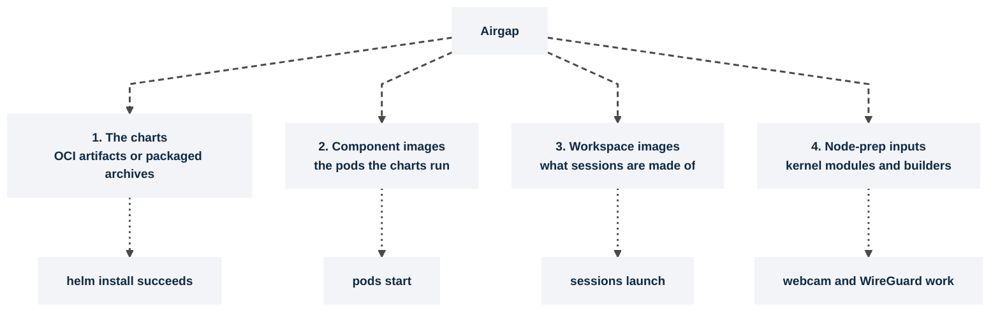

# Registries and airgap

> **Applies to:** both halves · **Charts/values:** `kasm-helm.components.*.image.registry`, `kasm-helm.imagePullSecrets`, `agent.image.registry`, `agent.imagePullSecrets`, `agent.imagePuller.*`, `agent.imageAvailabilityPolicy`, `nodePrep.imagePullSecrets`, `nodePrep.modules.*.method`

## Why this is needed

Every chart here installs with no internet access. What needs planning is the **four separate
things** that are normally fetched at install or run time, from four places, by four mechanisms.
Miss one and the failure appears much later than the install. Private registries on a connected
cluster are the same four things with a pull secret each.



Work them in that order; each one's failure hides the next.

## Before you start

- Credentials for the registry, and the ability to create Secrets in every release namespace.
  Secrets do not cross namespaces: the two-namespace layout needs the pull Secret in **both**.
- Three image flows use **different** values, and getting the first right does nothing for the
  second. This is the most common cause of `ImagePullBackOff` on session pods in an otherwise
  healthy install:

  | Flow | Who pulls | Value |
  | ---- | --------- | ----- |
  | Kasm component images (agent API, session proxy, operator, collector, plugins) | kubelet, per chart | each chart's own `imagePullSecrets` |
  | **Workspace** images launched as sessions | kubelet, with a pull Secret the agent creates from the credentials the manager sends per image | the workspace image's registry credentials in the Kasm admin UI (not a chart value) |
  | Pre-staged images on every node | the image-puller DaemonSet via `crictl` | `agent.imagePuller.images[].imagePullSecrets` |

- `kasm-node-prep` pulls its builder image (`nodePrep.image.*`) with `nodePrep.imagePullSecrets`, a
  list of Secret names in the release namespace like the other components. A KMM in-cluster build
  pulls the builder for its own build pod with the same Secrets and pushes the module image with
  `nodePrep.modules.v4l2loopback.kmm.imageRepoSecret`.
- Cloud variants: ECR tokens expire every 12 hours (refresh with the ECR credential helper or
  external-secrets, or attach the pull permission to the node role); GKE prefers Workload Identity
  or the node service account over a static Secret; AKS attaches ACR with
  `az aks update --attach-acr`; OpenShift links a `dockerconfigjson` Secret to the ServiceAccount.

## Steps

1. **The charts.** Published as OCI artifacts under `oci://registry-1.docker.io/kasmweb/` with
   dependencies embedded, so mirroring is a registry-to-registry copy:

   ```console
   crane copy registry-1.docker.io/kasmweb/kasm-platform:1.1190.6 \
       registry.internal.example.com/kasmweb/kasm-platform:1.1190.6
   helm show chart oci://registry.internal.example.com/kasmweb/kasm-platform --version <version> | head -3
   ```

   Expected: `apiVersion: v2`, `appVersion: 1.19.0`, and the description. `make package-agent`
   builds the same thing as a local `.tgz` if you would rather carry a file across the boundary.

2. **Component images.** Both halves have a generated list. The control plane's is
   [`charts/kasm-helm/images.txt`](../../charts/kasm-helm/images.txt), seven images (api, manager,
   postgres, proxy, guac, rdp-gateway, rdp-https-gateway). The agent family's comes from
   `make images-agent`, which writes `dist/kasm-agent-images.txt` including the conditional images
   and why they are conditional; the KMM **sign** image is listed under `# KMM mode` and is the one
   most often missed. `make images-check` verifies the list against the rendered manifests with an
   independent extractor and fails if anything is referenced but unlisted; run it before you
   mirror. Then create the pull Secret in each namespace and re-point every chart:

   ```console
   kubectl create secret docker-registry internal-registry --namespace kasm-agent \
     --docker-server=registry.internal.example.com --docker-username='<user>' --docker-password='<password>'
   ```

   ```yaml
   kasm-helm:
     components:
       api:
         image:
           registry: registry.internal.example.com    # one block per component: api, manager, proxy, and under connectionProxy: nginx, guac, rdpGateway, rdpHttpsGateway
     database:
       image:
         registry: registry.internal.example.com      # postgres lives here, not under components (there is no components.db)
     imagePullSecrets:
       enabled: true
       registry: registry.internal.example.com        # the chart creates the Secret
       username: "<user>"
       password: "<password>"
   kasm-agent:
     operator:
       image:
         registry: registry.internal.example.com
       imagePullSecrets:
         - name: internal-registry
     otelCollector:
       image:
         registry: registry.internal.example.com
       imagePullSecrets:
         - name: internal-registry
     agent:
       image:
         registry: registry.internal.example.com
       sessionProxy:
         image:
           registry: registry.internal.example.com
         sidecarImage:
           registry: registry.internal.example.com
       imagePullSecrets:
         - name: internal-registry
     videoDevicePlugin:
       image:
         registry: registry.internal.example.com
       imagePullSecrets:
         - name: internal-registry
     egressInstaller:
       imagePullSecrets:
         - name: internal-registry
     nodePrep:
       image:
         registry: registry.internal.example.com
       imagePullSecrets:
         - name: internal-registry
   ```

   Set only `kasm-helm.imagePullSecrets.enabled` and `.name` to reuse a Secret you created. Registry
   overrides are per component on the control plane, so one missed component is one
   `ImagePullBackOff` in an otherwise healthy release; the override list has to match the seven
   entries in `images.txt`, six under `components.*` plus `database.image` (the values schema
   rejects `components.db`). The third-party subcharts have their own paths:
   `csiRclone.imagePullSecrets`, `nfs-server-provisioner.image.repository`, and NVIDIA's air-gap
   procedure for `gpuOperator`, whose operands are not in the list.

   > **Note.** An upgrade that adds `kasm-helm.imagePullSecrets` (or changes a registry) less than
   > five minutes after the previous one fails with
   > `cannot patch "kasm-db-init" with kind Job: ... field is immutable` and leaves the release
   > `failed`, because the completed Job is still inside its `ttlSecondsAfterFinished` window.
   > `kubectl -n kasm delete job kasm-db-init`, then run the same upgrade again.

3. **Workspace images.** The one that is not a chart value. Workspace images are pulled from
   whatever registry the **manager** has configured for each workspace; mirroring the component
   images does nothing for them. Re-point them in the Kasm admin UI, or seed them that way
   ([Preseeding](../reference/preseed.md)), and put the credentials on the workspace image
   itself: **Workspaces → the image → Docker Registry, Docker Username, Docker Password**
   ([Kasm docs: Workspaces](https://www.kasmweb.com/docs/latest/guide/workspaces.html)). The
   manager sends them with every launch request; the agent writes them into a
   `kubernetes.io/dockerconfigjson` Secret named after the registry host
   (`kasm-registry-<host>`, with `auths` for the host's usual spellings), and puts that Secret in
   `imagePullSecrets` of the `KasmWorkspace` and the session pod. The Secret is per registry, not
   per session, so it stays behind after the session ends and is reused. Name the image with
   its registry host (`registry.internal.example.com/team/chrome:1.19.0`): the agent uses the
   name as given and does not prepend the registry, so a bare `team/chrome:1.19.0` goes to
   Docker Hub.

   > **Note**
   > There is no chart-level "workspace pull secret": the agent authenticates workspace image
   > pulls only from the per-image credentials above, which it turns into a per-registry Secret
   > on each session pod. For a cluster-wide credential instead, add a Secret to the
   > `imagePullSecrets` of the ServiceAccount the session pods run as
   > (`kubectl get pod <session pod> -o jsonpath='{.spec.serviceAccountName}'` names it), or
   > pre-stage the images on every node with `agent.imagePuller` (step 1), whose per-entry
   > `imagePullSecrets` do work.

4. **Node-prep inputs.** `nodePrep` is the one component that fetches at **run** time, and only in
   some modes:

   | `nodePrep.modules.<mod>.method` | Airgap behaviour |
   | ------------------------------- | ---------------- |
   | `build` | Compiles on the node; needs kernel headers and packages at runtime. Use a pre-baked builder image that carries them, `openssl` included |
   | `kmm` with prebuilt images | KMM only ever pulls: build the per-kernel images once, outside, and mirror them. The airgap-friendly mode |
   | `kmm` with in-cluster build | The same runtime-fetch problem as `build` |

   With Secure Boot signing on, KMM also pulls a **sign** image. [Webcam and kernel modules](nodes/webcam-kernel-modules.md)
   and [Secure Boot](nodes/secure-boot.md).

5. **Pre-pull images**, so the first session on a node does not wait for a cold pull. The operator
   already creates a `KasmImagePuller` from the manager's own workspace list; `agent.imagePuller.*`
   adds an explicit one for images you want staged regardless. `images[].image` is a full
   reference used verbatim, so it must already name the mirror.

   ```yaml
   kasm-agent:
     agent:
       imagePuller:
         enabled: true
         imagePullPolicy: IfNotPresent
         images:
           - image: registry.internal.example.com/kasmweb/chrome:1.19.0
             registry: https://registry.internal.example.com
             imagePullSecrets:
               - name: internal-registry
       imageAvailabilityPolicy: all      # advertise catalog images before they stage; default 'pulled' waits
   ```

## Verify

```console
kubectl -n kasm-agent get events --field-selector reason=Failed
kubectl -n kasm-agent get pods
kubectl -n kasm-agent get secret internal-registry -o jsonpath='{.type}{"\n"}'
kubectl -n kasm-agent get kasmimagepullers.agent.kasm.com
```

Expected: `No resources found` from the events query (no `ErrImagePull` or `ImagePullBackOff`);
every pod `Running` or `Completed`; `kubernetes.io/dockerconfigjson`; the image-puller DaemonSet
with a pod on every session node. Events live about an hour, so a pull failure from earlier work
still shows; judge by the event's age, or by pod status alone. Then launch a session from a
private workspace image with the boundary closed: the pod reaches `Running` without a pull error.

## Chart values

```yaml
kasm-helm:
  imagePullSecrets:
    enabled: true
    name: internal-registry

kasm-agent:
  agent:
    imagePullSecrets:
      - name: internal-registry
    imagePuller:
      enabled: true
      images:
        - image: registry.internal.example.com/kasmweb/chrome:1.19.0
          registry: https://registry.internal.example.com
          imagePullSecrets:
            - name: internal-registry
  operator:
    imagePullSecrets:
      - name: internal-registry
```

Installing the charts directly, drop the `kasm-helm:` and `kasm-agent:` keys.

## Troubleshooting

| Symptom | Cause | Fix |
| ------- | ----- | --- |
| Agent and operator pods run, **session** pods `ImagePullBackOff` | The workspace image has no registry credentials in the manager, or its name lacks the registry host (a bare name goes to Docker Hub) | Set Docker Registry/Username/Password on the image and use the full image reference; check `kubectl get secret kasm-registry-<host>` exists and is in the session pod's `imagePullSecrets` |
| Every session fails to launch, control plane healthy | Workspace images unreachable; they come from the manager's registry, not from values | Re-point them in the manager |
| Pull works in one namespace, fails in the other | Secrets do not cross namespaces | Create the Secret in both release namespaces |
| ECR pulls fail every morning | ECR tokens expire after 12 hours | Credential helper, external-secrets, or the node role |
| `nodePrep` builder image will not pull | `nodePrep.imagePullSecrets` not set, or the Secret is in another namespace | Name the Secret under `nodePrep.imagePullSecrets`; for a KMM build also `nodePrep.modules.v4l2loopback.kmm.imageRepoSecret` |
| Pre-pull DaemonSet fails on one image only | `imagePuller.images[].image` still names the upstream registry | Rewrite the full reference to the mirror, with that entry's `imagePullSecrets` |
| A workspace is reported unavailable until its image finishes pre-pulling | `imageAvailabilityPolicy` is `pulled` (default): only staged images are advertised | Set `imageAvailabilityPolicy: all` to advertise catalog images before they stage (they pull on demand at launch), or wait for `agent.imagePuller` to finish |
| One control-plane pod `ImagePullBackOff` | A `components.<name>.image.registry` override missed | Override every component |
| `gpuOperator` operands fail to pull in an airgap | Not in `dist/kasm-agent-images.txt` | NVIDIA's air-gapped procedure, values passed through as `gpuOperator.*` |

The rest is in [Troubleshooting](../reference/troubleshooting.md).

## Decisions

- [ ] Charts mirrored as OCI artifacts, or carried as `make package-agent` archives.
- [ ] Control-plane images from `images.txt` mirrored; every `components.*.image.registry` and `database.image.registry` re-pointed.
- [ ] Agent-family images from `make images-agent` mirrored, conditional ones included; `make images-check` green.
- [ ] Workspace images mirrored and re-pointed **in the manager**, with registry credentials on each private image and the registry host in its name.
- [ ] A `dockerconfigjson` Secret in every release namespace, with a refresh story for expiring tokens.
- [ ] `nodePrep` in a mode that does not fetch at runtime, or a pre-baked builder image supplied.
- [ ] One session launched end to end with the boundary closed.
