# External access and TLS

> **Applies to:** [External access to sessions, TLS, and the login cookie](../feature-matrix.md#networking--access) · **Charts/values:** `agent.publicHostname`, `agent.publicPort`, `agent.gatewayRoute.*`, `agent.tlsRoute.*`, `agent.httpRoute.*`, `agent.ingress.*`, `agent.route.*`, `agent.sessionProxy.service.*`, `agent.sessionProxy.proxyProtocol.*`, `agent.sessionProxy.certificate.*`, `agent.sessionProxy.certSecretName`, `kasm-helm.publicAddr`, `kasm-helm.ingress.*`, `kasm-helm.route.*`, `kasm-helm.proxyService.type`, `kasm-helm.certificate.*`, `kasm-helm.trustedCaBundle.*`, `kasm-helm.kasmConfig.authDomain`

## Why this is needed

The two halves of a Kasm deployment are exposed **independently**. Users log in to the control
plane; their browsers then stream the session **directly** from the agent's session proxy. Each half
terminates its own TLS, on its own hostname. Get the hostnames, the certificate coverage, the
websocket timeout or the auth-cookie domain wrong and the symptom is always the same-looking
failure — a 404, a 401, or a session that dies after a minute.

## How the traffic flows


<details>
<summary>Diagram source (Mermaid)</summary>

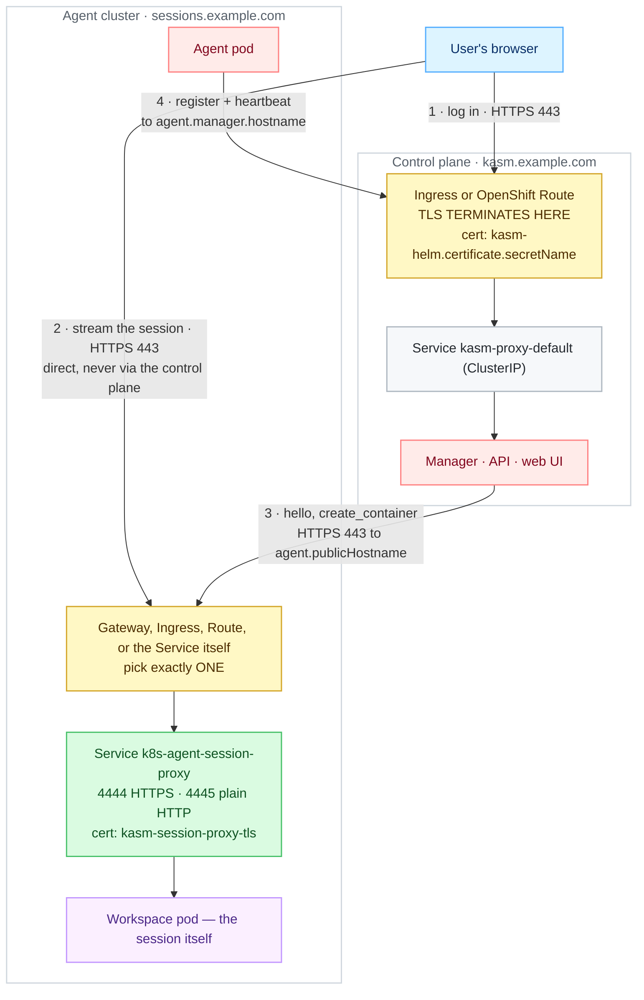

</details>

Read it as **two audiences, one hostname**:

* **Browsers** reach the session proxy at `agent.publicHostname` (arrow 2). This connection carries
  the session's video and input, and it is a long-lived websocket.
* **The manager** reaches the *same* hostname (arrow 3) to call the agent — `hello`,
  `create_container`. It is a separate client, often on a different network from the users.

Both must resolve `agent.publicHostname` and reach it. That is why the value is mandatory, and why
an exposure method that only works from inside the office VPN will break session creation as well as
session streaming.

The agent's own outbound traffic (arrow 4) goes the other way, to `agent.manager.hostname`. It is
not part of external access — but it is the same firewall conversation, so plan it at the same time.

## Words used on this page

| Term | In one line |
| ---- | ----------- |
| **IngressClass** | Names which ingress controller serves an Ingress. `kubectl get ingressclass` lists them; `agent.ingress.className` picks one. |
| **GatewayClass** | The Gateway API equivalent of an IngressClass — which implementation (Traefik, Envoy, Cilium) will implement a Gateway. |
| **Gateway** | An actual listening endpoint created from a GatewayClass. It has an address and one or more listeners. |
| **listener** | One port + protocol + hostname on a Gateway, with a name. `sectionName` in a route points at one listener by that name. |
| **`parentRef`** | The pointer from a route (HTTPRoute/TLSRoute) to the Gateway — and optionally the listener — that should serve it. |
| **SNI** | The hostname the browser sends *in the clear* at the start of a TLS handshake. It is the only thing a passthrough listener can route on. |
| **terminate** | The edge decrypts TLS, so the browser validates the **edge's** certificate and cleartext continues inside the cluster. |
| **passthrough** | The edge forwards the encrypted bytes untouched, so the browser validates the **session proxy's** certificate end to end. |
| **`externalTrafficPolicy`** | On a Service: `Cluster` (default) rewrites the client's source IP; `Local` preserves it but only routes through nodes that actually run a proxy pod. |
| **session proxy** | The nginx deployment the *operator* creates next to the agent, named `<agent name>-session-proxy`. It is what browsers stream from. |

## Before you start

* Two hostnames, **siblings under one parent domain** — for example `kasm.example.com` (control
  plane `kasm-helm.publicAddr`) and `sessions.example.com` (agent `agent.publicHostname`). They must
  differ, and the Kasm Authorization Domain must be their shared parent.
* DNS for both, pointing at whatever fronts the cluster.
* Exactly **one** exposure method on the agent side. All of them point at the same Service.
* Whatever fronts the session proxy must hold **WebSockets** open: idle timeout ≥ 3600s (or an L4
  idle timeout ≥ 3600s where nothing speaks HTTP).
* cert-manager plus an `Issuer`/`ClusterIssuer`, if you want certificates issued in-cluster.
* Not sure which exposure method to pick? Start at the [exposure decision matrix](../planning.md#42-exposure-decision-matrix) — all eight options against TLS termination, client IP, idle timeouts and what is verified.

Every `helm upgrade --install` below installs from a checkout of this repository. The six Kasm
subcharts are `file://` dependencies, so stage them into `charts/` once before the first install:

```console
helm dependency build charts/kasm-agent
```

Check your two hostnames resolve before you install anything — most "the route does not work"
reports are a missing DNS record:

```console
dig +short kasm.example.com
dig +short sessions.example.com
```

Both should print an address that belongs to whatever fronts your cluster. An empty answer means
there is nothing to debug on the Kubernetes side yet.

## Step 1 — the hostname pair and the authorization domain

Do this once, whichever exposure option you go on to pick. Kasm's login cookie is issued for the
**Authorization Domain**; if that is not the shared parent of both hostnames, the browser will not
send the cookie to the agent and every session connect returns 401.

On a **fresh** control plane it is a value, applied by the preseed at first start:

```yaml
kasm-helm:
  publicAddr: kasm.example.com
  kasmConfig:
    generatePreseed: true
    authDomain: example.com
```

On an **existing** control plane the preseed does not run. Change it by hand:

1. *Settings → Auth* → set **Kasm Auth Domain** to `example.com`.
2. *Infrastructure → Zones* → open the zone the agent reports to (`agent.zone`, default `default`):
   * **Proxy Connections** → **off**. Left on, the control plane relays session traffic with the
     original `Host` header, which matches no route on the agent side and returns 404.
   * **Upstream Auth Address** → the control plane's `publicAddr`.

Background: [Running alongside the kasm-helm control plane](../../charts/kasm-agent/README.md#running-alongside-the-kasm-helm-control-plane).

## Step 2 — pick one exposure option

| Value | Shape | TLS terminates at | When |
| ----- | ----- | ----------------- | ---- |
| `agent.gatewayRoute.enabled=true` | Operator-managed Gateway API `TLSRoute`, SNI passthrough | the session proxy | **Preferred** where the operator supports it — the route and the Service cannot drift → [Walkthrough B](#walkthrough-b--tls-passthrough-gatewayroute-or-tlsroute) |
| `agent.tlsRoute.enabled=true` | The same passthrough `TLSRoute`, owned by the Helm release | the session proxy | Older operators, or when the route must be a release object → [Walkthrough B](#walkthrough-b--tls-passthrough-gatewayroute-or-tlsroute) |
| `agent.httpRoute.enabled=true` | Gateway API `HTTPRoute` | the Gateway | Standard Gateway API setups → [Walkthrough A](#walkthrough-a--gateway-api-httproute) |
| `agent.ingress.enabled=true` | `networking.k8s.io/v1` Ingress | the ingress controller | ingress-nginx / Traefik ingress → [Walkthrough C](#walkthrough-c--ingress) |
| `agent.route.enabled=true` | OpenShift `Route` | the session proxy (`passthrough` default) | OpenShift → [Walkthrough E](#walkthrough-e--openshift-route) |
| *(none)* + `agent.sessionProxy.service.type` | `NodePort` / `LoadBalancer` on the proxy Service | the session proxy | No ingress layer at all → [Walkthrough D](#walkthrough-d--nodeport-or-loadbalancer) |

Full comparison: [External access](../../charts/kasm-agent-instance/README.md#external-access) and
[`gatewayRoute` vs `tlsRoute`](../../charts/kasm-agent-instance/README.md#gatewayroute-vs-tlsroute--who-owns-the-route).

Distro / cloud variants:

| Platform | Usual choice |
| -------- | ------------ |
| k3s | Traefik. Gateway API provider is **not** on by default — enable it with a `HelmChartConfig` ([Reference](#enabling-the-gateway-api-provider-on-k3s--traefik)). Verified live. |
| kubeadm / vanilla | ingress-nginx (`agent.ingress`), or any Gateway API implementation. |
| EKS / AKS / GKE | Cloud LB in front of ingress-nginx, or `agent.sessionProxy.service.type=LoadBalancer` straight onto the proxy. Raise the LB idle timeout (an AWS NLB defaults to 350s). |
| OpenShift | `agent.route.enabled=true` — passthrough termination is the native path. |

---

## Walkthrough A — Gateway API HTTPRoute

**When to pick this.** You already run a Gateway API implementation and are happy for TLS to
terminate at the Gateway, on a certificate the Gateway holds. It is the simplest Gateway API path
and the only one that gives you HTTP-level routing and timeouts.


<details>
<summary>Diagram source (Mermaid)</summary>

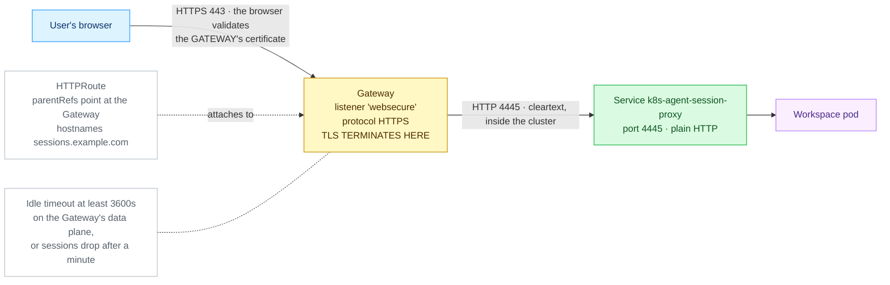

</details>

### A1 — Prerequisites

1. **The Gateway API CRDs are installed, and which bundle version:**

   ```console
   kubectl get crd gateways.gateway.networking.k8s.io \
     -o jsonpath='{.metadata.annotations.gateway\.networking\.k8s\.io/bundle-version}'
   ```

   Good: something like `v1.5.1`. `NotFound` means the Gateway API is not installed at all — use
   [Walkthrough C](#walkthrough-c--ingress) instead, or install the CRDs.

2. **A Gateway exists and is programmed:**

   ```console
   kubectl get gateway -A
   ```

   Good: at least one row with `PROGRAMMED  True` and an `ADDRESS`. `Programmed=False` means the
   implementation has not accepted it yet — fix that before going further.

3. **One of its listeners carries your hostname and terminates HTTPS:**

   ```console
   kubectl -n kube-system get gateway traefik-gateway \
     -o jsonpath='{range .spec.listeners[*]}{.name}{"  "}{.protocol}{"  "}{.port}{"  "}{.hostname}{"  "}{.tls.mode}{"\n"}{end}'
   ```

   Good: a line like `websecure  HTTPS  8443  sessions.example.com  Terminate`. Note the listener's
   **name** — that is the `sectionName` you may want later. The port shown is the Gateway's own
   backend port; what users hit on the outside can be 443 in front of it.

4. **That listener admits routes from the agent's namespace:**

   ```console
   kubectl -n kube-system get gateway traefik-gateway -o yaml | grep -A6 allowedRoutes
   ```

   Good: `from: All`, or a `Selector` that matches your agent namespace's
   `kubernetes.io/metadata.name` label. This is the single most common reason a route is rejected.

5. **The Gateway holds a certificate for the hostname** — check `certificateRefs` on that listener,
   and that the Secret it names exists. If you use cert-manager to produce it, confirm it is
   installed:

   ```console
   kubectl get crd certificates.cert-manager.io
   kubectl get clusterissuer
   ```

   Good: the CRD exists and at least one ClusterIssuer shows `READY  True`.

### A2 — Values and install

`agent-httproute.yaml`:

```yaml
agent:
  manager:
    hostname: kasm.example.com
    existingTokenSecret: kasm-manager-token
  publicHostname: sessions.example.com
  httpRoute:
    enabled: true
    parentRefs:
      - name: traefik-gateway
        namespace: kube-system
```

```console
helm upgrade --install kasm-agent charts/kasm-agent \
  --namespace kasm-agent --create-namespace \
  --values agent-httproute.yaml
```

`httpRoute.hostnames` defaults to `[publicHostname]`, and `httpRoute.backendPort` defaults to
**4445**, the proxy's plain-HTTP listener — the right pairing when TLS terminates at the Gateway.
Add `sectionName` under `parentRefs` if the Gateway carries more than one listener and you want to
pin this route to one of them.

### A3 — What good looks like

```console
kubectl -n kasm-agent get httproute
kubectl -n kasm-agent get httproute -o jsonpath='{range .items[*]}{.metadata.name}{"\n"}{range .status.parents[*].conditions[*]}  {.type}={.status} {.reason}{"\n"}{end}{end}'
```

Expect `Accepted=True` and `ResolvedRefs=True` on every parent.

```console
kubectl -n kasm-agent get svc k8s-agent-session-proxy
kubectl -n kasm-agent get agent k8s-agent
```

Expect a `ClusterIP` Service carrying 4444 and 4445, and the Agent's `PHASE` column reading `Ready`.
The Service is created by the **operator**, not by this chart, and is named after `agent.name`
(default `k8s-agent`) — so `k8s-agent-session-proxy`.

```console
curl -kI https://sessions.example.com/
```

Expect an HTTP status line back from the session proxy. **`404` is the correct answer** with no
active session — it proves the whole path terminates somewhere that speaks Kasm. A connection
refused or a hang means the route or the Gateway address is wrong; a certificate error means the
Gateway is serving the wrong certificate for this hostname.

Finally, log in at the control-plane hostname and launch a session. The browser's URL bar should
show the **agent's** hostname, and the session should stay up past 60 seconds.

### A4 — Most likely failures

| Symptom | Fix |
| ------- | --- |
| `Accepted=False` with `NotAllowedByListeners` | The listener's `allowedRoutes` does not admit the agent namespace — prerequisite 4 above. See [Troubleshooting](#troubleshooting). |
| The session dies after about a minute | The Gateway data plane's idle timeout is still at its default. Raise it to ≥ 3600s; there is no Kasm value for this, it is a Gateway setting. See [Idle timeouts](#idle-timeouts). |

---

## Walkthrough B — TLS passthrough (`gatewayRoute` or `tlsRoute`)

**When to pick this.** You want end-to-end TLS: nothing on shared cluster infrastructure decrypts
session traffic, and the browser validates the session proxy's own certificate. Prefer
`agent.gatewayRoute` (the operator creates and reconciles the route) and fall back to
`agent.tlsRoute` (the Helm release owns it) only for operator builds that lack the field.


<details>
<summary>Diagram source (Mermaid)</summary>

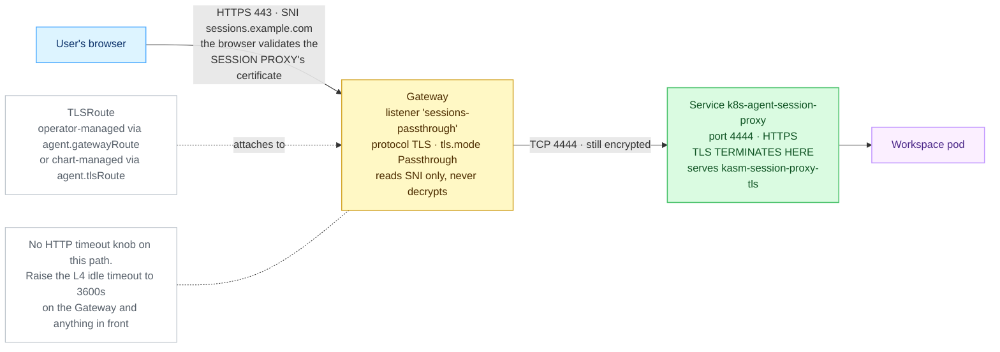

</details>

### B1 — Prerequisites

1. **Gateway API 1.5 or newer**, so `TLSRoute` is in the standard channel:

   ```console
   kubectl get crd gateways.gateway.networking.k8s.io \
     -o jsonpath='{.metadata.annotations.gateway\.networking\.k8s\.io/bundle-version}'
   ```

   Good: `v1.5.0` or later (Kubernetes 1.31+).

2. **The `TLSRoute` kind is actually served, and at which version:**

   ```console
   kubectl api-resources --api-group=gateway.networking.k8s.io | grep -i tlsroute
   ```

   Good: a row ending `gateway.networking.k8s.io/v1 ... TLSRoute`. A row showing `v1alpha2` means an
   older, experimental-channel bundle — the chart handles that automatically, see
   [`tlsRoute.apiVersion`](#tlsroute-api-versions). No row at all means the CRD is not installed and
   this path cannot work.

3. **A `Passthrough` listener exists.** A normal terminating HTTPS listener will **not** serve a
   `TLSRoute`:

   ```console
   kubectl -n kube-system get gateway traefik-gateway \
     -o jsonpath='{range .spec.listeners[*]}{.name}{"  "}{.protocol}{"  "}{.port}{"  "}{.hostname}{"  "}{.tls.mode}{"\n"}{end}'
   ```

   Good: a line like `sessions-passthrough  TLS  8443  sessions.example.com  Passthrough`. If there
   is none, add one — the exact shape that was verified on the lab cluster is in
   [Reference](#the-verified-passthrough-listener).

4. **That listener admits the agent's namespace** — same check as
   [A1 step 4](#a1--prerequisites).

5. **cert-manager, if you want it to issue the session-proxy certificate:**

   ```console
   kubectl get clusterissuer
   ```

   Good: at least one `READY  True`. Under passthrough the browser sees this certificate directly,
   so it must be **publicly trusted** — a cluster-internal CA will produce a warning in every user's
   browser.

### B2 — Values and install

`agent-passthrough.yaml`:

```yaml
agent:
  manager:
    hostname: kasm.example.com
    existingTokenSecret: kasm-manager-token
  publicHostname: sessions.example.com
  gatewayRoute:
    enabled: true
    parentRef:
      name: traefik-gateway
      namespace: kube-system
      sectionName: sessions-passthrough
  sessionProxy:
    certificate:
      enabled: true
      issuerRef:
        kind: ClusterIssuer
        name: letsencrypt-prod
      dnsNames:
        - sessions.example.com
        - "*.sessions.example.com"
```

```console
helm upgrade --install kasm-agent charts/kasm-agent \
  --namespace kasm-agent --create-namespace \
  --values agent-passthrough.yaml
```

Note the shape difference between the two passthrough options:
`gatewayRoute.parentRef` is a **single** reference; `tlsRoute.parentRefs` is a **list**. To use the
chart-managed one instead, swap that block for:

```yaml
agent:
  tlsRoute:
    enabled: true
    parentRefs:
      - name: traefik-gateway
        namespace: kube-system
        sectionName: sessions-passthrough
```

`gatewayRoute.hostnames` is defaulted by the *operator* to `[publicHostname]`, so leaving it empty
is the normal case. `tlsRoute.hostnames` is defaulted by the chart to the same thing. Either way the
session proxy's certificate must cover whatever ends up in force.

### B3 — What good looks like

```console
kubectl -n kasm-agent get tlsroute
kubectl -n kasm-agent get agent k8s-agent -o jsonpath='{range .status.conditions[*]}{.type}={.status}  {.reason}{"\n"}{end}'
```

Expect a `TLSRoute` to exist, and the Agent to report `Available=True` and `Degraded=False`. On the
`gatewayRoute` path the operator also reports on the route it owns: `Degraded=False` carries the
reason `GatewayRouteUsable` when the route is in place, and a failure shows up as
`GatewayRouteAccepted=False` or `Degraded=True` with `TLSRouteForbidden`.

With `agent.tlsRoute` the route is a Helm object instead, so check its own status:

```console
kubectl -n kasm-agent get tlsroute -o jsonpath='{range .items[*]}{.metadata.name}{"\n"}{range .status.parents[*].conditions[*]}  {.type}={.status} {.reason}{"\n"}{end}{end}'
```

Expect `Accepted=True` and `ResolvedRefs=True`.

```console
curl -kI https://sessions.example.com/
```

Expect an HTTP status line — **`404` is correct** with no active session.

Then prove it really is passthrough, by checking the browser gets the **session proxy's**
certificate and not the Gateway's. The two fingerprints must match:

```console
kubectl -n kasm-agent get secret kasm-session-proxy-tls -o jsonpath='{.data.tls\.crt}' \
  | base64 -d | openssl x509 -noout -fingerprint -sha256
echo | openssl s_client -servername sessions.example.com -connect sessions.example.com:443 2>/dev/null \
  | openssl x509 -noout -fingerprint -sha256
```

### B4 — Most likely failures

| Symptom | Fix |
| ------- | --- |
| `no matches for kind "TLSRoute" in version "gateway.networking.k8s.io/v1alpha2"` | The cluster serves `TLSRoute` only as `v1`. Use the current chart (it picks the version automatically) or set `agent.tlsRoute.apiVersion`. See [Troubleshooting](#troubleshooting). |
| Agent shows `Degraded=True` with `TLSRouteForbidden`, and no TLSRoute appears | The operator's `manager-role` lacks the TLSRoute rule, or the CRD is not served. Sessions keep working; only the route is unfulfilled. See [Troubleshooting](#troubleshooting). |
| Browser certificate warning on the session hostname | The session proxy's own certificate does not cover the hostname. Add it, and `*.<hostname>`, to `agent.sessionProxy.certificate.dnsNames`. See [Certificates](#certificates). |

---

## Walkthrough C — Ingress

**When to pick this.** The cluster has an ingress controller and no Gateway API, which is the common
case on kubeadm and most managed services. TLS terminates at the controller, on a Secret you name.


<details>
<summary>Diagram source (Mermaid)</summary>

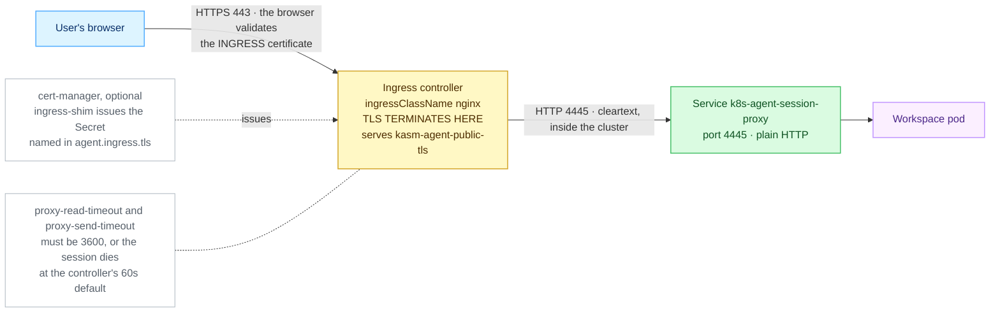

</details>

### C1 — Prerequisites

1. **An IngressClass exists:**

   ```console
   kubectl get ingressclass
   ```

   Good: at least one row, e.g. `nginx  k8s.io/ingress-nginx`. The name in the first column is what
   goes in `agent.ingress.className`. A row marked `(default)` is used when you leave that empty —
   but naming it explicitly is safer.

2. **The controller has an address users can reach:**

   ```console
   kubectl get svc -A | grep LoadBalancer
   ```

   Good: the controller's Service shows a real `EXTERNAL-IP`, not `<pending>`. On bare metal with no
   load-balancer implementation, the controller usually uses host ports instead — check
   `kubectl get svc -n ingress-nginx` and your node's firewall.

3. **A TLS Secret for the hostname**, or cert-manager to make one:

   ```console
   kubectl -n kasm-agent get secret kasm-agent-public-tls
   kubectl get clusterissuer
   ```

   Good: either the Secret already exists (type `kubernetes.io/tls`), or a ClusterIssuer shows
   `READY  True`. With cert-manager installed, adding the annotation
   `cert-manager.io/cluster-issuer: letsencrypt-prod` to `agent.ingress.annotations` makes
   ingress-shim create the Secret named in `agent.ingress.tls` for you.

### C2 — Values and install

`agent-ingress.yaml`:

```yaml
agent:
  manager:
    hostname: kasm.example.com
    existingTokenSecret: kasm-manager-token
  publicHostname: sessions.example.com
  ingress:
    enabled: true
    className: nginx
    annotations:
      nginx.ingress.kubernetes.io/proxy-read-timeout: "3600"
      nginx.ingress.kubernetes.io/proxy-send-timeout: "3600"
      cert-manager.io/cluster-issuer: letsencrypt-prod
    tls:
      - secretName: kasm-agent-public-tls
        hosts:
          - sessions.example.com
```

```console
helm upgrade --install kasm-agent charts/kasm-agent \
  --namespace kasm-agent --create-namespace \
  --values agent-ingress.yaml
```

The two timeout annotations are **not optional**. ingress-nginx defaults to a 60s read timeout,
which cuts the session websocket about a minute in. `ingress.hosts` defaults to
`[publicHostname]`; `ingress.backendPort` defaults to 4445, the proxy's plain-HTTP listener.

### C3 — What good looks like

```console
kubectl -n kasm-agent get ingress
```

Expect the Ingress to show your `CLASS`, your `HOSTS`, and an `ADDRESS` — an empty `ADDRESS` column
means no controller has claimed it, usually a wrong `className`.

```console
kubectl -n kasm-agent get secret kasm-agent-public-tls
kubectl -n kasm-agent get svc k8s-agent-session-proxy
kubectl -n kasm-agent get agent k8s-agent
```

Expect a `kubernetes.io/tls` Secret, a `ClusterIP` Service carrying 4444 and 4445, and the Agent's
`PHASE` reading `Ready`.

```console
curl -kI https://sessions.example.com/
```

Expect an HTTP status line — **`404` is correct** with no active session. Drop `-k` once the
certificate is real; it should then validate cleanly against the **ingress** certificate.

### C4 — Most likely failures

| Symptom | Fix |
| ------- | --- |
| Session dies after ~60s | The timeout annotations are missing or on the wrong controller's annotation prefix. See [Idle timeouts](#idle-timeouts) and [Troubleshooting](#troubleshooting). |
| The Ingress has no `ADDRESS` | `agent.ingress.className` names an IngressClass that does not exist, or no controller is running. Re-check prerequisite 1. |

---

## Walkthrough D — NodePort or LoadBalancer

**When to pick this.** There is no ingress controller and none coming, or an external load balancer
(a cloud NLB, an F5, an HAProxy box) will front the sessions directly. TLS terminates at the session
proxy, so the browser validates its certificate.


<details>
<summary>Diagram source (Mermaid)</summary>

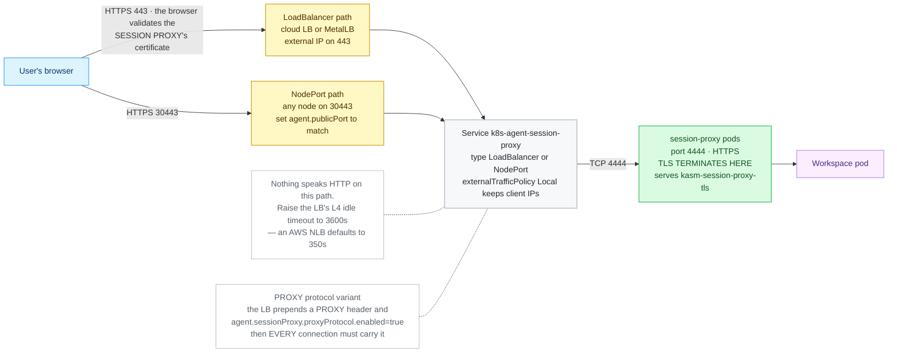

</details>

### D1 — Prerequisites

1. **For the LoadBalancer type — does the cluster hand out addresses?**

   ```console
   kubectl get svc -A | grep LoadBalancer
   ```

   Good: existing LoadBalancer Services show real addresses in `EXTERNAL-IP`. If every one says
   `<pending>`, there is no cloud controller or MetalLB, and a LoadBalancer Service will never get an
   address — use `NodePort` instead.

2. **For the NodePort type — will the environment route those ports to the nodes?** Kubernetes
   allocates from 30000–32767. Confirm with your firewall or cloud security-group rules; a VM host
   that only forwards 443 refuses the connection before Kubernetes sees it. Check what a node's
   address actually is:

   ```console
   kubectl get nodes -o wide
   ```

3. **A publicly trusted certificate for the session proxy.** Browsers reach the proxy directly here,
   so a cluster-internal CA is not enough:

   ```console
   kubectl get clusterissuer
   ```

   Good: at least one `READY  True`. Bringing your own instead is fine — create a
   `kubernetes.io/tls` Secret in the release namespace and point `agent.sessionProxy.certSecretName`
   at it. **The proxy will not start without that Secret**, whichever way you produce it.

### D2 — Values and install

LoadBalancer, `agent-lb.yaml`:

```yaml
agent:
  manager:
    hostname: kasm.example.com
    existingTokenSecret: kasm-manager-token
  publicHostname: sessions.example.com
  sessionProxy:
    certificate:
      enabled: true
      issuerRef:
        kind: ClusterIssuer
        name: letsencrypt-prod
      dnsNames:
        - sessions.example.com
        - "*.sessions.example.com"
    service:
      type: LoadBalancer
      externalTrafficPolicy: Local
```

NodePort with a pinned port, `agent-nodeport.yaml`:

```yaml
agent:
  manager:
    hostname: kasm.example.com
    existingTokenSecret: kasm-manager-token
  publicHostname: sessions.example.com
  publicPort: 30443
  sessionProxy:
    certSecretName: kasm-session-proxy-tls
    service:
      type: NodePort
      httpsNodePort: 30443
```

```console
helm upgrade --install kasm-agent charts/kasm-agent \
  --namespace kasm-agent --create-namespace \
  --values agent-lb.yaml
```

`agent.publicPort` must match the port users actually connect on — 443 behind a load balancer that
listens there, or the node port itself when browsers hit a node directly. `httpsNodePort` pins the
port for the proxy's own HTTPS listener (4444); `httpNodePort` pins the plain-HTTP one (4445), for
when TLS is terminated somewhere in front. Both must fall inside 30000–32767, and both are stable
across reconciles even when left unpinned.

### D3 — What good looks like

```console
kubectl -n kasm-agent get svc k8s-agent-session-proxy
```

Expect `TYPE  LoadBalancer` with a real `EXTERNAL-IP` (not `<pending>`), or `TYPE  NodePort` with
`4444:30443/TCP` in the `PORT(S)` column.

```console
kubectl -n kasm-agent get agent k8s-agent
kubectl -n kasm-agent get secret kasm-session-proxy-tls
```

Expect `PHASE  Ready` and the TLS Secret to exist.

```console
curl -kI https://sessions.example.com/
```

Expect an HTTP status line — **`404` is correct** with no active session. Run it from **outside** the
cluster, on the same network path a user will be on: a NodePort that answers from a cluster node and
refuses from a laptop is a firewall problem, not a Kasm one.

### D4 — Most likely failures

| Symptom | Fix |
| ------- | --- |
| NodePort answers in-cluster, refused from a LAN client | The environment does not route 30000–32767 to the nodes. See [Troubleshooting](#troubleshooting). |
| Some clients time out with `externalTrafficPolicy: Local` | Traffic reached a node with no session-proxy pod. Raise `agent.sessionProxy.replicas`, pin with `nodeSelector`, or use an LB that honours the health check. See [Preserving real client IPs](#preserving-real-client-ips). |
| Everything breaks the moment PROXY protocol is enabled | The fronting proxy is not sending the header. See [Preserving real client IPs](#preserving-real-client-ips). |

---

## Walkthrough E — OpenShift Route

**When to pick this.** You are on OpenShift. The router is already there and `passthrough`
termination is the native path — the browser validates the session proxy's certificate end to end.


<details>
<summary>Diagram source (Mermaid)</summary>

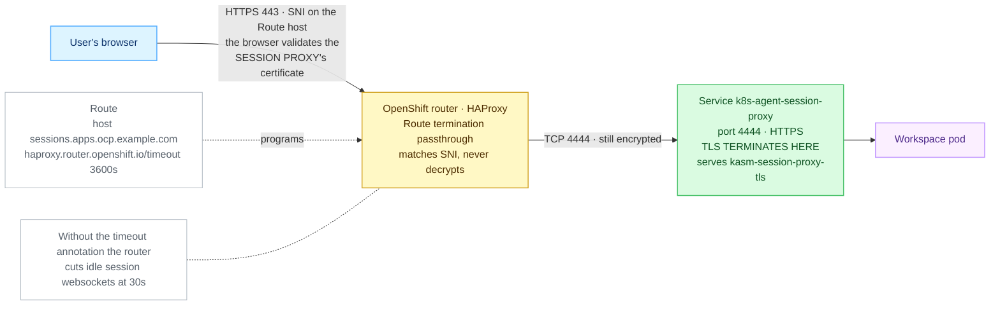

</details>

### E1 — Prerequisites

1. **The Route API is served** (i.e. this really is OpenShift):

   ```console
   kubectl api-resources --api-group=route.openshift.io
   ```

   Good: a `routes` row. Nothing means it is not OpenShift — use another walkthrough.

2. **Your hostname sits under a domain the router serves.** Find the cluster's wildcard domain:

   ```console
   kubectl -n openshift-ingress-operator get ingresscontroller default -o jsonpath='{.status.domain}'
   ```

   Good: something like `apps.ocp.example.com`. A hostname under it — `sessions.apps.ocp.example.com`
   — needs no extra DNS. A hostname outside it needs its own DNS record pointing at the router.

3. **A publicly trusted certificate for the session proxy.** Under the default `passthrough`
   termination the router does not present a certificate of its own; the browser sees the proxy's:

   ```console
   kubectl get clusterissuer
   ```

   Good: at least one `READY  True`, or you already hold a `kubernetes.io/tls` Secret to point
   `agent.sessionProxy.certSecretName` at.

### E2 — Values and install

`agent-route.yaml`:

```yaml
agent:
  manager:
    hostname: kasm.example.com
    existingTokenSecret: kasm-manager-token
  publicHostname: sessions.apps.ocp.example.com
  route:
    enabled: true
    annotations:
      haproxy.router.openshift.io/timeout: "3600s"
    tls:
      termination: passthrough
      insecureEdgeTerminationPolicy: Redirect
  sessionProxy:
    certificate:
      enabled: true
      issuerRef:
        kind: ClusterIssuer
        name: letsencrypt-prod
      dnsNames:
        - sessions.apps.ocp.example.com
        - "*.sessions.apps.ocp.example.com"
```

```console
helm upgrade --install kasm-agent charts/kasm-agent \
  --namespace kasm-agent --create-namespace \
  --values agent-route.yaml
```

`route.host` defaults to `publicHostname`. `route.backendPort` follows the termination mode when
left empty — 4444 for `passthrough` and `reencrypt`, 4445 for `edge`. The timeout annotation is
effectively mandatory: the OpenShift router's default connection timeout is **30 seconds**.

### E3 — What good looks like

```console
kubectl -n kasm-agent get route
kubectl -n kasm-agent get route -o jsonpath='{range .items[*]}{.spec.host}{"  "}{.spec.tls.termination}{"  "}{.spec.port.targetPort}{"\n"}{end}'
```

Expect your host, `passthrough`, and target port `4444`.

```console
kubectl -n kasm-agent get agent k8s-agent
curl -kI https://sessions.apps.ocp.example.com/
```

Expect `PHASE  Ready` and an HTTP status line — **`404` is correct** with no active session.

### E4 — Most likely failures

| Symptom | Fix |
| ------- | --- |
| Session dies after ~30s | The `haproxy.router.openshift.io/timeout` annotation is missing. See [Troubleshooting](#troubleshooting). |
| Browser certificate warning | Under `passthrough` the browser validates the session proxy's certificate — it must cover `route.host`. See [Certificates](#certificates). |

---

## Reference

### The session proxy's two ports

The session proxy listens on two ports. **4444** is its own HTTPS listener, served with the
certificate in `agent.sessionProxy.certSecretName`. **4445** is plain HTTP, for use behind something
that has already terminated TLS.

| Exposure | Default backend port | Why |
| -------- | -------------------- | --- |
| `agent.httpRoute` | 4445 | TLS terminates at the Gateway |
| `agent.ingress` | 4445 | TLS terminates at the Ingress |
| `agent.tlsRoute` / `agent.gatewayRoute` | 4444 | passthrough — nothing decrypted it earlier |
| `agent.route` (OpenShift) | 4444 for `passthrough`/`reencrypt`, 4445 for `edge` | follows `route.tls.termination` |
| `agent.sessionProxy.service` | both published | point your LB at whichever suits |

Sending an Ingress or HTTPRoute to 4444 instead works, but the controller then has to be told to
speak TLS upstream — `nginx.ingress.kubernetes.io/backend-protocol: "HTTPS"` on ingress-nginx.

### Certificates

Browsers connect to the session proxy directly, so on any passthrough or direct-Service path its
certificate must be **publicly trusted** — a cluster-internal CA is not enough. Cover the public
hostname **and** its wildcard:

```yaml
agent:
  sessionProxy:
    certificate:
      enabled: true
      issuerRef:
        kind: ClusterIssuer
        name: letsencrypt-prod
      dnsNames:
        - sessions.example.com
        - "*.sessions.example.com"
```

Bringing your own instead: create a `kubernetes.io/tls` Secret in the release namespace and set
`agent.sessionProxy.certSecretName`. Either way the Secret must exist — the proxy will not start
without it, even when TLS is terminated in front of it.

On the control-plane side, either supply `kasm-helm.certificate.secretName` or let cert-manager
issue it, keeping the wildcard on:

```yaml
kasm-helm:
  certificate:
    secretName: kasm-tls
    certManager:
      enabled: true
      addWildCard: true
      issuerName: letsencrypt-prod
      issuerKind: ClusterIssuer
```

### Idle timeouts

Kasm sessions are long-lived websockets. Every default in this space is too short.

| Path | Knob |
| ---- | ---- |
| `agent.ingress` (ingress-nginx) | `nginx.ingress.kubernetes.io/proxy-read-timeout: "3600"` and `proxy-send-timeout` in `agent.ingress.annotations` |
| `agent.route` (OpenShift) | `haproxy.router.openshift.io/timeout: "3600s"` in `agent.route.annotations` |
| `agent.httpRoute` | the Gateway data plane's own idle timeout — not a Kasm value |
| passthrough and direct Service | no HTTP knob exists. Raise the **L4 idle timeout** on the Gateway's data plane or the load balancer (an AWS NLB defaults to 350s) |

### Preserving real client IPs

Optional, and pick exactly one — the two mechanisms are alternatives, not layers.

```yaml
agent:
  sessionProxy:
    service:
      type: LoadBalancer
      externalTrafficPolicy: Local     # L4: no SNAT, but only routes via nodes running a proxy pod
```

```yaml
agent:
  sessionProxy:
    proxyProtocol:
      enabled: true                    # L7: the fronting proxy MUST send PROXY protocol
      trustedCIDRs:
        - 10.0.0.0/16
```

`proxyProtocol` is all-or-nothing: once on, nginx requires a PROXY header on **every** connection,
so browsers, health checks and `curl` hitting the listener directly all break. Enable it on the load
balancer at the same time, never on its own.

### The control-plane half

Keep the control plane on `ClusterIP` when an ingress fronts it. A `LoadBalancer` there claims the
node's :443, which the controller fronting the session proxy usually already holds — the chart
rejects that combination outright.

```yaml
kasm-helm:
  proxyService:
    type: ClusterIP
  ingress:
    enabled: true
    ingressClassName: traefik
    backendProtocol: http
```

The control plane's proxy Service is named per zone — `<release>-proxy-<zone>`, so a release
called `kasm` with the default zone gives `kasm-proxy-default`, not `kasm-proxy`. The
externally-typed one is `<release>-proxy-ext-<zone>`. Use those names when you port-forward or
point an Ingress backend at it by hand.

### Internal CA bundles

Internal CAs **inside the cluster** go in with `kasm-helm.trustedCaBundle.enabled=true` and
`kasm-helm.trustedCaBundle.caCerts`. CA certificates *inside sessions* are a different mechanism
entirely — file mappings under `/usr/local/share/ca-certificates/` plus an `update-ca-certificates`
start command.

### Enabling the Gateway API provider on k3s / Traefik

On k3s the Gateway provider is off by default; enable it with a `HelmChartConfig` in `kube-system`
(k3s reconciles it automatically). This is the shape that was verified on the lab cluster; check
`helm show values traefik/traefik` against your Traefik version:

```yaml
apiVersion: helm.cattle.io/v1
kind: HelmChartConfig
metadata:
  name: traefik
  namespace: kube-system
spec:
  valuesContent: |-
    providers:
      kubernetesGateway:
        enabled: true
    gateway:
      enabled: true
      listeners:
        websecure:
          port: 8443              # Traefik's backend port; :443 on the node DNATs to it
          protocol: HTTPS
          hostname: sessions.example.com
          namespacePolicy: All    # must admit the agent namespace
          certificateRefs:
            - name: kasm-agent-public-tls
```

### The verified passthrough listener

TLS passthrough needs a listener declared with `protocol: TLS` and `tls.mode: Passthrough`. A normal
terminating HTTPS listener will not serve a `TLSRoute`. On Traefik 3.7 (Gateway API 1.5.1) it can
share port 8443 with the terminated HTTPS listener as long as the hostnames differ:

```yaml
- name: sessions-passthrough
  port: 8443
  protocol: TLS
  hostname: sessions.example.com
  tls:
    mode: Passthrough
  allowedRoutes:
    namespaces:
      from: Selector
      selector:
        matchExpressions:
          - {key: kubernetes.io/metadata.name, operator: In, values: [kasm, kasm-agent]}
```

The `matchExpressions` form above admits two namespaces. For a single namespace the shorter
`matchLabels` form does the same job:

```yaml
  allowedRoutes:
    namespaces:
      from: Selector
      selector:
        matchLabels:
          kubernetes.io/metadata.name: kasm-agent
```

`from: All` admits every namespace and needs no selector at all.

Point the route at it with `agent.gatewayRoute.parentRef.sectionName=sessions-passthrough` and
`agent.gatewayRoute.hostnames[0]=sessions.example.com`; the session proxy certificate must cover
that hostname (the `*.<publicHostname>` wildcard does).

Check the listener's own `Accepted`/`Programmed` conditions and the TLSRoute's `status.parents`
before trusting a k3s `HelmChartConfig` edit: on this lab the identical listener declared through
Traefik's chart values made the chart's upgrade job fail and briefly removed the Gateway object,
while patching the live Gateway programmed it immediately. Validate on the Gateway first, then move
the listener into your chart values.

### TLSRoute API versions

`TLSRoute` is in the Gateway API **standard** channel as `v1` since release 1.5 (Kubernetes 1.31 or
newer); only CRD bundles older than that carry it in the experimental channel, as `v1alpha2`.

The chart picks the version for you: `v1` when the cluster serves it, `v1alpha2` when only the older
experimental-channel CRD is served, and `v1` when rendering without a cluster (`helm template`). Set
`agent.tlsRoute.apiVersion` to override that choice — for example when rendering offline for a
cluster that still serves only `v1alpha2`. On the `agent.gatewayRoute` path the **operator** creates
the route, and it creates `v1`.

### One Gateway that did not work

On Cilium 1.20 / kubeadm 1.34, the host-network Cilium Gateway reported `Accepted` and `Programmed`
with correct Envoy configuration and still never served traffic: the kernel accepted connections and
nothing ever answered them. The upstream Traefik chart with host ports 80 and 443 was the working
Gateway on that same cluster. This is an observation about that build, not a verdict on Cilium
Gateway generally — but do not treat `Programmed=True` as proof that sessions will stream. Curl the
public hostname before you believe the status conditions.

### Minimal umbrella values

Under the `kasm-platform` umbrella, both halves in one file:

```yaml
kasm-helm:
  publicAddr: kasm.example.com
  proxyService:
    type: ClusterIP
  ingress:
    enabled: true
    ingressClassName: traefik
  certificate:
    secretName: kasm-tls
  kasmConfig:
    generatePreseed: true
    authDomain: example.com

kasm-agent:
  agent:
    publicHostname: sessions.example.com
    gatewayRoute:
      enabled: true
      parentRef:
        name: traefik-gateway
        namespace: kube-system
        sectionName: sessions-passthrough
    sessionProxy:
      certificate:
        enabled: true
        issuerRef:
          kind: ClusterIssuer
          name: letsencrypt-prod
        dnsNames:
          - sessions.example.com
          - "*.sessions.example.com"
```

Installing the charts directly? Drop the `kasm-agent:` key (start at `agent:`) for `kasm-agent`, and
drop the `kasm-helm:` key for `kasm-helm`.

## Verify end to end

```console
curl -k -sS -o /dev/null -w '%{http_code}\n' https://sessions.example.com/
openssl s_client -connect sessions.example.com:443 -servername sessions.example.com </dev/null 2>/dev/null \
  | openssl x509 -noout -subject -ext subjectAltName
```

Expected indicators:

* The `curl` returns an HTTP status from the session proxy — **`404` is normal** with no active
  session. A connection refused/timeout means the route or the Service exposure is wrong.
* The certificate's SANs include `sessions.example.com`. On a passthrough route
  (`gatewayRoute`/`tlsRoute`/OpenShift `Route`) the certificate you see is the **session proxy's
  own**; on `httpRoute`/`ingress` it is the Gateway's.
* Gateway API path:

  ```console
  kubectl -n kasm-agent get httproute,tlsroute -o wide
  kubectl -n kasm-agent describe httproute <name> | grep -A3 'Parents\|Accepted'
  ```

  `Accepted: True` and `ResolvedRefs: True`. `Accepted: False` with `NotAllowedByListeners` means the
  listener does not admit this namespace.
* Log in at the control-plane hostname and launch a session: the browser URL bar shows the **agent's**
  hostname, and the session stays up past 60 seconds (proof the websocket timeout is raised).

## Troubleshooting

| Symptom | Cause | Fix |
| ------- | ----- | --- |
| Session connect returns **401** | The auth cookie is scoped to the control-plane hostname only | Set the Kasm Auth Domain to the shared parent — `kasm-helm.kasmConfig.authDomain` on a fresh install, Settings → Auth on an existing one; then use a fresh incognito window |
| Session connect returns **404** from the ingress | The zone's *Proxy Connections* is on, so traffic is relayed with the original `Host` header and matches no route | Disable *Proxy Connections* and set *Upstream Auth Address* to the control plane's `publicAddr` |
| Session dies after ~60s (ingress-nginx) or ~30s (OpenShift router) | Default proxy timeouts cut the websocket | `proxy-read-timeout` / `proxy-send-timeout` `3600`, or `haproxy.router.openshift.io/timeout: 3600s` |
| Idle passthrough sessions dropped at ~350s | The L4 idle timeout on the load balancer (AWS NLB default) | Raise the LB idle timeout; there is no HTTP knob on a passthrough path |
| `HTTPRoute`/`TLSRoute` shows `Accepted: False` | The Gateway listener does not admit the agent namespace, or the hostname does not match | Fix the listener's `allowedRoutes` and `hostname` |
| `TLSRoute` not recognised by the API server | The Gateway API CRDs are missing or older than 1.5, when `TLSRoute` was experimental-channel only | Install Gateway API 1.5 or newer (standard channel includes `TLSRoute`), or use `httpRoute`/`ingress` |
| `no matches for kind "TLSRoute" in version "gateway.networking.k8s.io/v1alpha2"` | Gateway API 1.5+ serves `TLSRoute` only as `v1`; something rendered the old version | Use the current chart (it selects `v1` automatically) or set `agent.tlsRoute.apiVersion` |
| Browser certificate warning on the session hostname | Passthrough route serving the session proxy's own certificate, which does not cover the public hostname | Add the hostname (and `*.<hostname>`) to `agent.sessionProxy.certificate.dnsNames`, or provision `agent.sessionProxy.certSecretName` |
| NodePort answers in-cluster, refused from a LAN client | The environment does not route 30000–32767 to the nodes | Open the range, or front the proxy with an ingress/LB |
| Everything breaks the moment PROXY protocol is enabled | The fronting proxy is not sending a PROXY header | Enable it on the load balancer too, or turn `agent.sessionProxy.proxyProtocol.enabled` back off |
| Some clients time out with `externalTrafficPolicy: Local` | Traffic routed via a node with no session-proxy pod | Raise `agent.sessionProxy.replicas`, pin with `nodeSelector`, or use an LB that honours the health check |
| Gateway shows `Accepted`/`Programmed`, connections hang with no response | Observed on the host-network Cilium Gateway (Cilium 1.20 / kubeadm 1.34): correct Envoy config, no traffic served | Prove it with `curl` rather than status conditions; the upstream Traefik chart on host ports 80/443 worked on the same cluster |
| Control-plane install rejected with a port conflict | `kasm-helm.proxyService.type=LoadBalancer` alongside an ingress | Set it to `ClusterIP` |

- **Agent shows `Degraded=True/TLSRouteForbidden` (or `TLSRouteUnavailable`) and no TLSRoute appears** → the operator cannot manage TLSRoutes: its `manager-role` lacks the `gateway.networking.k8s.io/tlsroutes` rule, or the TLSRoute CRD is not served (Gateway API standard channel ≥ 1.5). Everything else keeps reconciling — Service, session proxy, workspaces — so sessions stay up; only `agent.gatewayRoute` is unfulfilled and `GatewayRouteAccepted=False`. Fix: reinstall/upgrade the operator chart (its `manager-role` ships the rule; a `helm upgrade` also reverts any manual RBAC edit) or install the Gateway API CRDs, then the operator creates the TLSRoute and the condition clears without a restart of anything else.

## Checklist

- [ ] Two sibling hostnames under one parent domain, DNS in place
- [ ] Exactly one of `gatewayRoute` / `tlsRoute` / `httpRoute` / `ingress` / `route` / direct `sessionProxy.service`
- [ ] Gateway listener carries the hostname and admits the agent namespace (passthrough listener uses `protocol: TLS`, `tls.mode: Passthrough`)
- [ ] Websocket / L4 idle timeout ≥ 3600s on whatever fronts the proxy
- [ ] Session-proxy certificate covers the public hostname **and** `*.<hostname>`, publicly trusted
- [ ] Control-plane certificate in place; `kasm-helm.proxyService.type=ClusterIP` behind an ingress
- [ ] Kasm Auth Domain set to the shared parent; zone *Proxy Connections* off, *Upstream Auth Address* set
- [ ] Client-IP strategy chosen (`externalTrafficPolicy=Local` **or** `proxyProtocol` + `trustedCIDRs`)
- [ ] `curl -k https://<agent hostname>/` answers (404 with no session is expected)
- [ ] A browser session connects and survives past 60 seconds
