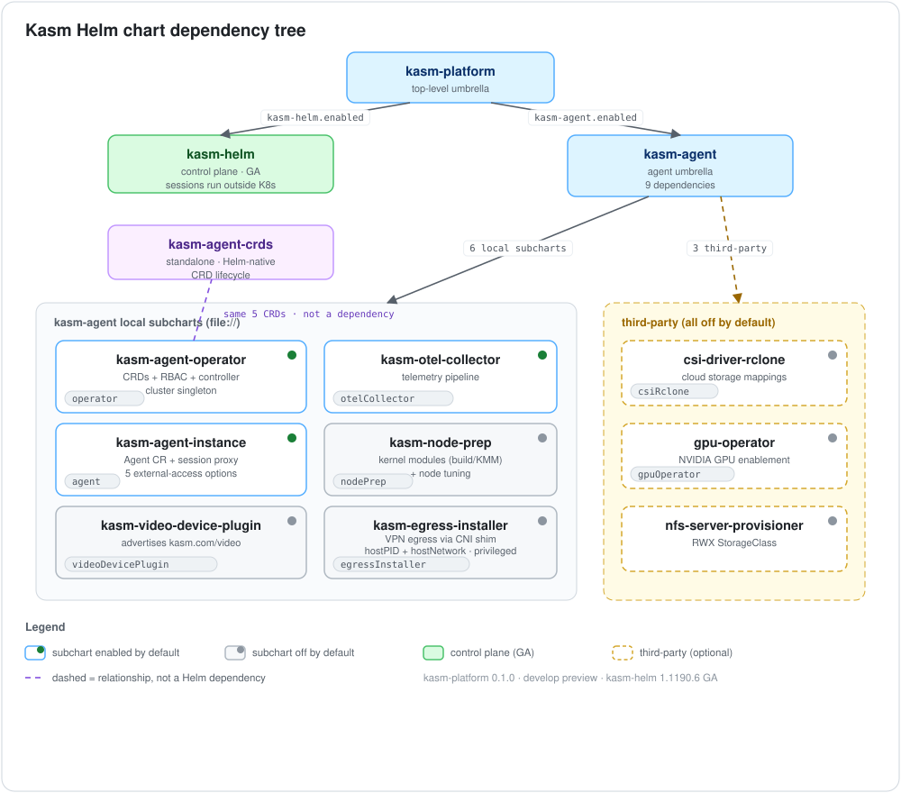
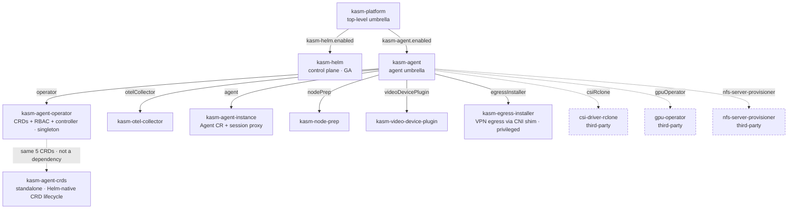

# Kasm Workspaces on Kubernetes: Architecture

This is the map of the ten Helm charts in this repository — what each one is, how
they depend on one another, and which combination to reach for. Every chart keeps
its own README with the full value reference; this document links to those rather
than repeating them.

## The two halves of a Kasm deployment

A Kasm Workspaces deployment has two halves:

- **The control plane** — what users log in to: the web UI, the manager and API
  services, the session proxy, Guacamole, the RDP gateways, and a database. In this
  repository that is the **[kasm-helm](../../charts/kasm-helm/README.md)** chart.
  **Sessions do not run here.**
- **The agent** — what actually runs sessions: an operator, an `Agent` custom
  resource, and a session proxy that users' browsers connect to directly. In this
  repository that is the **[kasm-agent](../../charts/kasm-agent/README.md)** umbrella
  and the subcharts it composes.

An agent registers with a manager, and from then on the manager schedules workspaces
into the agent's cluster. The manager a Kubernetes agent registers with can be this
repo's control plane, a control plane in another cluster, a VM/Docker deployment, or
a Kasm-hosted one — the two halves are deployed and versioned independently, and each
installs perfectly well alone.

## The chart dependency tree

Diagram source (Mermaid)

Grounded in the actual `Chart.yaml` dependency blocks:

- **kasm-platform** (`charts/kasm-platform/Chart.yaml`) declares two `file://`
  dependencies — `kasm-helm` (condition `kasm-helm.enabled`) and `kasm-agent`
  (condition `kasm-agent.enabled`). Neither is aliased. It adds no workloads of its
  own beyond an `extraObjects` escape hatch.
- **kasm-agent** (`charts/kasm-agent/Chart.yaml`) declares **nine** dependencies —
  six local Kasm subcharts and three optional third-party charts:
  - Local, aliased: `kasm-agent-operator` (alias `operator`),
    `kasm-otel-collector` (`otelCollector`), `kasm-agent-instance` (`agent`),
    `kasm-node-prep` (`nodePrep`), `kasm-video-device-plugin`
    (`videoDevicePlugin`), and `kasm-egress-installer` (`egressInstaller`).
  - Third-party: `csi-driver-rclone` (`csiRclone`, from
    `oci://ghcr.io/veloxpack/charts`), `gpu-operator` (`gpuOperator`, from
    `https://helm.ngc.nvidia.com/nvidia`), and `nfs-server-provisioner`
    (un-aliased, from the nfs-ganesha repo). Each is gated by a `*.enabled`
    condition and defaults **off**.
- **kasm-agent-crds** (`charts/kasm-agent-crds/Chart.yaml`) has **no dependencies,
  and nothing depends on it**. It is a standalone release — see
  [Why the CRDs are split from the operator](#why-the-crds-are-split-from-the-operator).

Default toggles inside kasm-agent: `operator`, `otelCollector`, and `agent` default
**enabled**; `nodePrep`, `videoDevicePlugin`, `egressInstaller`, and all three
third-party dependencies default **disabled**.

Build order matters. kasm-platform packages kasm-agent from disk — its `charts/`
directory included — so kasm-agent's own nine dependencies must be staged first:
`helm dependency build charts/kasm-agent` before
`helm dependency build charts/kasm-platform` (the `make deps-agent` target does both,
in that order).

## Cluster singletons

- **kasm-agent-operator is a cluster singleton.** It owns cluster-scoped CRDs and
  fixed-name ClusterRoles, so only one release per cluster may set
  `operator.enabled=true`. To run a second agent in another namespace of the same
  cluster, install it with `operator.enabled=false` and let it share the operator
  already there.
- **The operator's Secret access is per namespace, not cluster-wide.** Its ClusterRole carries no
  `secrets` rule; each `kasm-agent-instance` release stamps a Role in its own namespace granting the
  operator's ServiceAccount get/create/update on the storage-mapping Secrets there. In the
  two-namespace layout, tell the agent where the operator runs
  (`agent.operatorRBAC.serviceAccount.namespace`).
- **The third-party GPU Operator and rclone CSI driver are cluster-scoped too.**
  Enable each in at most one release per cluster, and leave it off if something else
  already installs it.
- The control plane (kasm-helm), by contrast, creates **no** cluster-scoped objects
  at all — no CRDs, no ClusterRoles — so it can never collide with the agent's
  cluster-scoped resources. That is what makes single-namespace co-location safe.

## Why the CRDs are split from the operator

The operator's CustomResourceDefinitions — `agents`, `kasmworkspaces`, and
`kasmimagepullers` in group `agent.kasm.com` — exist in the tree twice, on purpose, because Helm's two ways
of installing a CRD each give up something the other has:

- **kasm-agent-operator's `crds/` directory** is applied *before* the release
  manifest is rendered and validated, so a one-command install of an umbrella that
  also creates `Agent`/`KasmImagePuller` resources works. The cost: **`helm upgrade`
  never touches a `crds/` CRD** — schema changes must be applied out of band with
  `kubectl apply --server-side -f charts/kasm-agent-operator/crds/`.
- **kasm-agent-crds** ships the identical schemas as ordinary Helm templates, so a
  release of it owns their lifecycle and `helm upgrade` applies schema changes. The
  cost: those templates cannot supply the schema in the same pass that validates the
  same release's own custom resources — which is why it is a separate release you
  install *first*.

Reach for kasm-agent-crds when a fleet's CRD versions should move through the same
review, promotion, and rollout machinery as everything else you deploy with Helm.
Skip it — and let the operator chart's `crds/` directory do the work — for a single
cluster installed once and upgraded by hand. The two copies are kept byte-identical
by `make crds-sync-check`, which fails the build the moment they diverge. Full
detail: [kasm-agent-crds](../../charts/kasm-agent-crds/README.md) and the CRD-lifecycle
section of [kasm-agent-operator](../../charts/kasm-agent-operator/README.md).

## Deployment topologies

Four common layouts:

1. **Whole stack, single namespace (kasm-platform).** Both halves in one release,
   in one namespace — the simplest install. The agent can read the control plane's
   manager-token Secret directly, with nothing to copy. Use `kasm-platform` with
   both halves enabled; see its
   [worked example](../../charts/kasm-platform/README.md).
2. **Two namespaces, one cluster (recommended).** Control plane (kasm-helm) in one
   namespace, agent (kasm-agent) in another, on the same cluster — the recommended
   layout when the two halves should stay isolated. Copy the registration token
   across namespaces. See "Running alongside the kasm-helm control plane" in the
   [kasm-agent README](../../charts/kasm-agent/README.md).
3. **Agent only.** Install kasm-agent (or kasm-platform with
   `kasm-helm.enabled=false`) against a manager that already exists elsewhere —
   another cluster, a VM/Docker deployment, or a Kasm-hosted manager. Point
   `agent.manager.hostname` at it.
4. **Control plane only.** Install kasm-helm (or kasm-platform with
   `kasm-agent.enabled=false`) when agents live elsewhere — other clusters or VM
   agents — or are added later.

In any shared-namespace topology, leave the agent umbrella's `networkPolicies`
**disabled** (its baseline models only the agent's own flows and would cut the
control plane off), and expect the `privileged` Pod Security Standard to cover the
control-plane pods too if `nodePrep`/`videoDevicePlugin` are on. `egressInstaller`
raises that bar further: its DaemonSet needs `hostPID` *and* `hostNetwork` on top of
a privileged container, so the namespace has to permit host namespaces as well — and
in a shared namespace that permission covers the control plane too. Both READMEs
spell this out.

## Which chart do I use?

See [The charts](charts.md) — what each one installs, and which to
start from.

## Versions and history

kasm-helm is versioned on the Kasm Workspaces release cadence — currently chart
`1.1190.6` / app `1.19.0`, GA. The agent-family and umbrella charts are versioned
independently and are currently `0.1.0` (app `develop`), a developer preview. For
release history, see each chart's `CHANGELOG.md` — for example,
[charts/kasm-helm/CHANGELOG.md](../../charts/kasm-helm/CHANGELOG.md). There is no
repository-wide changelog.
