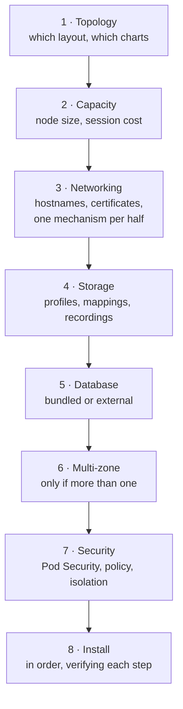
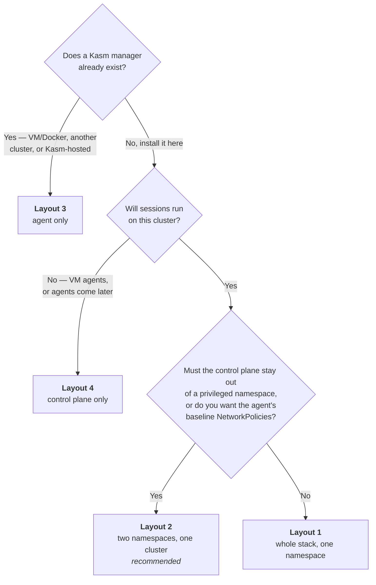
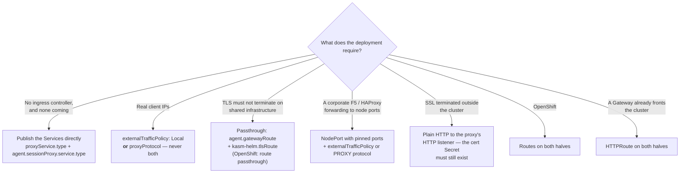

> **Applies to:** both halves · **Output:** a values file you can install · **Next:** [Install and verify](../operate/install-and-verify.md)

# Planning a Kasm deployment

1. **[Hosting and topology](#hosting-and-topology)** — pick one of the four layouts, and the provider if managed.
2. **[Capacity model](capacity.md)** — cost a session, cost a node, find the ceiling that binds first.
3. **[Network plan](#network-plan)** — two hostnames, one auth domain, exactly one exposure method.
4. **[Storage plan](storage/README.md)** — profiles, storage mappings, recordings, the node image store.
5. **[Security decisions](security.md)** — what the privileged charts cost you, and where.
6. **[Install order and verification](../operate/install-and-verify.md)**, then **[day 2](../operate/upgrade.md)** and the **[master checklist](#master-checklist)**.

Each phase is a set of decisions, each ending in `- [ ]` items. It assembles the rest of this
repository's documentation rather than repeating it: [architecture](../overview/architecture.md) says which
chart, [what works on Kubernetes](../reference/feature-matrix.md) says which value, the
[how-tos](README.md) say how. Follow the links for mechanics.

For whoever sizes the cluster, owns DNS and TLS, and signs off the security posture — before the
first `helm install`. Several decisions here (the two hostnames, the NetworkPolicy engine, the node
image) cannot be changed afterwards without a rebuild.

---

## The sequence

| Step | Page | The decision |
| ---- | ---- | ------------ |
| 1 | [below](#hosting-and-topology) | Which of four layouts, and therefore which charts |
| 2 | [Capacity](capacity.md) | What a session costs, and how many fit on a node |
| 3 | [Networking](networking/README.md) | The hostname pair, the certificates, one exposure mechanism per half |
| 4 | [Storage](storage/README.md) | Persistent profiles, user mappings, recordings, the image store |
| 5 | [Database](database.md) | Bundled PostgreSQL or your own |
| 6 | [Multi-zone](multi-zone.md) | Only if sessions run in more than one place |
| 7 | [Security](security.md) | Pod Security admission, RBAC, isolation |
| 8 | [Install and verify](../operate/install-and-verify.md) | The order, and what good looks like |

Cross-cutting, and worth reading before step 1 if either applies:
[Supported platforms](support.md), [Managed providers](managed-providers.md),
[Airgap](airgap.md), [Registries](registries.md), [Nodes and devices](nodes/README.md).

## Hosting and topology

### Pick a layout

Two questions decide it: where the manager lives, and whether the two halves share a namespace.

| Layout | What it is | What you install |
| ------ | ---------- | ---------------- |
| **1** | Whole stack, single namespace | [`kasm-platform`](../../charts/kasm-platform/README.md), both halves enabled |
| **2** *(recommended)* | Both halves, one cluster, a namespace each | [`kasm-helm`](../../charts/kasm-helm/README.md) and [`kasm-agent`](../../charts/kasm-agent/README.md) as separate releases |
| **3** | Agent only; the manager is elsewhere | [`kasm-agent`](../../charts/kasm-agent/README.md), or `kasm-platform` with `kasm-helm.enabled=false` |
| **4** | Control plane only; sessions run elsewhere | [`kasm-helm`](../../charts/kasm-helm/README.md), or `kasm-platform` with `kasm-agent.enabled=false` |

Each is described in full in
[Architecture → Deployment topologies](../overview/architecture.md#deployment-topologies), and the
toggle matrix for driving all four from the one umbrella chart is in
[kasm-platform → The toggle matrix](../../charts/kasm-platform/README.md#the-toggle-matrix).

**Three variations on those four:**

* **More than one region or cluster** — layout 3, repeated: one `kasm-agent` release per cluster,
  one `kasm-helm.kasmZones` entry per zone. See [Multi-zone](multi-zone.md).
* **A second agent in another namespace of the same cluster** — layout 2, with
  `operator.enabled=false` on the second release. The operator is a
  [cluster singleton](../overview/architecture.md#cluster-singletons), so only one release may own it.
* **`networkPolicies.enabled=true`** — layouts 2 and 3 only. The baseline models the agent's traffic
  flows, so it is only safe in a namespace that holds nothing else; on layout 1 it would cut the
  control plane off.

### What the layout choice fixes

Picking a layout settles five things at once. None of them is a later tuning knob.

| Fixed by the layout | 1 — single namespace | 2 — two namespaces | 3 — agent only | 4 — control plane only |
| ------------------- | -------------------- | ------------------ | -------------- | ---------------------- |
| Scope of the `privileged` Pod Security Standard | covers control-plane pods too | agent namespace only | agent namespace only | not needed |
| Agent baseline NetworkPolicies (`networkPolicies.enabled`) | must stay `false` — the baseline models only the agent's flows | `true` supported | `true` supported | n/a |
| Where the manager lives | same release | same cluster, other namespace | outside this cluster | here; agents elsewhere |
| Manager token | reference the control plane's Secret in place (`agent.manager.existingTokenSecret`) | copy the Secret across namespaces | issued by the remote manager | n/a |
| Cross-cluster reachability | none needed | none needed | the agent must reach `agent.manager.hostname`, and the manager must reach the session proxy | n/a |

The four things the two halves must agree on — the zone, the token, the manager address, and the
hostname split — are spelled out in
[kasm-agent → Running alongside the kasm-helm control plane](../../charts/kasm-agent/README.md#running-alongside-the-kasm-helm-control-plane).

### If the cluster is managed

A managed service fixes the node OS, the load balancer, and the security baseline — and those
decide which optional charts are *possible*, not merely convenient. Start at the
[cross-provider matrix](managed-providers.md#cross-provider-matrix), then work the
[Before you pick a provider](managed-providers.md#before-you-pick-a-provider)
checklist, which collects the choices that cannot be changed after cluster creation.

Three that bite hardest:

* **Node image.** Bottlerocket and COS cannot build kernel modules at all; if webcam is in scope,
  either the image ships headers and a toolchain, or you commit to
  `nodePrep.modules.v4l2loopback.method=kmm` with prebuilt per-kernel images.
* **NetworkPolicy engine.** A creation-time choice on AKS, and a feature flag on EKS. A
  `NetworkPolicy` under a non-enforcing CNI succeeds silently and isolates nothing.
* **Serverless node pools.** Fargate, GKE Autopilot and AKS virtual nodes cannot run `nodePrep`,
  `videoDevicePlugin`, `egressInstaller`, the rclone CSI node plugin, or `agent.imagePuller`.

Minimum floor for the agent family, whatever the provider: **Kubernetes 1.26+** (or OpenShift
4.10+), Helm 3, a default StorageClass with dynamic provisioning, working in-pod DNS, and a
reachable manager with a registration token — see
[kasm-agent → Prerequisites](../../charts/kasm-agent/README.md#prerequisites). The control plane's own
floor is lower, at 1.24+.

**Decisions**

- [ ] Layout chosen from the table in [2.1](#pick-a-layout), and the reason recorded.
- [ ] If managed: provider chosen, and [Before you pick a provider](managed-providers.md#before-you-pick-a-provider) worked through.
- [ ] Node image confirmed able to do what the feature set needs (kernel modules, `/dev/fuse`, `/dev/dri`).
- [ ] NetworkPolicy engine selected — at cluster creation where the provider requires it.
- [ ] One cluster, one `operator.enabled=true`; likewise `gpuOperator.enabled` and `csiRclone.enabled`.
- [ ] Kubernetes ≥ 1.26 on every cluster that will run an agent.

---

## Network plan

The full treatment is in [Networking](networking/README.md) — it starts with
[Certificates](networking/certificates.md), then one page per mechanism, each covering both halves.
What follows is the worksheet to fill in before you get there.

### The worksheet

Fill this in before touching values. The hostname pair in particular cannot be changed later
without renaming one of them.

| Item | Decide | Value that carries it |
| ---- | ------ | --------------------- |
| Control-plane hostname | e.g. `kasm.example.com` | `kasm-helm.publicAddr` |
| Agent public hostname | must **differ** from the above; one per zone | `agent.publicHostname` |
| Session-proxy public port | 443 unless something in front says otherwise | `agent.publicPort` |
| **Authorization domain** | the shared **parent** of both hostnames | `kasm-helm.kasmConfig.authDomain` |
| Zone name | must already exist on the control plane | `agent.zone`, `kasm-helm.kasmZones` |
| Zone routing | `proxy_connections: false`; `upstream_auth_address` = the control-plane address — [why](multi-zone.md#zone-routing-the-pair-that-picks-the-topology) | entries under `kasm-helm.kasmZones` |
| Control-plane certificate | own cert, or cert-manager (keep the wildcard) | `kasm-helm.certificate.secretName`, or `kasm-helm.certificate.certManager.enabled` + `issuerName` + `addWildCard` |
| Agent certificate | must cover the hostname **and** `*.<hostname>`, publicly trusted | `agent.sessionProxy.certSecretName`, or `agent.sessionProxy.certificate.enabled` + `dnsNames` |
| Exposure, control plane | ingress, Route, or the Service directly | `kasm-helm.ingress.enabled` / `kasm-helm.route.enabled` / `kasm-helm.proxyService.type` |
| Exposure, agent | **exactly one** of six | see [Networking](networking/README.md#choosing-a-mechanism) |
| Idle timeout | ≥ 3600s on whatever fronts the proxy | ingress annotations, or the LB's L4 idle timeout |
| Real client IPs | needed, or not | `agent.sessionProxy.service.externalTrafficPolicy`, **or** `agent.sessionProxy.proxyProtocol.enabled` + `trustedCIDRs` |
| Per-session egress / VPN | needed, or not | `egressInstaller.enabled`, `egressInstaller.distro` |
| Policy baseline | on only in an agent-only namespace | `networkPolicies.enabled`, `networkPolicies.manager.ports` |

Two hostnames, siblings under one parent, plus that parent as the authorization domain, is the
whole shape. Get it wrong and every session connect returns 401 (cookie out of scope) or 404 (zone
still relaying through the control-plane proxy).

### Starting from the requirement

Most deployments already know what they need rather than which mechanism provides it:

Whichever you pick: the control plane stays on `proxyService.type=ClusterIP` behind an ingress,
Route or Gateway API route, and the chart rejects the combination outright — see
[why](networking/loadbalancer-nodeport.md#why-the-control-plane-must-be-clusterip-behind-a-front-end).

## Master checklist

### Hosting and topology

- [ ] Layout chosen from the table in [2.1](#pick-a-layout), and the reason recorded.
- [ ] If managed: provider chosen, and [Before you pick a provider](managed-providers.md#before-you-pick-a-provider) worked through.
- [ ] Node image confirmed able to do what the feature set needs (kernel modules, `/dev/fuse`, `/dev/dri`).
- [ ] NetworkPolicy engine selected — at cluster creation where the provider requires it.
- [ ] One cluster, one `operator.enabled=true`; likewise `gpuOperator.enabled` and `csiRclone.enabled`.
- [ ] Kubernetes ≥ 1.26 on every cluster that will run an agent.

### Capacity

- [ ] Per-session cost written down from **your** images' `cores` / `memory_bytes`.
- [ ] `shmSize` checked against each image's memory limit — the shm is inside the limit.
- [ ] Recording decided; licence confirmed; `recordingBufferSize` and ephemeral-storage floor budgeted.
- [ ] Fixed per-node overhead measured on a real node.
- [ ] The binding ceiling identified and the arithmetic recorded.
- [ ] `maxPods` checked against the planned session density.
- [ ] Node disk sized with `80GB + (users × space_per_user)` on the image-store volume.
- [ ] Swap decision made — sessions get no swap (memory request = limit); the swapfile helps only other Burstable pods.
- [ ] Node pool labelled; `agent.workspacesNodeSelector` and the DaemonSet `nodeSelector`s agree.
- [ ] If the pool is tainted: session scheduling onto it verified.
- [ ] A load test scheduled before go-live.

### Network

- [ ] Two sibling hostnames under one parent domain; DNS planned for both.
- [ ] `kasm-helm.kasmConfig.authDomain` set to that parent.
- [ ] Zone named, `proxy_connections: false` and `upstream_auth_address` set on it.
- [ ] Exactly one agent exposure method chosen.
- [ ] Idle timeout ≥ 3600s confirmed on whatever fronts the session proxy.
- [ ] Session-proxy certificate covers `<hostname>` and `*.<hostname>`, publicly trusted.
- [ ] Control-plane certificate settled; `proxyService.type=ClusterIP` behind an ingress or Route.
- [ ] Client-IP mechanism chosen — one, not both — and the LB configured to match.
- [ ] Per-session egress decided; prerequisites verified first if yes.
- [ ] Gateway/ingress listener admits every namespace that needs it.

### Storage

- [ ] RWX class identified, or RWO accepted with its node-pinning consequence.
- [ ] Bundled NFS server, if used, has `persistence.enabled=true`.
- [ ] Storage mappings decided; FUSE confirmed; `csiRclone` in exactly one release.
- [ ] Recording buffer, ephemeral floor, upload target and egress path planned.
- [ ] Image-store volume sized; kubelet image-GC thresholds set.
- [ ] Pre-pull strategy chosen and the runtime socket confirmed reachable.

### Security

- [ ] Namespace layout chosen with the `privileged` PSS blast radius in mind.
- [ ] `egressInstaller` explicitly in or out.
- [ ] Understood that `helm upgrade` re-applies the operator's cluster RBAC.
- [ ] CNI enforcement proven before `networkPolicies.enabled=true`.
- [ ] `networkPolicies.manager.ports` set to the post-DNAT backend port where relevant.
- [ ] Airgap plan covers chart, component images, workspace images and node-prep inputs.
- [ ] Secure Boot state of the node image known.
- [ ] Pull secrets planned for both image flows, with a token-refresh story.

### Install

- [ ] CRD ownership chosen.
- [ ] Install source chosen: OCI, or a checkout with the inside-out dependency build.
- [ ] Namespace labels applied ahead of the install.
- [ ] Install order agreed: CRDs → control plane → token copy → agent.
- [ ] Someone owns the two manual UI steps.
- [ ] Verification run end to end, including one real session past 60 seconds.

### Day 2

- [ ] Upgrade order documented: CRDs → operator → agent.
- [ ] Version-lockstep rule owned.
- [ ] CRD upgrade path chosen and written down.
- [ ] "Never `helm rollback` the CRD release" understood.
- [ ] Uninstall runbook stored somewhere findable.
- [ ] Database backups configured and a restore rehearsed.
- [ ] Node-drain procedure accounts for in-flight sessions and recordings.
- [ ] Node-wide `tuning.*` rollback order known.

---

## Related reading

* [Architecture](../overview/architecture.md) — how the halves and charts compose.
* [The charts](../overview/charts.md) — what each one installs.
* [What works on Kubernetes](../reference/feature-matrix.md) — feature by feature.
* [Troubleshooting](../operate/troubleshooting.md) — when the plan met the cluster.
