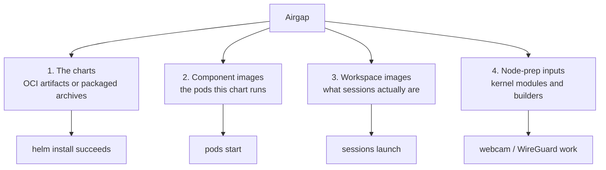

> **Applies to:** both halves · **Charts/values:** `kasm-helm.components.*.image.registry`, `kasm-helm.imagePullSecrets`, `agent.image.registry`, `agent.imagePullSecrets`, `agent.workspaceImagePullSecrets`, `nodePrep.modules.*.method`

# Airgapped installation

Every chart here installs with no internet access. What needs planning is not the charts — it is the
**four separate things** that are normally fetched at install or run time, from four different
places, by four different mechanisms. Miss one and the failure appears much later than the install.



Work them in that order — each one's failure hides the next.

## 1. The charts

The charts are published as OCI artifacts under `oci://registry-1.docker.io/kasmweb/`, with their
dependencies embedded, so mirroring them is a registry-to-registry copy rather than a checkout:

```console
$ crane copy registry-1.docker.io/kasmweb/kasm-platform:1.1190.6 \
    registry.internal.example.com/kasmweb/kasm-platform:1.1190.6
$ helm show chart oci://registry.internal.example.com/kasmweb/kasm-platform --version 1.1190.6 \
    | head -3
apiVersion: v2
appVersion: 1.19.0
description: Kasm Workspaces on Kubernetes...
```

`make package-agent` builds the same thing as a local `.tgz` if you would rather carry a file across
the boundary than run a registry on both sides.

## 2. Component images

The images the charts' own pods run. Both halves have a generated list:

* **Control plane** — [`charts/kasm-helm/images.txt`](../../charts/kasm-helm/images.txt), seven
  images (api, manager, postgres, proxy, guac, rdp-gateway, rdp-https-gateway).
* **Agent family** — `make images-agent`, which also lists the conditional ones and says why they
  are conditional. The KMM **sign** image is only pulled when Secure Boot signing is enabled, so it
  is listed under `# KMM mode` and is the one most often missed.

  `make images-check` verifies that list against the rendered manifests and fails if anything is
  referenced but unlisted — worth running before you mirror, because a missing entry surfaces as a
  pod that cannot start rather than as an error you can trace back here.

Mirror them, then re-point both halves:

```yaml
kasm-helm:
  components:
    api:
      image:
        registry: registry.internal.example.com
  imagePullSecrets:
    - name: internal-registry

kasm-agent:
  agent:
    image:
      registry: registry.internal.example.com
    imagePullSecrets:
      - name: internal-registry
```

Registry overrides are per-component on the control plane, so a single missed component is a single
`ImagePullBackOff` in an otherwise healthy release:

```console
$ kubectl -n kasm get pods --field-selector=status.phase!=Running
NAME                          READY   STATUS             RESTARTS   AGE
kasm-guac-default-0           0/2     ImagePullBackOff   0          4m
```

## 3. Workspace images

**The one that is not a chart value.** Workspace images are pulled from whatever registry the
*manager* has configured for each workspace, not from anything in `values.yaml`. Mirroring the
component images does nothing for them.

Re-point them in the Kasm admin UI (or seed them that way — see
[Preseeding](../reference/preseed.md)), and supply credentials with
`agent.workspaceImagePullSecrets`, which is a **different value** from `agent.imagePullSecrets`:
one is for the images sessions are made of, the other for the agent's own containers. See
[Registries and image pulling](registries.md).

The symptom of getting this wrong is a healthy-looking deployment where every session fails to
launch.

## 4. Node-prep inputs

`nodePrep` is the one component that fetches at **run** time rather than install time, and only in
some modes:

| `nodePrep.modules.<mod>.method` | Airgap behaviour |
| ------------------------------- | ---------------- |
| `build` | Compiles the module on the node — needs kernel headers and packages **at runtime**. Use a pre-baked builder image that already carries them (`openssl` included, which the stock builder installs at runtime). |
| `kmm` with prebuilt images | Kernel Module Management only ever pulls. The airgap-friendly mode: build the per-kernel images once, outside, and mirror them. |
| `kmm` with in-cluster build | Same runtime-fetch problem as `build`. |

Secure Boot adds one more: with signing enabled, KMM pulls a **sign** image that a plain
`make images-agent` reading is easy to skip past. See
[Secure Boot](nodes/secure-boot.md) and
[Kernel modules and webcam](nodes/kernel-modules-and-webcam.md).

## Checklist

- [ ] Charts mirrored as OCI artifacts, or carried as `make package-agent` archives.
- [ ] Control-plane images from `charts/kasm-helm/images.txt` mirrored, and every
      `components.*.image.registry` re-pointed.
- [ ] Agent-family images from `make images-agent` mirrored, conditional ones included.
- [ ] KMM sign image mirrored **if** Secure Boot signing is enabled.
- [ ] Workspace images mirrored and re-pointed **in the manager**, not in values.
- [ ] `imagePullSecrets` and `workspaceImagePullSecrets` both set — they are different values.
- [ ] `nodePrep` mode chosen that does not fetch at runtime, or a pre-baked builder image supplied.
- [ ] One session actually launched, end to end, with the boundary closed.
