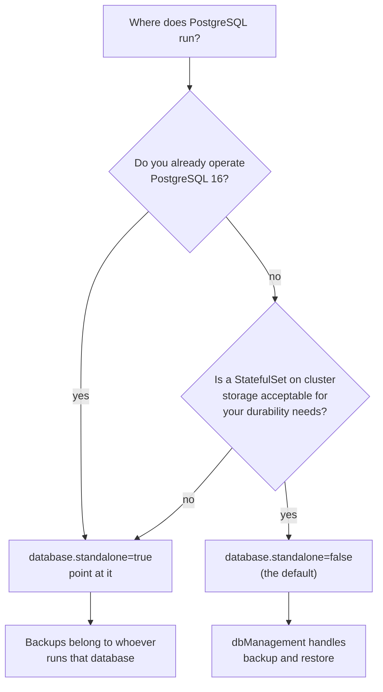

> **Applies to:** the control plane (`kasm-helm`) · **Charts/values:** `kasm-helm.database.*`, `kasm-helm.dbManagement.*`, `kasm-helm.kasmConfig.*`

# Database

Kasm keeps everything durable in one PostgreSQL database: users, groups, workspace definitions,
zones, settings, session history. The agent half is stateless by comparison — lose an agent and you
lose running sessions; lose the database and you lose the deployment.

Two options, decided before the first install because moving between them means a dump and reload.

## Bundled or external



| | Bundled (`standalone: false`, the default) | External (`standalone: true`) |
| --- | --- | --- |
| Runs as | a StatefulSet in the release, on `database.storage` | wherever you already run PostgreSQL 16 |
| Backups | `dbManagement` CronJob to its own PVC | yours |
| Upgrades | the chart runs the migration jobs | the chart runs the migration jobs |
| Survives | pod loss; not PVC loss | whatever your platform gives you |
| Best for | evaluation, single-cluster, small deployments | production, HA, anything with an existing DBA team |

**PostgreSQL 16 is a requirement, not a recommendation** — Kasm's schema and migrations assume it.

## The bundled database

```yaml
kasm-helm:
  database:
    standalone: false
    storage:
      size: 20Gi
      storageClassName: ""      # empty uses the cluster default
```

Size it for the deployment rather than the session count — the database grows with users, groups,
workspaces and session *history*, not with concurrency. Session history is the part that grows
without bound; plan to prune it, or to grow the volume.

The volume is the whole deployment. `helm uninstall` does not delete the PVC, which is deliberate —
see [Uninstall](../operate/uninstall.md).

## An external database

```yaml
kasm-helm:
  database:
    standalone: true
    hostname: postgres.internal.example.com
    port: 5432
    kasmDbName: kasm
    kasmDbUser: kasmapp
    kasmDbSecret:
      existingSecret: kasm-db-credentials
      existingSecretKey: password
```

Requirements the chart cannot check for you, from
[Kasm's remote-database documentation](https://docs.kasm.com/docs/latest/how-to/remote_database#requirements):
PostgreSQL 16, a database and a role that owns it, and network reach from the cluster. If
`networkPolicies.enabled=true`, the egress path to the database host has to be permitted as well —
see [NetworkPolicy enforcement](networking/network-policies.md).

The chart still runs initialization and migration jobs against it. It creates the schema on a fresh
database; it does not create the database or the role.

```console
$ kubectl -n kasm get job -l app.kubernetes.io/component=db-init
NAME           STATUS     COMPLETIONS   DURATION   AGE
kasm-db-init   Complete   1/1           47s        3m

$ kubectl -n kasm logs job/kasm-db-init --tail=3
INFO  seeding default properties
INFO  seeding default users
INFO  database initialization complete
```

A job stuck at `0/1` with `could not translate host name` is DNS or NetworkPolicy, not credentials.

## Seeding at initialization

`kasmConfig` and the preseed values only apply **when the database is initialized** — on a genuinely
fresh database, not on an existing one. That covers zones, the auth domain, default users, API
credentials and the workspace library. On an existing database the same changes are made in the
admin UI or through the admin API.

This is why `kasmConfig.authDomain` is worth getting right at install time: it sets the domain the
login cookie is scoped to, and on Kubernetes it has to cover both the control plane's hostname and
the agent's, or sessions fail with a 401 the moment streaming starts.

Full reference: [Preseeding](../reference/preseed.md),
[default users](../reference/default-users.md),
[default API users](../reference/default-api-users.md).

## Backup and restore

See [Backup and restore](../operate/backup-restore.md). In short: `dbManagement` covers the bundled
database, an external one is yours to protect, and `examples/db-upload.yaml` is the path in from a
Docker-based Kasm.

## Checklist

- [ ] Bundled or external decided, before the first install.
- [ ] PostgreSQL 16 confirmed if external; database and owning role created.
- [ ] `database.storage.size` and storage class chosen if bundled.
- [ ] Credentials supplied through `existingSecret` rather than inline values.
- [ ] Egress to an external database permitted if `networkPolicies.enabled=true`.
- [ ] `kasmConfig.authDomain` set to the parent domain covering both halves — fresh installs only.
- [ ] A backup path that has actually been restored from once.
