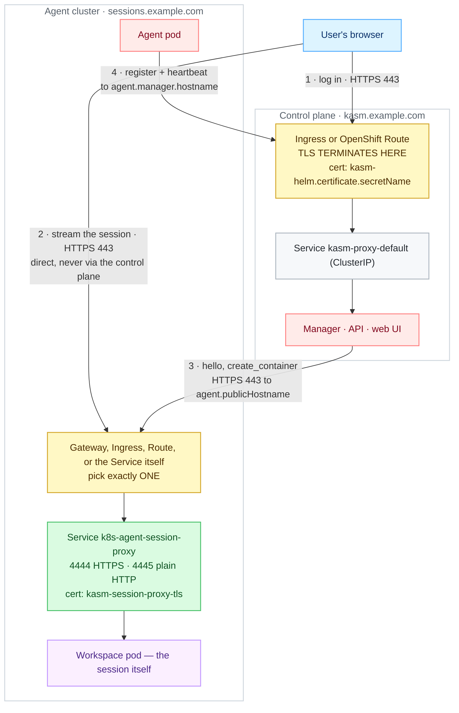
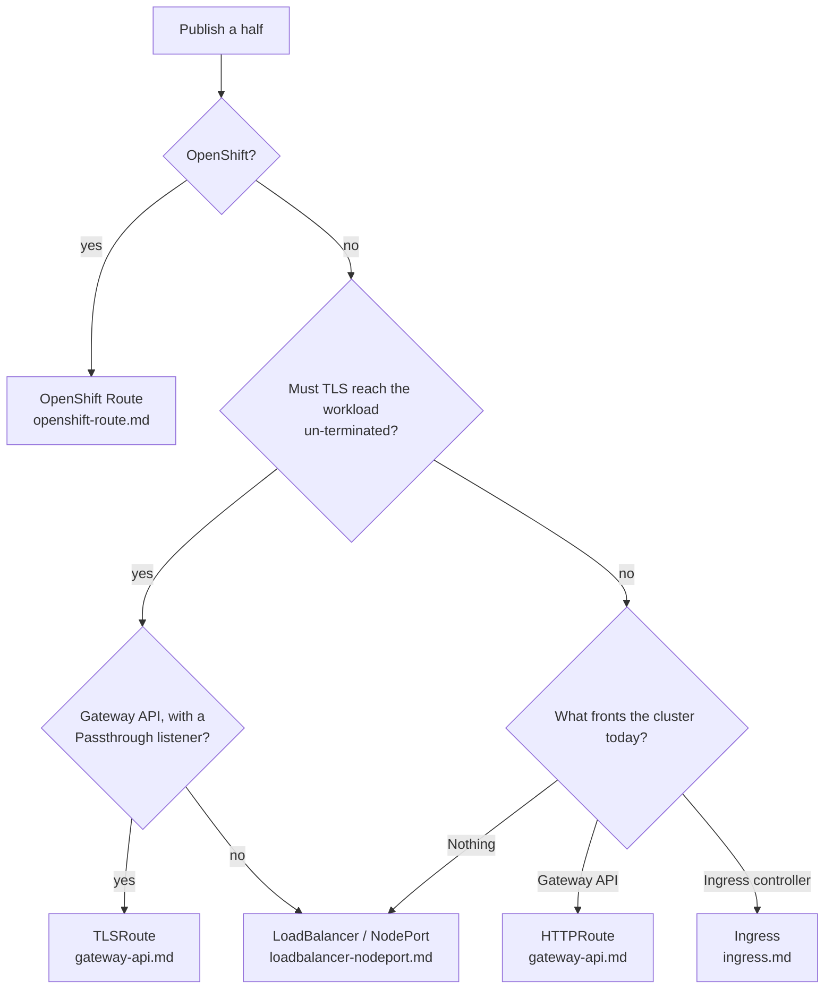

# Networking

> **Applies to:** [External access to sessions, TLS, and the login cookie](../../reference/feature-matrix.md#networking-and-access) · **Both halves:** the control plane (`kasm-helm`) and the agent are published **independently**, on their own hostnames, each terminating its own TLS.

Read [Certificates](certificates.md) first — every mechanism below assumes the certificate question
is already settled. Then pick exactly one mechanism per half from the table further down and follow
that page.

## Why this is needed

The two halves of a Kasm deployment are exposed **independently**. Users log in to the control
plane; their browsers then stream the session **directly** from the agent's session proxy. Each half
terminates its own TLS, on its own hostname. Get the hostnames, the certificate coverage, the
websocket timeout or the auth-cookie domain wrong and the symptom is always the same-looking
failure — a 404, a 401, or a session that dies after a minute.

## How the traffic flows


<details>
<summary>Diagram source (Mermaid)</summary>



</details>

Read it as **two audiences, one hostname**:

* **Browsers** reach the session proxy at `agent.publicHostname` (arrow 2). This connection carries
  the session's video and input, and it is a long-lived websocket.
* **The manager** reaches the *same* hostname (arrow 3) to call the agent — `hello`,
  `create_container`. It is a separate client, often on a different network from the users.

Both must resolve `agent.publicHostname` and reach it. That is why the value is mandatory, and why
an exposure method that only works from inside the office VPN will break session creation as well as
session streaming.

The agent's own outbound traffic (arrow 4) goes the other way, to `agent.manager.hostname`. It is
not part of external access — but it is the same firewall conversation, so plan it at the same time.

## Words used on this page

| Term | In one line |
| ---- | ----------- |
| **IngressClass** | Names which ingress controller serves an Ingress. `kubectl get ingressclass` lists them; `agent.ingress.className` picks one. |
| **GatewayClass** | The Gateway API equivalent of an IngressClass — which implementation (Traefik, Envoy, Cilium) will implement a Gateway. |
| **Gateway** | An actual listening endpoint created from a GatewayClass. It has an address and one or more listeners. |
| **listener** | One port + protocol + hostname on a Gateway, with a name. `sectionName` in a route points at one listener by that name. |
| **`parentRef`** | The pointer from a route (HTTPRoute/TLSRoute) to the Gateway — and optionally the listener — that should serve it. |
| **SNI** | The hostname the browser sends *in the clear* at the start of a TLS handshake. It is the only thing a passthrough listener can route on. |
| **terminate** | The edge decrypts TLS, so the browser validates the **edge's** certificate and cleartext continues inside the cluster. |
| **passthrough** | The edge forwards the encrypted bytes untouched, so the browser validates the **session proxy's** certificate end to end. |
| **`externalTrafficPolicy`** | On a Service: `Cluster` (default) rewrites the client's source IP; `Local` preserves it but only routes through nodes that actually run a proxy pod. |
| **session proxy** | The nginx deployment the *operator* creates next to the agent, named `<agent name>-session-proxy`. It is what browsers stream from. |

## Choosing a mechanism

Both halves have to be published, and they do not have to use the same mechanism — a common shape
is an Ingress in front of the control plane and TLS passthrough in front of the agent, because only
the agent half carries a certificate the browser must see end to end.



| Mechanism | Control plane (`kasm-helm`) | Agent | TLS terminates at | Page |
| --------- | --------------------------- | ----- | ----------------- | ---- |
| Ingress | `ingress.enabled` | `agent.ingress.enabled` | the ingress controller | [ingress.md](ingress.md) |
| Gateway API, terminating | `httpRoute.enabled` | `agent.httpRoute.enabled` | the Gateway | [gateway-api.md](gateway-api.md) |
| Gateway API, passthrough | `tlsRoute.enabled` | `agent.gatewayRoute.enabled` (preferred) or `agent.tlsRoute.enabled` | the workload itself | [gateway-api.md](gateway-api.md) |
| OpenShift Route | `route.enabled` | `agent.route.enabled` | the router, or the workload with `passthrough` | [openshift-route.md](openshift-route.md) |
| Service, published directly | `proxyService.type` | `agent.sessionProxy.service.type` | the workload itself | [loadbalancer-nodeport.md](loadbalancer-nodeport.md) |

**Exactly one per half.** All of a half's options publish the same Service, so enabling two gives one
hostname two owners. Both charts reject the combination at render time rather than letting it reach
the cluster.

**The control plane stays `ClusterIP` behind anything.** `kasm-helm.proxyService.type=LoadBalancer`
alongside an Ingress, Route or Gateway API route is refused: that Service would claim the node's
:443 which the controller already holds.

Two more things are published separately and have their own pages:
[the RDP gateway](loadbalancer-nodeport.md#the-rdp-gateway) (raw TCP, so it is never covered by an
Ingress) and [per-session egress](egress.md).

Distro and cloud variants are in [Supported platforms](../managed-providers.md); traffic
restrictions between the halves are in [NetworkPolicy enforcement](network-policies.md).

## Before you start

* Two hostnames, **siblings under one parent domain** — for example `kasm.example.com` (control
  plane `kasm-helm.publicAddr`) and `sessions.example.com` (agent `agent.publicHostname`). They must
  differ, and the Kasm Authorization Domain must be their shared parent.
* DNS for both, pointing at whatever fronts the cluster.
* Exactly **one** exposure method on the agent side. All of them point at the same Service.
* Whatever fronts the session proxy must hold **WebSockets** open: idle timeout ≥ 3600s (or an L4
  idle timeout ≥ 3600s where nothing speaks HTTP).
* cert-manager plus an `Issuer`/`ClusterIssuer`, if you want certificates issued in-cluster.
* Not sure which exposure method to pick? Start at the [exposure decision matrix](#choosing-a-mechanism) — all eight options against TLS termination, client IP, idle timeouts and what is verified.

Every `helm upgrade --install` below installs the published chart from
`oci://registry-1.docker.io/kasmweb/`, whose package embeds every dependency. Add `--version` to
pin a release.

Check your two hostnames resolve before you install anything — most "the route does not work"
reports are a missing DNS record:

```console
dig +short kasm.example.com
dig +short sessions.example.com
```

Both should print an address that belongs to whatever fronts your cluster. An empty answer means
there is nothing to debug on the Kubernetes side yet.

## Direct-connect or proxied

Before the hostnames, one topology decision — it changes what you need hostnames and certificates
for at all.

| | Direct-connect *(default here)* | Proxied |
| --- | --- | --- |
| Zone setting | `proxy_connections: false` | `proxy_connections: true` *(Kasm's default)* |
| Browser talks to | the control plane **and** the agent | the control plane only |
| Agent needs a public hostname | yes | no — only reachable from the control-plane proxy |
| Agent certificate | publicly trusted, plus its wildcard | any, including self-signed |
| Cookie scope / auth domain | load-bearing | irrelevant |
| Session traffic path | browser → agent | browser → control plane → agent |

**Direct-connect is what these charts are built and tested around.** Session traffic bypasses the
control plane, which is what lets the agent scale independently of it.

### The proxied topology, and its one constraint

With `proxy_connections: true` the control-plane proxy relays session traffic upstream to the
address the agent registered. It forwards the **browser's** `Host` header, not the agent's:

```nginx
proxy_set_header  Host $host;
proxy_pass        $connect_schema://$connect_hostname:$connect_port/$connect_path;
```

So the constraint is precise: **nothing between the control-plane proxy and the session proxy may
route on the `Host` header.** That rules out `agent.ingress` and `agent.httpRoute`, whose whole job
is host routing — the relayed request carries the control plane's name, matches no rule, and 404s.
It does *not* rule out:

* `agent.sessionProxy.service` — a LoadBalancer, NodePort or ClusterIP Service does no host routing.
* TLS passthrough — `agent.gatewayRoute`, `agent.tlsRoute` or an OpenShift `passthrough` Route route
  on **SNI**, which nginx takes from the `proxy_pass` host rather than the forwarded `Host`.

Because the agent only has to be reachable from the control-plane proxy pod, on a single cluster it
can be the in-cluster Service, with no ingress object at all:

```yaml
agent:
  publicHostname: k8s-agent-session-proxy.kasm-agent.svc.cluster.local
  publicPort: 4444
```

What you gain: one public hostname, one DNS record, no cookie-scope question, and a session-proxy
certificate that need not be publicly trusted — the relay sets no `proxy_ssl_verify`, so nginx's
default of `off` accepts a self-signed one.

What you pay:

* **Every session's traffic crosses the control-plane proxy** — bandwidth, CPU, and one bottleneck
  for the whole deployment.
* **A 30-minute idle ceiling that is not a value.** `proxy_read_timeout` and `proxy_send_timeout`
  are fixed at `1800s` in the proxy ConfigMap. Everywhere else these pages ask for ≥3600s; on this
  path you cannot set it without replacing the ConfigMap.
* **Multi-zone loses much of its point**, since traffic hair-pins through the control plane wherever
  the zone actually runs.

> **Verification status: lab-verified.** Sessions have been launched end to end on the relay path -
> browser to control-plane proxy to session proxy to workspace pod, with the WebSocket upgrading
> (`101`) and the stream running - on both k3s (amd64) and kind (arm64). It is also the shape a
> default install lands in, because `kasmConfig.generatePreseed` is `false` and Kasm's own default
> for a zone is `proxy_connections: true`.
>
> What is **not** covered is this repository's automated tests: every e2e scenario and every file
> under `examples/` sets `proxy_connections: false`, so nothing here guards the relay path against
> regression.

The rest of this page assumes direct-connect.

## The hostname pair and the authorization domain

Do this once, whichever exposure option you go on to pick. Kasm's login cookie is issued for the
**Authorization Domain**; if that is not the shared parent of both hostnames, the browser will not
send the cookie to the agent and every session connect returns 401.

On a **fresh** control plane it is a value, applied by the preseed at first start:

```yaml
kasm-helm:
  publicAddr: kasm.example.com
  kasmConfig:
    generatePreseed: true
    authDomain: example.com
```

On an **existing** control plane the preseed does not run. Change it by hand:

1. *Settings → Auth* → set **Kasm Auth Domain** to `example.com`.
2. *Infrastructure → Zones* → open the zone the agent reports to (`agent.zone`, default `default`):
   * **Proxy Connections** → **off**. Left on, the control plane relays session traffic with the
     original `Host` header, which matches no route on the agent side and returns 404.
   * **Upstream Auth Address** → the control plane's `publicAddr`.

Background: [Running alongside the kasm-helm control plane](../../../charts/kasm-agent/README.md#running-alongside-the-kasm-helm-control-plane).

## The session proxy's two ports

The session proxy listens on two ports. **4444** is its own HTTPS listener, served with the
certificate in `agent.sessionProxy.certSecretName`. **4445** is plain HTTP, for use behind something
that has already terminated TLS.

| Exposure | Default backend port | Why |
| -------- | -------------------- | --- |
| `agent.httpRoute` | 4445 | TLS terminates at the Gateway |
| `agent.ingress` | 4445 | TLS terminates at the Ingress |
| `agent.tlsRoute` / `agent.gatewayRoute` | 4444 | passthrough — nothing decrypted it earlier |
| `agent.route` (OpenShift) | 4444 for `passthrough`/`reencrypt`, 4445 for `edge` | follows `route.tls.termination` |
| `agent.sessionProxy.service` | both published | point your LB at whichever suits |

Sending an Ingress or HTTPRoute to 4444 instead works, but the controller then has to be told to
speak TLS upstream — `nginx.ingress.kubernetes.io/backend-protocol: "HTTPS"` on ingress-nginx.

## Minimal umbrella values

Under the `kasm-platform` umbrella, both halves in one file:

```yaml
kasm-helm:
  publicAddr: kasm.example.com
  proxyService:
    type: ClusterIP
  ingress:
    enabled: true
    ingressClassName: traefik
  certificate:
    secretName: kasm-tls
  kasmConfig:
    generatePreseed: true
    authDomain: example.com

kasm-agent:
  agent:
    publicHostname: sessions.example.com
    gatewayRoute:
      enabled: true
      parentRef:
        name: traefik-gateway
        namespace: kube-system
        sectionName: sessions-passthrough
    sessionProxy:
      certificate:
        enabled: true
        issuerRef:
          kind: ClusterIssuer
          name: letsencrypt-prod
        dnsNames:
          - sessions.example.com
          - "*.sessions.example.com"
```

Installing the charts directly? Drop the `kasm-agent:` key (start at `agent:`) for `kasm-agent`, and
drop the `kasm-helm:` key for `kasm-helm`.

## Verify end to end

```console
curl -k -sS -o /dev/null -w '%{http_code}\n' https://sessions.example.com/
openssl s_client -connect sessions.example.com:443 -servername sessions.example.com </dev/null 2>/dev/null \
  | openssl x509 -noout -subject -ext subjectAltName
```

Expected indicators:

* The `curl` returns an HTTP status from the session proxy — **`404` is normal** with no active
  session. A connection refused/timeout means the route or the Service exposure is wrong.
* The certificate's SANs include `sessions.example.com`. On a passthrough route
  (`gatewayRoute`/`tlsRoute`/OpenShift `Route`) the certificate you see is the **session proxy's
  own**; on `httpRoute`/`ingress` it is the Gateway's.
* Gateway API path:

  ```console
  kubectl -n kasm-agent get httproute,tlsroute -o wide
  kubectl -n kasm-agent describe httproute <name> | grep -A3 'Parents\|Accepted'
  ```

  `Accepted: True` and `ResolvedRefs: True`. `Accepted: False` with `NotAllowedByListeners` means the
  listener does not admit this namespace.
* Log in at the control-plane hostname and launch a session: the browser URL bar shows the **agent's**
  hostname, and the session stays up past 60 seconds (proof the websocket timeout is raised).

## Troubleshooting

| Symptom | Cause | Fix |
| ------- | ----- | --- |
| Session connect returns **401** | The auth cookie is scoped to the control-plane hostname only | Set the Kasm Auth Domain to the shared parent — `kasm-helm.kasmConfig.authDomain` on a fresh install, Settings → Auth on an existing one; then use a fresh incognito window |
| Session connect returns **404** from the ingress | The zone's *Proxy Connections* is on, so traffic is relayed with the original `Host` header and matches no route | Disable *Proxy Connections* and set *Upstream Auth Address* to the control plane's `publicAddr` |
| Session dies after ~60s (ingress-nginx) or ~30s (OpenShift router) | Default proxy timeouts cut the websocket | `proxy-read-timeout` / `proxy-send-timeout` `3600`, or `haproxy.router.openshift.io/timeout: 3600s` |
| Idle passthrough sessions dropped at ~350s | The L4 idle timeout on the load balancer (AWS NLB default) | Raise the LB idle timeout; there is no HTTP knob on a passthrough path |
| `HTTPRoute`/`TLSRoute` shows `Accepted: False` | The Gateway listener does not admit the agent namespace, or the hostname does not match | Fix the listener's `allowedRoutes` and `hostname` |
| `TLSRoute` not recognised by the API server | The Gateway API CRDs are missing or older than 1.5, when `TLSRoute` was experimental-channel only | Install Gateway API 1.5 or newer (standard channel includes `TLSRoute`), or use `httpRoute`/`ingress` |
| `no matches for kind "TLSRoute" in version "gateway.networking.k8s.io/v1alpha2"` | Gateway API 1.5+ serves `TLSRoute` only as `v1`; something rendered the old version | Use the current chart (it selects `v1` automatically) or set `agent.tlsRoute.apiVersion` |
| Browser certificate warning on the session hostname | Passthrough route serving the session proxy's own certificate, which does not cover the public hostname | Add the hostname (and `*.<hostname>`) to `agent.sessionProxy.certificate.dnsNames`, or provision `agent.sessionProxy.certSecretName` |
| NodePort answers in-cluster, refused from a LAN client | The environment does not route 30000–32767 to the nodes | Open the range, or front the proxy with an ingress/LB |
| Everything breaks the moment PROXY protocol is enabled | The fronting proxy is not sending a PROXY header | Enable it on the load balancer too, or turn `agent.sessionProxy.proxyProtocol.enabled` back off |
| Some clients time out with `externalTrafficPolicy: Local` | Traffic routed via a node with no session-proxy pod | Raise `agent.sessionProxy.replicas`, pin with `nodeSelector`, or use an LB that honours the health check |
| Gateway shows `Accepted`/`Programmed`, connections hang with no response | Observed on the host-network Cilium Gateway (Cilium 1.20 / kubeadm 1.34): correct Envoy config, no traffic served | Prove it with `curl` rather than status conditions; the upstream Traefik chart on host ports 80/443 worked on the same cluster |
| Control-plane install rejected with a port conflict | `kasm-helm.proxyService.type=LoadBalancer` alongside an ingress | Set it to `ClusterIP` |

- **Agent shows `Degraded=True/TLSRouteForbidden` (or `TLSRouteUnavailable`) and no TLSRoute appears** → the operator cannot manage TLSRoutes: its `manager-role` lacks the `gateway.networking.k8s.io/tlsroutes` rule, or the TLSRoute CRD is not served (Gateway API standard channel ≥ 1.5). Everything else keeps reconciling — Service, session proxy, workspaces — so sessions stay up; only `agent.gatewayRoute` is unfulfilled and `GatewayRouteAccepted=False`. Fix: reinstall/upgrade the operator chart (its `manager-role` ships the rule; a `helm upgrade` also reverts any manual RBAC edit) or install the Gateway API CRDs, then the operator creates the TLSRoute and the condition clears without a restart of anything else.

## Checklist

- [ ] Two sibling hostnames under one parent domain, DNS in place
- [ ] Exactly one of `gatewayRoute` / `tlsRoute` / `httpRoute` / `ingress` / `route` / direct `sessionProxy.service`
- [ ] Gateway listener carries the hostname and admits the agent namespace (passthrough listener uses `protocol: TLS`, `tls.mode: Passthrough`)
- [ ] Websocket / L4 idle timeout ≥ 3600s on whatever fronts the proxy
- [ ] Session-proxy certificate covers the public hostname **and** `*.<hostname>`, publicly trusted
- [ ] Control-plane certificate in place; `kasm-helm.proxyService.type=ClusterIP` behind an ingress
- [ ] Kasm Auth Domain set to the shared parent; zone *Proxy Connections* off, *Upstream Auth Address* set
- [ ] Client-IP strategy chosen (`externalTrafficPolicy=Local` **or** `proxyProtocol` + `trustedCIDRs`)
- [ ] `curl -k https://<agent hostname>/` answers (404 with no session is expected)
- [ ] A browser session connects and survives past 60 seconds
