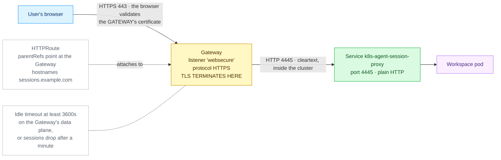
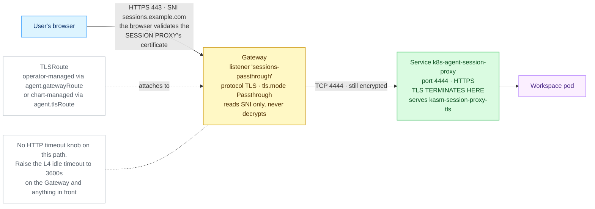

# Gateway API

> **Applies to:** publishing either half through a Gateway API implementation, and the RDP gateway on Gateway API 1.6+ · **Charts/values:** `kasm-helm.httpRoute.*`, `kasm-helm.tlsRoute.*`, `kasm-helm.tcpRoute.*`, `agent.httpRoute.*`, `agent.gatewayRoute.*`, `agent.tlsRoute.*` · **Prerequisite:** [Certificates](certificates.md)

The Gateway API covers every part of a Kasm deployment: the proxy either terminating at the Gateway
(`HTTPRoute`) or passing through to the workload (`TLSRoute`), and — on Gateway API 1.6 or newer —
the RDP gateway on a `TCPRoute`.

Which route kind you need depends on where TLS should terminate:

| Route kind | TLS terminates at | Control plane | Agent | Standard channel since |
| ---------- | ----------------- | ------------- | ----- | ---------------------- |
| `HTTPRoute` | the Gateway | `httpRoute.enabled` | `agent.httpRoute.enabled` | 1.0 |
| `TLSRoute` | the workload (SNI passthrough) | `tlsRoute.enabled` | `agent.gatewayRoute.enabled` or `agent.tlsRoute.enabled` | 1.5 |
| `TCPRoute` | n/a — raw TCP | `tcpRoute.enabled` (RDP gateway) | — | 1.6 |

## Certificates live on the Gateway, not the route

This is the one thing that behaves differently from an Ingress, and the most common reason a
correct-looking Gateway API install serves the wrong certificate.

An Ingress has a `tls:` block, so `kasm-helm.ingress.tls` wires `certificate.secretName` straight
into it. **A Gateway API route has no such field.** The certificate belongs to the Gateway's
listener. The chart still mints the Secret — `certificate.certManager`, or one you create — but you
have to reference it yourself:

```yaml
listeners:
  - name: kasm
    protocol: HTTPS
    port: 443
    hostname: kasm.example.com
    tls:
      mode: Terminate
      certificateRefs:
        - name: kasm-tls          # the Secret this chart minted
```

When the Gateway is in a different namespace from the Secret, that reference needs a
`ReferenceGrant` in the Secret's namespace. Only `parentRefs` cross namespaces in the routes this
chart renders; the `backendRefs` stay local, so they need no grant.

## Cluster prerequisites

Confirm the CRDs are present and which channel they came from — the bundle version decides which
route kinds you can use at all:

```console
$ kubectl get crd -o name | grep gateway.networking.k8s.io
customresourcedefinition.apiextensions.k8s.io/gatewayclasses.gateway.networking.k8s.io
customresourcedefinition.apiextensions.k8s.io/gateways.gateway.networking.k8s.io
customresourcedefinition.apiextensions.k8s.io/grpcroutes.gateway.networking.k8s.io
customresourcedefinition.apiextensions.k8s.io/httproutes.gateway.networking.k8s.io
customresourcedefinition.apiextensions.k8s.io/referencegrants.gateway.networking.k8s.io
customresourcedefinition.apiextensions.k8s.io/tlsroutes.gateway.networking.k8s.io

$ kubectl get crd gateways.gateway.networking.k8s.io \
    -o jsonpath='{.metadata.annotations.gateway\.networking\.k8s\.io/bundle-version}{"\n"}'
v1.5.1
```

No `tcproutes` in that list means the bundle predates 1.6, and `tcpRoute` is not available.

Then check the Gateway's listeners, because the listener — not the route — decides whether
passthrough is possible:

```console
$ kubectl -n kube-system get gateway traefik-gateway \
    -o jsonpath='{range .spec.listeners[*]}{.name}{" "}{.protocol}{" "}{.port}{" "}{.hostname}{" "}{.tls.mode}{"\n"}{end}'
web         HTTP    80
websecure   HTTPS   443    kasm.example.com        Terminate
sessions    TLS     443    sessions.example.com    Passthrough
```

The fifth column is what matters. A listener printed with an empty `tls.mode` is terminating TLS,
and a `TLSRoute` attached to it will never pass anything through — sessions fail at the TLS
handshake with no useful error on either side.

### Enabling the Gateway API provider on k3s / Traefik

On k3s the Gateway provider is off by default; enable it with a `HelmChartConfig` in `kube-system`
(k3s reconciles it automatically). This is the shape that was verified on the lab cluster; check
`helm show values traefik/traefik` against your Traefik version:

```yaml
apiVersion: helm.cattle.io/v1
kind: HelmChartConfig
metadata:
  name: traefik
  namespace: kube-system
spec:
  valuesContent: |-
    providers:
      kubernetesGateway:
        enabled: true
    gateway:
      enabled: true
      listeners:
        websecure:
          port: 8443              # Traefik's backend port; :443 on the node DNATs to it
          protocol: HTTPS
          hostname: sessions.example.com
          namespacePolicy: All    # must admit the agent namespace
          certificateRefs:
            - name: kasm-agent-public-tls
```

### The verified passthrough listener

TLS passthrough needs a listener declared with `protocol: TLS` and `tls.mode: Passthrough`. A normal
terminating HTTPS listener will not serve a `TLSRoute`. On Traefik 3.7 (Gateway API 1.5.1) it can
share port 8443 with the terminated HTTPS listener as long as the hostnames differ:

```yaml
- name: sessions-passthrough
  port: 8443
  protocol: TLS
  hostname: sessions.example.com
  tls:
    mode: Passthrough
  allowedRoutes:
    namespaces:
      from: Selector
      selector:
        matchExpressions:
          - {key: kubernetes.io/metadata.name, operator: In, values: [kasm, kasm-agent]}
```

The `matchExpressions` form above admits two namespaces. For a single namespace the shorter
`matchLabels` form does the same job:

```yaml
  allowedRoutes:
    namespaces:
      from: Selector
      selector:
        matchLabels:
          kubernetes.io/metadata.name: kasm-agent
```

`from: All` admits every namespace and needs no selector at all.

Point the route at it with `agent.gatewayRoute.parentRef.sectionName=sessions-passthrough` and
`agent.gatewayRoute.hostnames[0]=sessions.example.com`; the session proxy certificate must cover
that hostname (the `*.<publicHostname>` wildcard does).

Check the listener's own `Accepted`/`Programmed` conditions and the TLSRoute's `status.parents`
before trusting a k3s `HelmChartConfig` edit: on this lab the identical listener declared through
Traefik's chart values made the chart's upgrade job fail and briefly removed the Gateway object,
while patching the live Gateway programmed it immediately. Validate on the Gateway first, then move
the listener into your chart values.

### TLSRoute API versions

`TLSRoute` is in the Gateway API **standard** channel as `v1` since release 1.5 (Kubernetes 1.31 or
newer); only CRD bundles older than that carry it in the experimental channel, as `v1alpha2`.

The chart picks the version for you: `v1` when the cluster serves it, `v1alpha2` when only the older
experimental-channel CRD is served, and `v1` when rendering without a cluster (`helm template`). Set
`agent.tlsRoute.apiVersion` to override that choice — for example when rendering offline for a
cluster that still serves only `v1alpha2`. On the `agent.gatewayRoute` path the **operator** creates
the route, and it creates `v1`.

### One Gateway that did not work

On Cilium 1.20 / kubeadm 1.34, the host-network Cilium Gateway reported `Accepted` and `Programmed`
with correct Envoy configuration and still never served traffic: the kernel accepted connections and
nothing ever answered them. The upstream Traefik chart with host ports 80 and 443 was the working
Gateway on that same cluster. This is an observation about that build, not a verdict on Cilium
Gateway generally — but do not treat `Programmed=True` as proof that sessions will stream. Curl the
public hostname before you believe the status conditions.

## The control plane (`kasm-helm`)

Terminating at the Gateway:

```yaml
kasm-helm:
  publicAddr: kasm.example.com
  proxyService:
    type: ClusterIP          # required: the Gateway owns the external address
  httpRoute:
    enabled: true
    backendProtocol: http    # http -> proxy :8080, https -> proxy :8443
    parentRefs:
      - name: kasm-gateway
        namespace: kube-system
```

Or passing through to the proxy's own HTTPS listener, when TLS must not terminate on shared
infrastructure:

```yaml
kasm-helm:
  tlsRoute:
    enabled: true
    parentRefs:
      - name: kasm-gateway
        namespace: kube-system
        sectionName: kasm-passthrough
```

`httpRoute`, `tlsRoute`, `ingress` and `route` are alternatives — enable at most one.

With `kasmZones` set, both render **one route object per zone** plus one for `publicAddr`. That is
not the Ingress's shape: an `HTTPRoute`'s hostnames belong to the object while its rules match only
on path, header and method, so hostnames cannot be fanned out within a single route.

```console
$ kubectl -n kasm get httproute
NAME               HOSTNAMES                    AGE
kasm-proxy         ["kasm.example.com"]         4m
kasm-proxy-zonea   ["zonea.kasm.example.com"]   4m
kasm-proxy-zoneb   ["zoneb.kasm.example.com"]   4m

$ kubectl -n kasm get httproute kasm-proxy \
    -o jsonpath='{range .status.parents[*]}{.parentRef.name}{" "}{range .conditions[*]}{.type}={.status}{" "}{end}{"\n"}{end}'
kasm-gateway Accepted=True ResolvedRefs=True
```

`Accepted=False` is almost always the listener refusing the namespace — check the Gateway's
`allowedRoutes`. `ResolvedRefs=False` is a backend that does not exist, usually a zone name
mismatch.

## The agent — HTTPRoute

**When to pick this.** You already run a Gateway API implementation and are happy for TLS to
terminate at the Gateway, on a certificate the Gateway holds. It is the simplest Gateway API path
and the only one that gives you HTTP-level routing and timeouts.


<details>
<summary>Diagram source (Mermaid)</summary>



</details>

### Prerequisites

1. **The Gateway API CRDs are installed, and which bundle version:**

   ```console
   kubectl get crd gateways.gateway.networking.k8s.io \
     -o jsonpath='{.metadata.annotations.gateway\.networking\.k8s\.io/bundle-version}'
   ```

   Good: something like `v1.5.1`. `NotFound` means the Gateway API is not installed at all — use
   [Walkthrough C](ingress.md#the-agent) instead, or install the CRDs.

2. **A Gateway exists and is programmed:**

   ```console
   kubectl get gateway -A
   ```

   Good: at least one row with `PROGRAMMED  True` and an `ADDRESS`. `Programmed=False` means the
   implementation has not accepted it yet — fix that before going further.

3. **One of its listeners carries your hostname and terminates HTTPS:**

   ```console
   kubectl -n kube-system get gateway traefik-gateway \
     -o jsonpath='{range .spec.listeners[*]}{.name}{"  "}{.protocol}{"  "}{.port}{"  "}{.hostname}{"  "}{.tls.mode}{"\n"}{end}'
   ```

   Good: a line like `websecure  HTTPS  8443  sessions.example.com  Terminate`. Note the listener's
   **name** — that is the `sectionName` you may want later. The port shown is the Gateway's own
   backend port; what users hit on the outside can be 443 in front of it.

4. **That listener admits routes from the agent's namespace:**

   ```console
   kubectl -n kube-system get gateway traefik-gateway -o yaml | grep -A6 allowedRoutes
   ```

   Good: `from: All`, or a `Selector` that matches your agent namespace's
   `kubernetes.io/metadata.name` label. This is the single most common reason a route is rejected.

5. **The Gateway holds a certificate for the hostname** — check `certificateRefs` on that listener,
   and that the Secret it names exists. If you use cert-manager to produce it, confirm it is
   installed:

   ```console
   kubectl get crd certificates.cert-manager.io
   kubectl get clusterissuer
   ```

   Good: the CRD exists and at least one ClusterIssuer shows `READY  True`.

### Values and install

`agent-httproute.yaml`:

```yaml
agent:
  manager:
    hostname: kasm.example.com
    existingTokenSecret: kasm-manager-token
  publicHostname: sessions.example.com
  httpRoute:
    enabled: true
    parentRefs:
      - name: traefik-gateway
        namespace: kube-system
```

```console
helm upgrade --install kasm-agent oci://registry-1.docker.io/kasmweb/kasm-agent \
  --namespace kasm-agent --create-namespace \
  --values agent-httproute.yaml
```

`httpRoute.hostnames` defaults to `[publicHostname]`, and `httpRoute.backendPort` defaults to
**4445**, the proxy's plain-HTTP listener — the right pairing when TLS terminates at the Gateway.
Add `sectionName` under `parentRefs` if the Gateway carries more than one listener and you want to
pin this route to one of them.

### What good looks like

```console
kubectl -n kasm-agent get httproute
kubectl -n kasm-agent get httproute -o jsonpath='{range .items[*]}{.metadata.name}{"\n"}{range .status.parents[*].conditions[*]}  {.type}={.status} {.reason}{"\n"}{end}{end}'
```

Expect `Accepted=True` and `ResolvedRefs=True` on every parent.

```console
kubectl -n kasm-agent get svc k8s-agent-session-proxy
kubectl -n kasm-agent get agent k8s-agent
```

Expect a `ClusterIP` Service carrying 4444 and 4445, and the Agent's `PHASE` column reading `Ready`.
The Service is created by the **operator**, not by this chart, and is named after `agent.name`
(default `k8s-agent`) — so `k8s-agent-session-proxy`.

```console
curl -kI https://sessions.example.com/
```

Expect an HTTP status line back from the session proxy. **`404` is the correct answer** with no
active session — it proves the whole path terminates somewhere that speaks Kasm. A connection
refused or a hang means the route or the Gateway address is wrong; a certificate error means the
Gateway is serving the wrong certificate for this hostname.

Finally, log in at the control-plane hostname and launch a session. The browser's URL bar should
show the **agent's** hostname, and the session should stay up past 60 seconds.

### Most likely failures

| Symptom | Fix |
| ------- | --- |
| `Accepted=False` with `NotAllowedByListeners` | The listener's `allowedRoutes` does not admit the agent namespace — prerequisite 4 above. See [Troubleshooting](README.md#troubleshooting). |
| The session dies after about a minute | The Gateway data plane's idle timeout is still at its default. Raise it to ≥ 3600s; there is no Kasm value for this, it is a Gateway setting. See [Idle timeouts](loadbalancer-nodeport.md#idle-timeouts). |

---

## The agent — TLS passthrough

**When to pick this.** You want end-to-end TLS: nothing on shared cluster infrastructure decrypts
session traffic, and the browser validates the session proxy's own certificate. Prefer
`agent.gatewayRoute` (the operator creates and reconciles the route) and fall back to
`agent.tlsRoute` (the Helm release owns it) only for operator builds that lack the field.


<details>
<summary>Diagram source (Mermaid)</summary>



</details>

### Prerequisites

1. **Gateway API 1.5 or newer**, so `TLSRoute` is in the standard channel:

   ```console
   kubectl get crd gateways.gateway.networking.k8s.io \
     -o jsonpath='{.metadata.annotations.gateway\.networking\.k8s\.io/bundle-version}'
   ```

   Good: `v1.5.0` or later (Kubernetes 1.31+).

2. **The `TLSRoute` kind is actually served, and at which version:**

   ```console
   kubectl api-resources --api-group=gateway.networking.k8s.io | grep -i tlsroute
   ```

   Good: a row ending `gateway.networking.k8s.io/v1 ... TLSRoute`. A row showing `v1alpha2` means an
   older, experimental-channel bundle — the chart handles that automatically, see
   [`tlsRoute.apiVersion`](#tlsroute-api-versions). No row at all means the CRD is not installed and
   this path cannot work.

3. **A `Passthrough` listener exists.** A normal terminating HTTPS listener will **not** serve a
   `TLSRoute`:

   ```console
   kubectl -n kube-system get gateway traefik-gateway \
     -o jsonpath='{range .spec.listeners[*]}{.name}{"  "}{.protocol}{"  "}{.port}{"  "}{.hostname}{"  "}{.tls.mode}{"\n"}{end}'
   ```

   Good: a line like `sessions-passthrough  TLS  8443  sessions.example.com  Passthrough`. If there
   is none, add one — the exact shape that was verified on the lab cluster is in
   [Reference](#the-verified-passthrough-listener).

4. **That listener admits the agent's namespace** — same check as
   [A1 step 4](#cluster-prerequisites).

5. **cert-manager, if you want it to issue the session-proxy certificate:**

   ```console
   kubectl get clusterissuer
   ```

   Good: at least one `READY  True`. Under passthrough the browser sees this certificate directly,
   so it must be **publicly trusted** — a cluster-internal CA will produce a warning in every user's
   browser.

### Values and install

`agent-passthrough.yaml`:

```yaml
agent:
  manager:
    hostname: kasm.example.com
    existingTokenSecret: kasm-manager-token
  publicHostname: sessions.example.com
  gatewayRoute:
    enabled: true
    parentRef:
      name: traefik-gateway
      namespace: kube-system
      sectionName: sessions-passthrough
  sessionProxy:
    certificate:
      enabled: true
      issuerRef:
        kind: ClusterIssuer
        name: letsencrypt-prod
      dnsNames:
        - sessions.example.com
        - "*.sessions.example.com"
```

```console
helm upgrade --install kasm-agent oci://registry-1.docker.io/kasmweb/kasm-agent \
  --namespace kasm-agent --create-namespace \
  --values agent-passthrough.yaml
```

Note the shape difference between the two passthrough options:
`gatewayRoute.parentRef` is a **single** reference; `tlsRoute.parentRefs` is a **list**. To use the
chart-managed one instead, swap that block for:

```yaml
agent:
  tlsRoute:
    enabled: true
    parentRefs:
      - name: traefik-gateway
        namespace: kube-system
        sectionName: sessions-passthrough
```

`gatewayRoute.hostnames` is defaulted by the *operator* to `[publicHostname]`, so leaving it empty
is the normal case. `tlsRoute.hostnames` is defaulted by the chart to the same thing. Either way the
session proxy's certificate must cover whatever ends up in force.

### What good looks like

```console
kubectl -n kasm-agent get tlsroute
kubectl -n kasm-agent get agent k8s-agent -o jsonpath='{range .status.conditions[*]}{.type}={.status}  {.reason}{"\n"}{end}'
```

Expect a `TLSRoute` to exist, and the Agent to report `Available=True` and `Degraded=False`. On the
`gatewayRoute` path the operator also reports on the route it owns: `Degraded=False` carries the
reason `GatewayRouteUsable` when the route is in place, and a failure shows up as
`GatewayRouteAccepted=False` or `Degraded=True` with `TLSRouteForbidden`.

With `agent.tlsRoute` the route is a Helm object instead, so check its own status:

```console
kubectl -n kasm-agent get tlsroute -o jsonpath='{range .items[*]}{.metadata.name}{"\n"}{range .status.parents[*].conditions[*]}  {.type}={.status} {.reason}{"\n"}{end}{end}'
```

Expect `Accepted=True` and `ResolvedRefs=True`.

```console
curl -kI https://sessions.example.com/
```

Expect an HTTP status line — **`404` is correct** with no active session.

Then prove it really is passthrough, by checking the browser gets the **session proxy's**
certificate and not the Gateway's. The two fingerprints must match:

```console
kubectl -n kasm-agent get secret kasm-session-proxy-tls -o jsonpath='{.data.tls\.crt}' \
  | base64 -d | openssl x509 -noout -fingerprint -sha256
echo | openssl s_client -servername sessions.example.com -connect sessions.example.com:443 2>/dev/null \
  | openssl x509 -noout -fingerprint -sha256
```

### Most likely failures

| Symptom | Fix |
| ------- | --- |
| `no matches for kind "TLSRoute" in version "gateway.networking.k8s.io/v1alpha2"` | The cluster serves `TLSRoute` only as `v1`. Use the current chart (it picks the version automatically) or set `agent.tlsRoute.apiVersion`. See [Troubleshooting](README.md#troubleshooting). |
| Agent shows `Degraded=True` with `TLSRouteForbidden`, and no TLSRoute appears | The operator's `manager-role` lacks the TLSRoute rule, or the CRD is not served. Sessions keep working; only the route is unfulfilled. See [Troubleshooting](README.md#troubleshooting). |
| Browser certificate warning on the session hostname | The session proxy's own certificate does not cover the hostname. Add it, and `*.<hostname>`, to `agent.sessionProxy.certificate.dnsNames`. See [Certificates](certificates.md#certificates). |

---

## The RDP gateway: TCPRoute

`components.rdpGateway` speaks raw RDP, so it needs a `TCPRoute` — standard-channel `v1` since
Gateway API **1.6**, and deprecated as `v1alpha2` from that release on.

**Being in the bundle is not the same as the data plane implementing it.** TCPRoute graduated
recently; confirm your Gateway implementation actually supports it before choosing this over a
LoadBalancer Service, because the failure mode is a route that reports `Accepted=True` and carries
no traffic.

Leave `directRdpService.enabled` false: the RDP gateway Service already publishes the RDP port and
stays `ClusterIP` while the Gateway fronts it. Enabling both is refused.

```yaml
kasm-helm:
  components:
    rdpGateway:
      enabled: true
  tcpRoute:
    enabled: true
    rdpAccessURL: rdp.kasm.example.com
    parentRefs:
      - name: kasm-gateway
        namespace: kube-system
        sectionName: rdp
```

The Gateway needs a matching `protocol: TCP` listener:

```yaml
listeners:
  - name: rdp
    protocol: TCP
    port: 3389
    allowedRoutes:
      namespaces:
        from: Selector
        selector:
          matchLabels:
            kubernetes.io/metadata.name: kasm
```

### Multi-zone needs a listener per zone

A `TCPRoute` matches on neither hostname nor SNI. Where an `HTTPRoute` multiplexes every zone onto
one listener by hostname, each zone's RDP gateway needs a **listener of its own**, selected with
`parentRefs[].sectionName`:

```yaml
kasm-helm:
  tcpRoute:
    enabled: true
    rdpAccessURL: rdp.kasm.example.com
    zones:
      - name: zonea
        parentRefs:
          - name: kasm-gateway
            namespace: kube-system
            sectionName: rdp-zonea      # listener on :3389
      - name: zoneb
        parentRefs:
          - name: kasm-gateway
            namespace: kube-system
            sectionName: rdp-zoneb      # listener on :3390
```

This applies to zones in the **primary region** — the RDP gateway is only deployed there, so a
`kasmZones` list whose zones sit in different regions may still need only one. The chart fails the
render naming any primary-region zone left out:

```console
$ helm upgrade --install kasm oci://registry-1.docker.io/kasmweb/kasm-platform -f values.yaml
Error: execution error at (kasm-helm/templates/validation.yaml:8:4): tcpRoute.zones has no
entry for zone(s) zonea, zoneb. A TCPRoute matches on neither hostname nor SNI, so the zones
cannot share one Gateway listener: give every zone its own entry, using
parentRefs[].sectionName to select that zone's listener.
```

Verify what attached:

```console
$ kubectl -n kasm get tcproute
NAME                      AGE
kasm-rdp-gateway-zonea    2m
kasm-rdp-gateway-zoneb    2m

$ kubectl -n kasm get tcproute kasm-rdp-gateway-zonea \
    -o jsonpath='{range .status.parents[*]}{.parentRef.sectionName}{" "}{range .conditions[*]}{.type}={.status}{" "}{end}{"\n"}{end}'
rdp-zonea Accepted=True ResolvedRefs=True
```
