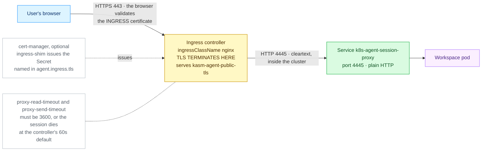

# Ingress

> **Applies to:** publishing either half through an ingress controller · **Charts/values:** `kasm-helm.ingress.*`, `kasm-helm.proxyService.type`, `agent.ingress.*` · **Prerequisite:** [Certificates](certificates.md)

The classic path: a `networking.k8s.io/v1` Ingress on an existing controller terminates TLS and
forwards plain HTTP to the workload. Available for both halves, and the only mechanism where the
certificate is wired in by the chart itself rather than held by the fronting layer.

**It cannot carry the RDP gateway.** An Ingress is HTTP-only, so `components.rdpGateway` is
published separately — see [LoadBalancer and NodePort](loadbalancer-nodeport.md#the-rdp-gateway).

## Cluster prerequisites

* An ingress controller with a class name you can name in `ingressClassName`
  (`kubectl get ingressclass`).
* **Websocket timeouts of at least 3600s on that controller.** Kasm sessions are long-lived VNC
  websockets; the default 60s read timeout on ingress-nginx kills a session about a minute in. This
  is a controller-level setting on the control-plane half and a per-Ingress annotation on the agent
  half.
* A TLS Secret, or cert-manager — see [Certificates](certificates.md).

```console
$ kubectl get ingressclass
NAME      CONTROLLER                      PARAMETERS   AGE
traefik   traefik.io/ingress-controller   <none>       9d
```

## The control plane (`kasm-helm`)

```yaml
kasm-helm:
  publicAddr: kasm.example.com
  proxyService:
    type: ClusterIP          # required: the controller owns the external address
  ingress:
    enabled: true
    ingressClassName: traefik
    tls: true                # wires certificate.secretName into the Ingress
    backendProtocol: http    # http -> proxy :8080, https -> proxy :8443
  certificate:
    secretName: kasm-tls
```

`backendProtocol` decides which of the proxy's two listeners the controller talks to. `http` (the
default) is right unless policy requires TLS on the in-cluster hop as well.

With `kasmZones` set, the chart renders **one rule per zone** plus a rule for `publicAddr` pointing
at the primary zone's Service, all on one Ingress object. The TLS block lists every zone hostname,
so the Secret has to cover them — see [multi-zone coverage](certificates.md#multi-zone-coverage).

The backend Services are named per zone, `<release>-proxy-<zone>`, so a release called `kasm` with
the default zone gives `kasm-proxy-default` — not `kasm-proxy`. Use that name when you port-forward
or point a backend at it by hand.

```console
$ kubectl -n kasm get ingress
NAME         CLASS     HOSTS               ADDRESS         PORTS     AGE
kasm-proxy   traefik   kasm.example.com    10.0.0.21       80, 443   3m

$ kubectl -n kasm get ingress kasm-proxy \
    -o jsonpath='{range .spec.rules[*]}{.host}{" -> "}{.http.paths[0].backend.service.name}{":"}{.http.paths[0].backend.service.port.number}{"\n"}{end}'
kasm.example.com -> kasm-proxy-default:8080
```

An empty `ADDRESS` column means the controller has not claimed the Ingress — usually a wrong
`ingressClassName`, and the symptom is a hostname that never resolves to anything useful.

## The agent

**When to pick this.** The cluster has an ingress controller and no Gateway API, which is the common
case on kubeadm and most managed services. TLS terminates at the controller, on a Secret you name.


<details>
<summary>Diagram source (Mermaid)</summary>



</details>

### Prerequisites

1. **An IngressClass exists:**

   ```console
   kubectl get ingressclass
   ```

   Good: at least one row, e.g. `nginx  k8s.io/ingress-nginx`. The name in the first column is what
   goes in `agent.ingress.className`. A row marked `(default)` is used when you leave that empty —
   but naming it explicitly is safer.

2. **The controller has an address users can reach:**

   ```console
   kubectl get svc -A | grep LoadBalancer
   ```

   Good: the controller's Service shows a real `EXTERNAL-IP`, not `<pending>`. On bare metal with no
   load-balancer implementation, the controller usually uses host ports instead — check
   `kubectl get svc -n ingress-nginx` and your node's firewall.

3. **A TLS Secret for the hostname**, or cert-manager to make one:

   ```console
   kubectl -n kasm-agent get secret kasm-agent-public-tls
   kubectl get clusterissuer
   ```

   Good: either the Secret already exists (type `kubernetes.io/tls`), or a ClusterIssuer shows
   `READY  True`. With cert-manager installed, adding the annotation
   `cert-manager.io/cluster-issuer: letsencrypt-prod` to `agent.ingress.annotations` makes
   ingress-shim create the Secret named in `agent.ingress.tls` for you.

### Values and install

`agent-ingress.yaml`:

```yaml
agent:
  manager:
    hostname: kasm.example.com
    existingTokenSecret: kasm-manager-token
  publicHostname: sessions.example.com
  ingress:
    enabled: true
    className: nginx
    annotations:
      nginx.ingress.kubernetes.io/proxy-read-timeout: "3600"
      nginx.ingress.kubernetes.io/proxy-send-timeout: "3600"
      cert-manager.io/cluster-issuer: letsencrypt-prod
    tls:
      - secretName: kasm-agent-public-tls
        hosts:
          - sessions.example.com
```

```console
helm upgrade --install kasm-agent oci://registry-1.docker.io/kasmweb/kasm-agent \
  --namespace kasm-agent --create-namespace \
  --values agent-ingress.yaml
```

The two timeout annotations are **not optional**. ingress-nginx defaults to a 60s read timeout,
which cuts the session websocket about a minute in. `ingress.hosts` defaults to
`[publicHostname]`; `ingress.backendPort` defaults to 4445, the proxy's plain-HTTP listener.

### What good looks like

```console
kubectl -n kasm-agent get ingress
```

Expect the Ingress to show your `CLASS`, your `HOSTS`, and an `ADDRESS` — an empty `ADDRESS` column
means no controller has claimed it, usually a wrong `className`.

```console
kubectl -n kasm-agent get secret kasm-agent-public-tls
kubectl -n kasm-agent get svc k8s-agent-session-proxy
kubectl -n kasm-agent get agent k8s-agent
```

Expect a `kubernetes.io/tls` Secret, a `ClusterIP` Service carrying 4444 and 4445, and the Agent's
`PHASE` reading `Ready`.

```console
curl -kI https://sessions.example.com/
```

Expect an HTTP status line — **`404` is correct** with no active session. Drop `-k` once the
certificate is real; it should then validate cleanly against the **ingress** certificate.

### Most likely failures

| Symptom | Fix |
| ------- | --- |
| Session dies after ~60s | The timeout annotations are missing or on the wrong controller's annotation prefix. See [Idle timeouts](loadbalancer-nodeport.md#idle-timeouts) and [Troubleshooting](README.md#troubleshooting). |
| The Ingress has no `ADDRESS` | `agent.ingress.className` names an IngressClass that does not exist, or no controller is running. Re-check prerequisite 1. |

---
