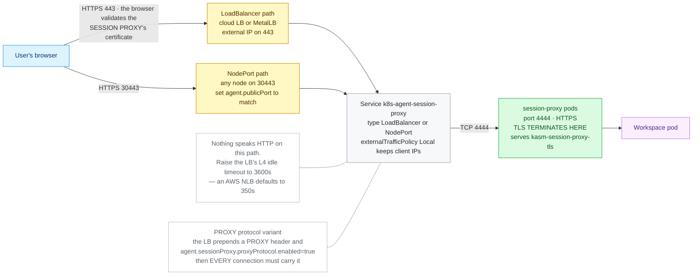

# LoadBalancer and NodePort

> **Applies to:** publishing either half without an ingress layer, and the RDP gateway in every case · **Charts/values:** `kasm-helm.proxyService.*`, `kasm-helm.directRdpService.*`, `agent.sessionProxy.service.*`, `agent.sessionProxy.proxyProtocol.*` · **Prerequisite:** [Certificates](certificates.md)

No ingress controller, no Gateway, no router — the Service is the external address. TLS terminates
on the workload itself, which means the certificate has to be on the workload rather than on
anything in front of it.

This is also the **only** way to publish the RDP gateway on most clusters, because it speaks raw
RDP rather than HTTP.

## Cluster prerequisites

* For `LoadBalancer`: a controller that provisions one — a cloud provider, MetalLB, or
  `cloud-provider-kind` in a lab. Without one the Service sits in `<pending>` forever.
  **`cloud-provider-kind` must run as root** (`sudo cloud-provider-kind`); started as a normal user
  it exits immediately with `Please run this again with 'sudo'` and the Service never gets an
  address. So on a stock kind cluster the `LoadBalancer` default is unreachable for the same
  practical reason it is on k3s, by a different mechanism - no provider at all, rather than a port
  already taken.
* For `NodePort`: a port in 30000–32767 open on every node the load balancer or DNS points at.
* An L4 idle timeout of at least 3600s on whatever fronts it. An AWS NLB defaults to 350s, which
  ends sessions mid-use.

```console
$ kubectl -n kasm get svc kasm-proxy-ext-default
NAME                     TYPE           CLUSTER-IP     EXTERNAL-IP    PORT(S)         AGE
kasm-proxy-ext-default   LoadBalancer   10.43.10.201   10.0.0.42      443:31856/TCP   2m
```

`EXTERNAL-IP` stuck at `<pending>` is the failure to look for — there is no load-balancer controller
in the cluster.

## The control plane (`kasm-helm`)

```yaml
kasm-helm:
  publicAddr: kasm.example.com
  proxyService:
    type: LoadBalancer       # or NodePort - see below
    annotations:
      service.beta.kubernetes.io/aws-load-balancer-type: nlb
```

The chart renders a **second**, externally-typed Service named `<release>-proxy-ext-<zone>`
publishing :443 onto the proxy's HTTPS listener; the in-cluster `<release>-proxy-<zone>` stays as it
is. Two restrictions the chart enforces:

* `LoadBalancer` **with** an Ingress, Route or Gateway API route is refused — see
  [below](#why-the-control-plane-must-be-clusterip-behind-a-front-end).
* `LoadBalancer` **with** `kasmZones` is refused: one load balancer cannot route by hostname, so
  multi-zone needs an ingress, Route or Gateway API route in front.

### NodePort on the control plane

`proxyService.type=NodePort` renders the same external Service, typed `NodePort`, publishing :443
onto the proxy's HTTPS listener. Kubernetes assigns a port from the service-node-port range
(30000–32767) unless you pin one:

```yaml
kasm-helm:
  proxyService:
    type: NodePort
    nodePort: 31443          # optional; omit to let Kubernetes choose
```

```console
$ kubectl -n kasm get svc kasm-proxy-ext-default
NAME                     TYPE       CLUSTER-IP      EXTERNAL-IP   PORT(S)         AGE
kasm-proxy-ext-default   NodePort   10.96.241.161   <none>        443:32010/TCP   1m

$ curl -sk -o /dev/null -w '%{http_code}\n' https://<node-ip>:32010/
200
```

This is the one option that needs **neither an ingress controller nor a load-balancer provider**,
which makes it the practical choice on kind and on k3s where Traefik holds :443.

> **Match the zone's `proxy_port` to the port users actually reach.** Kasm builds session URLs from
> `kasmZones[].proxy_port` — *not* from this Service. Publish on 32010 while the zone still says 443
> and users log in successfully, then every session sends the browser to `https://<host>:443/…`
> where nothing is listening. Set `kasmZones[].proxy_port` to the node port (preseed only, so at
> database initialisation) or change **Proxy Port** under *Infrastructure → Zones* on a running
> deployment.

NodePort carries the same two restrictions as `LoadBalancer` — not alongside an Ingress, Route or
Gateway API route, and not with `kasmZones`, since a node port cannot route by hostname. The chart
refuses both at render time.

### Why the control plane must be ClusterIP behind a front end

Two separate reasons, and only one of them is a hard failure everywhere.

**Always: it is a second door, configured differently.** The external Service publishes :443
straight onto the proxy's own HTTPS listener. It carries none of what the front end carries — not
your ingress certificate, not its annotations, not its websocket timeouts, and in a multi-zone
deployment not the host routing either. You end up with two reachable addresses for one application,
serving different certificates with different timeouts, and only one of them is the one you
configured.

**On k3s and any host-networked load-balancer implementation: an outright port collision.** k3s
ships ServiceLB (klipper-lb), which implements a `LoadBalancer` Service with a DaemonSet binding the
service port on **every node's host network**. Port 443 is exactly what Traefik already holds there,
so the two cannot coexist. This is the case the chart's error message was written for, and the one
verified in this repository's lab.

On a cloud provider it is not a collision — an NLB or ALB gets its own external address and a
NodePort in the 30000–32767 range, and nothing binds :443 on the node. The combination would
"work"; it would just give you the two-doors problem above. The chart refuses it regardless, because
a deployment that is reachable two ways with two different TLS configurations is not a state anyone
can support.

If what you actually want is the Service published directly, that is fine — just turn the front end
off rather than running both.

## The RDP gateway

`components.rdpGateway` speaks raw RDP on 3389, so it is never covered by the Ingress or Route
fronting the proxy. It is published on its own:

```yaml
kasm-helm:
  components:
    rdpGateway:
      enabled: true
  directRdpService:
    enabled: true
    type: LoadBalancer       # or NodePort
    rdpAccessURL: rdp.kasm.example.com
    loadBalancerPort: 3389
    annotations:
      service.beta.kubernetes.io/aws-load-balancer-type: nlb
```

`rdpAccessURL` is required — it is the hostname Kasm advertises to RDP clients and the name the
gateway serves under; the chart fails the render without it. The cloud load balancer behind this
**must be Layer 4 / TCP** (an NLB, not an ALB): an HTTP load balancer cannot carry RDP.

The Gateway API alternative is a `TCPRoute` — see
[Gateway API](gateway-api.md#the-rdp-gateway-tcproute), which needs Gateway API 1.6 or newer.

## The agent

**When to pick this.** There is no ingress controller and none coming, or an external load balancer
(a cloud NLB, an F5, an HAProxy box) will front the sessions directly. TLS terminates at the session
proxy, so the browser validates its certificate.


<details>
<summary>Diagram source (Mermaid)</summary>



</details>

### Prerequisites

1. **For the LoadBalancer type — does the cluster hand out addresses?**

   ```console
   kubectl get svc -A | grep LoadBalancer
   ```

   Good: existing LoadBalancer Services show real addresses in `EXTERNAL-IP`. If every one says
   `<pending>`, there is no cloud controller or MetalLB, and a LoadBalancer Service will never get an
   address — use `NodePort` instead.

2. **For the NodePort type — will the environment route those ports to the nodes?** Kubernetes
   allocates from 30000–32767. Confirm with your firewall or cloud security-group rules; a VM host
   that only forwards 443 refuses the connection before Kubernetes sees it. Check what a node's
   address actually is:

   ```console
   kubectl get nodes -o wide
   ```

3. **A publicly trusted certificate for the session proxy.** Browsers reach the proxy directly here,
   so a cluster-internal CA is not enough:

   ```console
   kubectl get clusterissuer
   ```

   Good: at least one `READY  True`. Bringing your own instead is fine — create a
   `kubernetes.io/tls` Secret in the release namespace and point `agent.sessionProxy.certSecretName`
   at it. **The proxy will not start without that Secret**, whichever way you produce it.

### Values and install

LoadBalancer, `agent-lb.yaml`:

```yaml
agent:
  manager:
    hostname: kasm.example.com
    existingTokenSecret: kasm-manager-token
  publicHostname: sessions.example.com
  sessionProxy:
    certificate:
      enabled: true
      issuerRef:
        kind: ClusterIssuer
        name: letsencrypt-prod
      dnsNames:
        - sessions.example.com
        - "*.sessions.example.com"
    service:
      type: LoadBalancer
      externalTrafficPolicy: Local
```

NodePort with a pinned port, `agent-nodeport.yaml`:

```yaml
agent:
  manager:
    hostname: kasm.example.com
    existingTokenSecret: kasm-manager-token
  publicHostname: sessions.example.com
  publicPort: 30443
  sessionProxy:
    certSecretName: kasm-session-proxy-tls
    service:
      type: NodePort
      httpsNodePort: 30443
```

```console
helm upgrade --install kasm-agent oci://registry-1.docker.io/kasmweb/kasm-agent \
  --namespace kasm-agent --create-namespace \
  --values agent-lb.yaml
```

`agent.publicPort` must match the port users actually connect on — 443 behind a load balancer that
listens there, or the node port itself when browsers hit a node directly. `httpsNodePort` pins the
port for the proxy's own HTTPS listener (4444); `httpNodePort` pins the plain-HTTP one (4445), for
when TLS is terminated somewhere in front. Both must fall inside 30000–32767, and both are stable
across reconciles even when left unpinned.

### What good looks like

```console
kubectl -n kasm-agent get svc k8s-agent-session-proxy
```

Expect `TYPE  LoadBalancer` with a real `EXTERNAL-IP` (not `<pending>`), or `TYPE  NodePort` with
`4444:30443/TCP` in the `PORT(S)` column.

```console
kubectl -n kasm-agent get agent k8s-agent
kubectl -n kasm-agent get secret kasm-session-proxy-tls
```

Expect `PHASE  Ready` and the TLS Secret to exist.

```console
curl -kI https://sessions.example.com/
```

Expect an HTTP status line — **`404` is correct** with no active session. Run it from **outside** the
cluster, on the same network path a user will be on: a NodePort that answers from a cluster node and
refuses from a laptop is a firewall problem, not a Kasm one.

### Most likely failures

| Symptom | Fix |
| ------- | --- |
| NodePort answers in-cluster, refused from a LAN client | The environment does not route 30000–32767 to the nodes. See [Troubleshooting](README.md#troubleshooting). |
| Some clients time out with `externalTrafficPolicy: Local` | Traffic reached a node with no session-proxy pod. Raise `agent.sessionProxy.replicas`, pin with `nodeSelector`, or use an LB that honours the health check. See [Preserving real client IPs](#preserving-real-client-ips). |
| Everything breaks the moment PROXY protocol is enabled | The fronting proxy is not sending the header. See [Preserving real client IPs](#preserving-real-client-ips). |

---

## Preserving real client IPs

Optional, and pick exactly one — the two mechanisms are alternatives, not layers.

```yaml
agent:
  sessionProxy:
    service:
      type: LoadBalancer
      externalTrafficPolicy: Local     # L4: no SNAT, but only routes via nodes running a proxy pod
```

```yaml
agent:
  sessionProxy:
    proxyProtocol:
      enabled: true                    # L7: the fronting proxy MUST send PROXY protocol
      trustedCIDRs:
        - 10.0.0.0/16
```

`proxyProtocol` is all-or-nothing: once on, nginx requires a PROXY header on **every** connection,
so browsers, health checks and `curl` hitting the listener directly all break. Enable it on the load
balancer at the same time, never on its own.

## Idle timeouts

Kasm sessions are long-lived websockets. Every default in this space is too short.

| Path | Knob |
| ---- | ---- |
| `agent.ingress` (ingress-nginx) | `nginx.ingress.kubernetes.io/proxy-read-timeout: "3600"` and `proxy-send-timeout` in `agent.ingress.annotations` |
| `agent.route` (OpenShift) | `haproxy.router.openshift.io/timeout: "3600s"` in `agent.route.annotations` |
| `agent.httpRoute` | the Gateway data plane's own idle timeout — not a Kasm value |
| passthrough and direct Service | no HTTP knob exists. Raise the **L4 idle timeout** on the Gateway's data plane or the load balancer (an AWS NLB defaults to 350s) |
