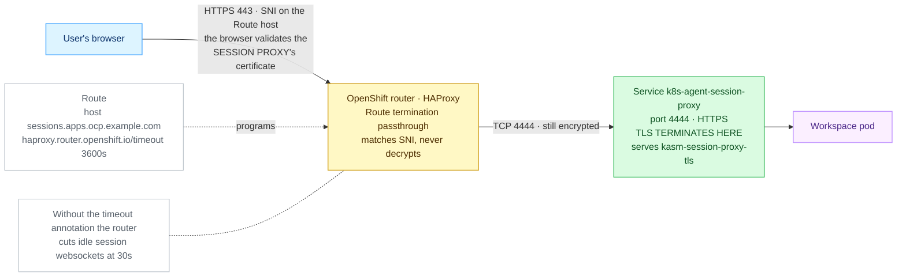

# OpenShift Route

> **Applies to:** publishing either half on OpenShift · **Charts/values:** `kasm-helm.route.*`, `kasm-helm.isOpenshift`, `agent.route.*` · **Prerequisite:** [Certificates](certificates.md)

The native path on OpenShift. The router is always there, it handles websockets without extra
configuration, and `passthrough` termination gives the agent half end-to-end TLS without needing
the Gateway API.

Set `kasm-helm.isOpenshift=true` as well, so the chart drops the explicit UID/GID settings and lets
OpenShift assign them from the namespace's range.

## Cluster prerequisites

* The `route.openshift.io` API, i.e. OpenShift or OKD.
* A router shard that admits the namespace, and DNS pointing at the router's wildcard.
* For the control plane's default `edge` termination, a certificate the router serves; for the
  agent's `passthrough`, a certificate on the session proxy itself.

```console
$ kubectl get routes.route.openshift.io -A -o name | head -1
route.route.openshift.io/console

$ oc get ingresscontroller default -n openshift-ingress-operator \
    -o jsonpath='{.status.domain}{"\n"}'
apps.cluster.example.com
```

## The control plane (`kasm-helm`)

```yaml
kasm-helm:
  isOpenshift: true
  publicAddr: kasm.example.com
  proxyService:
    type: ClusterIP
  route:
    enabled: true
    backendProtocol: http
    tls:
      termination: edge
      insecureEdgeTerminationPolicy: Redirect
```

Leaving `route.tls` empty renders a Route with **no TLS stanza at all** — plain HTTP on port 80,
which is rarely what is wanted. Set at least `termination`.

Unlike the Ingress, multi-zone renders **one Route object per zone** plus one for `publicAddr`,
because a Route carries a single host. `route.*` settings apply to all of them, and the certificate
must cover every zone hostname.

```console
$ kubectl -n kasm get routes.route.openshift.io
NAME               HOST/PORT                  SERVICES            PORT   TERMINATION     WILDCARD
kasm-proxy         kasm.example.com           kasm-proxy-zonea    8080   edge/Redirect   None
kasm-proxy-zoneb   zoneb.kasm.example.com     kasm-proxy-zoneb    8080   edge/Redirect   None
```

`kasm-helm.ingress.enabled` and `kasm-helm.route.enabled` are mutually exclusive and the chart says
so at render time rather than creating two owners for one hostname.

## The agent

**When to pick this.** You are on OpenShift. The router is already there and `passthrough`
termination is the native path — the browser validates the session proxy's certificate end to end.


<details>
<summary>Diagram source (Mermaid)</summary>



</details>

### Prerequisites

1. **The Route API is served** (i.e. this really is OpenShift):

   ```console
   kubectl api-resources --api-group=route.openshift.io
   ```

   Good: a `routes` row. Nothing means it is not OpenShift — use another walkthrough.

2. **Your hostname sits under a domain the router serves.** Find the cluster's wildcard domain:

   ```console
   kubectl -n openshift-ingress-operator get ingresscontroller default -o jsonpath='{.status.domain}'
   ```

   Good: something like `apps.ocp.example.com`. A hostname under it — `sessions.apps.ocp.example.com`
   — needs no extra DNS. A hostname outside it needs its own DNS record pointing at the router.

3. **A publicly trusted certificate for the session proxy.** Under the default `passthrough`
   termination the router does not present a certificate of its own; the browser sees the proxy's:

   ```console
   kubectl get clusterissuer
   ```

   Good: at least one `READY  True`, or you already hold a `kubernetes.io/tls` Secret to point
   `agent.sessionProxy.certSecretName` at.

### Values and install

`agent-route.yaml`:

```yaml
agent:
  manager:
    hostname: kasm.example.com
    existingTokenSecret: kasm-manager-token
  publicHostname: sessions.apps.ocp.example.com
  route:
    enabled: true
    annotations:
      haproxy.router.openshift.io/timeout: "3600s"
    tls:
      termination: passthrough
      insecureEdgeTerminationPolicy: Redirect
  sessionProxy:
    certificate:
      enabled: true
      issuerRef:
        kind: ClusterIssuer
        name: letsencrypt-prod
      dnsNames:
        - sessions.apps.ocp.example.com
        - "*.sessions.apps.ocp.example.com"
```

```console
helm upgrade --install kasm-agent oci://registry-1.docker.io/kasmweb/kasm-agent \
  --namespace kasm-agent --create-namespace \
  --values agent-route.yaml
```

`route.host` defaults to `publicHostname`. `route.backendPort` follows the termination mode when
left empty — 4444 for `passthrough` and `reencrypt`, 4445 for `edge`. The timeout annotation is
effectively mandatory: the OpenShift router's default connection timeout is **30 seconds**.

### What good looks like

```console
kubectl -n kasm-agent get route
kubectl -n kasm-agent get route -o jsonpath='{range .items[*]}{.spec.host}{"  "}{.spec.tls.termination}{"  "}{.spec.port.targetPort}{"\n"}{end}'
```

Expect your host, `passthrough`, and target port `4444`.

```console
kubectl -n kasm-agent get agent k8s-agent
curl -kI https://sessions.apps.ocp.example.com/
```

Expect `PHASE  Ready` and an HTTP status line — **`404` is correct** with no active session.

### Most likely failures

| Symptom | Fix |
| ------- | --- |
| Session dies after ~30s | The `haproxy.router.openshift.io/timeout` annotation is missing. See [Troubleshooting](README.md#troubleshooting). |
| Browser certificate warning | Under `passthrough` the browser validates the session proxy's certificate — it must cover `route.host`. See [Certificates](certificates.md#certificates). |

---
