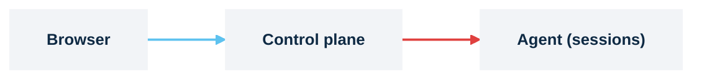

# Get started: one command to a running session

> **Applies to:** both halves

Install the whole Kasm platform with one `helm install` and launch a session from a browser. No
values file: the agent finds the control plane installed beside it, both halves generate their own
certificates, and session traffic is relayed through the control plane.



## Before you start

- A Kubernetes cluster, 1.26 or newer
- `kubectl` and Helm 3.18 or newer, pointed at the cluster.
- A default StorageClass. `kubectl get storageclass` shows one marked `(default)`.
- An address for a `LoadBalancer` Service: a cloud provider, MetalLB, or the ServiceLB that ships
  with k3s and k3d. If `EXTERNAL-IP` never leaves `<pending>` on your cluster, step 3 has a
  port-forward alternative.
- About ten minutes. A first install initializes the database and pulls images.

> **No cluster yet?** [k3d](https://k3d.io) runs k3s inside Docker and gives you both prerequisites
> at once, on Linux, macOS or Windows: a default StorageClass (local-path) and a `LoadBalancer`
> provider (ServiceLB). Create one with:
>
> ```console
> k3d cluster create kasm --k3s-arg "--disable=traefik@server:*" -p "443:443@loadbalancer"
> ```
>
> `--disable=traefik` matters: Traefik otherwise holds port 443 and ServiceLB can never bind it, so
> the proxy Service stays `<pending>`. The `-p` maps host 443 to the load balancer so the browser
> reaches the proxy on 443, which step 3 explains is the port session URLs are built on; browse to
> `https://localhost`. On **OrbStack**, drop the `-p` flag: OrbStack holds host 443 for its own
> proxy, so a mapping there fails the TLS handshake, but it routes container addresses to the host,
> so browse the Service's `EXTERNAL-IP` from step 3 directly (it already serves on 443). Kasm
> workspace images are `linux/amd64` only, so a session launched on an arm64 cluster (Apple Silicon,
> Windows on ARM) fails to pull unless you supply multi-arch images
> ([Supported platforms](../explanation/supported-platforms.md)).

## 1. Install

```console
helm install kasm oci://registry-1.docker.io/kasmweb/kasm-platform -n kasm --create-namespace
```

Helm returns as soon as it has created the resources and prints the release notes. Read them: they
are the map for everything below. The notes are rendered before anything exists, so on this first
install they cannot know the URL yet; they give you the command that finds it (step 3), name the
admin users and the Secret their passwords are in (step 4), tell you the agent will register on
its own and what to click afterwards (steps 6 and 7), and end with a warning that the certificates
are self-signed. They also spell out the two-step uninstall for when you are done.

## 2. Watch the rollout

```console
kubectl get pods -n kasm -w
```

Expected, after a few minutes on a cold cluster: the `kasm-db-init` Job reaches `Completed`, and
every other pod reaches `Running`. That is the control plane (api, manager, proxy, database,
Guacamole, the two RDP gateways), the operator, the telemetry collector, the agent and its session
proxy. Press `Ctrl-C` when nothing is still `ContainerCreating` or `Init:…`.

## 3. Find the URL

```console
kubectl get svc -n kasm kasm-proxy-ext-default \
  -o jsonpath='{.status.loadBalancer.ingress[0].ip}{.status.loadBalancer.ingress[0].hostname}'; echo
```

Expected: one address, for example `203.0.113.10`. Browse to `https://<address>`. From the first
`helm upgrade` on, the notes print it for you as `Kasm URL:   https://<address>`.

Your browser warns about the certificate: the chart generated a self-signed one. Accept the warning
for this address.

> **Note.** If the address stays empty because `EXTERNAL-IP` is `<pending>`, the cluster has no
> load-balancer provider. Forward the proxy to your machine instead, on port 443 so that session
> URLs, which Kasm builds on the zone's proxy port (443 by default), resolve:
> `sudo kubectl -n kasm port-forward --address 127.0.0.1 svc/kasm-proxy-ext-default 443:443`, then
> browse to `https://127.0.0.1`. The port-forward works precisely because it keeps port 443; the
> Service's node port (`kubectl get svc -n kasm kasm-proxy-ext-default` shows it as `443:3xxxx`)
> logs you in too, but the first session is sent to `https://<node>:443/...` where nothing answers,
> until the zone's Proxy Port is changed to the node port under Infrastructure → Zones.
> [Troubleshooting](../reference/troubleshooting.md) covers the k3s case where Traefik already
> holds port 443.

## 4. Get the password

```console
kubectl get secret -n kasm kasm-secrets -o jsonpath='{.data.admin-password}' | base64 -d; echo
```

Expected: a random password. The same Secret holds `user-password` for the unprivileged
`user@kasm.local`, plus `db-password`, `service-token` and `manager-token`. The notes never print
passwords; they are generated once and reused on every upgrade.

## 5. Log in

Open a **fresh private browser window** (a cookie from an earlier Kasm on the same address causes
confusing 401s), go to `https://<address>` and sign in as `admin@kasm.local` with that password.
Expected: the Kasm admin dashboard.

## 6. Check the agent registered

```console
kubectl get agents.agent.kasm.com -n kasm
```

Expected:

```text
NAME        PHASE   MANAGER                                     AGE
k8s-agent   Ready   kasm-proxy-default.kasm.svc.cluster.local   6m
```

`Ready` means the agent registered with the control plane and its heartbeats are arriving. It
reached the control plane at its in-cluster proxy Service and read the registration token from the
`kasm-secrets` Secret; both were derived, nothing was typed. In the admin UI,
**Infrastructure → Agents** now lists the agent under its session-proxy hostname,
`k8s-agent-session-proxy.kasm.svc.cluster.local`, disabled; the next step enables it.

## 7. Enable the agent

New agents register **disabled** ([Kasm docs: Agent settings](https://www.kasmweb.com/docs/latest/guide/agent_settings.html)). In the admin UI: **Infrastructure → Agents → the
agent listed as `k8s-agent-session-proxy.kasm.svc.cluster.local` → Enable**. Allow one heartbeat
interval (about 15 seconds) before launching anything; a session requested before that fails with
"No resources are available".

> **Note.** The manager setting `auto_agent` makes new agents enable themselves;
> [Enable agents automatically](../how-to/enable-agents-automatically.md) seeds it.

## 8. Install a workspace and authorize it

A fresh Kasm has an empty library. **Workspaces → Registry**, pick one (Chrome is a good first),
**Install**. Then **Workspaces → the workspace → assign it to the `All Users` group**. Without the
group, launching fails with "Image Not Authorized".

## 9. Launch a session

Back on the dashboard, click the workspace. Expected: a desktop or browser streaming inside your
tab within about fifteen seconds once the image is on a node. The image, several gigabytes, has to
get there first: the operator starts pulling it as soon as the workspace is installed, and until it
has landed a launch is **refused** with "No resources are available" rather than queued. Wait for
`kubectl get kasmimagepullers.agent.kasm.com -n kasm` to show `ImagesStaged`, then click again.

Look at the address bar: it still shows the control plane's address. Session traffic is relayed
through the control plane to the session proxy inside the cluster, which is why nothing about
hostnames, cookies or certificates had to be configured.

## Verify from the cluster

```console
kubectl get kasmworkspaces.agent.kasm.com -n kasm
```

Expected: one row per running session. Each session is a custom resource the operator turns into
a pod; `kubectl get pods -n kasm` shows it alongside the platform pods, and deleting the session
from the Kasm UI removes both.

## Where next

- Keep this install: give it a DNS name and a trusted certificate with
  [Install on one cluster](../how-to/install/one-cluster.md).
- Put the two halves in separate namespaces, with the agent's NetworkPolicies on:
  [Install in two namespaces](../how-to/install/two-namespaces.md).
- Have browsers stream from the agent directly instead of through the control plane:
  [Switch sessions to direct-connect](../how-to/networking/direct-connect.md), after reading
  [Deployment topologies](../explanation/topologies.md).
- Remove it: the two-step uninstall in [Day 2](../how-to/day-2.md#uninstall).
